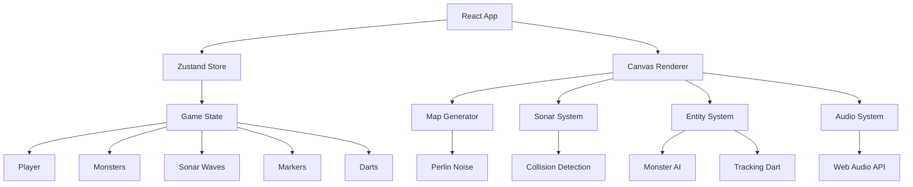
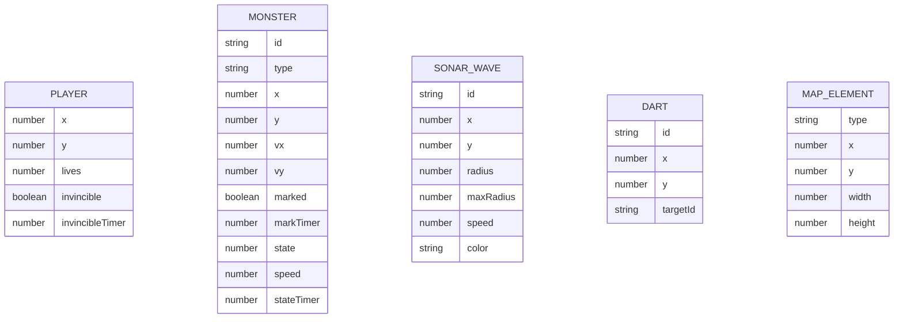

## 1. 架构设计



## 2. 技术说明
- 前端：React 18 + TypeScript + Vite
- 状态管理：Zustand
- 渲染：Canvas 2D API
- 音效：Web Audio API
- 构建工具：Vite

## 3. 路由定义
| 路由 | 用途 |
|-----|-----|
| / | 游戏主界面 |

## 4. 数据模型
### 4.1 数据模型定义



## 5. 文件结构
```
src/
├── game/
│   ├── store.ts       # Zustand状态管理
│   ├── map.ts       # 地图生成与碰撞检测
│   ├── sonar.ts     # 声波系统
│   ├── entities.ts  # 实体（怪物、飞镖）
│   └── renderer.ts # 渲染循环
├── App.tsx          # 根组件
└── main.tsx         # 入口文件
```
