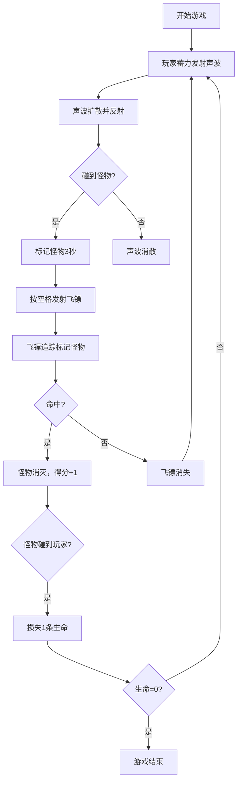

## 1. 产品概述
回声猎手是一款基于声呐机制的俯视角探索游戏，玩家在黑暗森林中依靠声波脉冲感知环境、追踪怪物、收集宝藏。
- 核心玩法：发射声波探测隐藏怪物，使用追踪飞镖消灭标记的怪物，生存并获取高分
- 目标用户：喜欢独特游戏体验的玩家，休闲游戏爱好者

## 2. 核心特性

### 2.1 用户角色
| 角色 | 注册方式 | 核心权限 |
|------|----------|---------|
| 玩家 | 无需注册，直接进入游戏 | 游戏操作、分数记录 |

### 2.2 功能模块
1. **游戏主界面**：森林地图、玩家角色、怪物、声呐系统
2. **战斗系统**：声波发射与反射、怪物标记、追踪飞镖
3. **UI系统**：生命值、计时器、得分显示
4. **音效系统**：Web Audio API 生成环境音效

### 2.3 页面详情
| 页面名称 | 模块名称 | 功能描述 |
|---------|---------|---------|
| 游戏主界面 | 森林地图 | Perlin噪声生成1000x800像素地图，包含树木、岩石、草丛 |
| 游戏主界面 | 玩家角色 | 玩家始终居中，控制声呐发射和飞镖射击 |
| 游戏主界面 | 怪物系统 | 三种怪物AI：潜伏者、游荡者、拟态者 |
| 游戏主界面 | 声呐系统 | 鼠标蓄力发射声波，碰到障碍物反射，碰到怪物标记 |
| 游戏主界面 | 追踪飞镖 | 空格键发射，自动追踪标记怪物 |
| 游戏主界面 | UI显示 | 生命值心形图标、计时、得分 |
| 游戏结束界面 | 结束画面 | 显示最终得分 |

## 3. 核心流程
玩家进入游戏后，使用鼠标蓄力发射声波探测周围环境，声波碰到怪物后标记位置，玩家按空格键发射追踪飞镖消灭标记怪物获取分数，同时躲避怪物攻击保护生命值。

## 4. 用户界面设计
### 4.1 设计风格
- 主色调：深色霓虹风格
- 背景色：#0A1A0A
- 主强调色：#00FFAA（青绿色）
- 危险色：#FF0044（红色）
- 怪物色：蓝色#3366FF、紫色#9933FF、绿色#33FF66
- 字体：monospace等宽字体
- 发光效果：text-shadow 0 0 8px #00FFAA

### 4.2 页面设计概览
| 页面名称 | 模块名称 | UI元素 |
|---------|---------|--------|
| 游戏主界面 | 左上角 | 生命值心形图标（#FF0044，20x20px） |
| 游戏主界面 | 右上角 | 计时器和得分（monospace，#00FFAA，16px） |
| 游戏主界面 | 中央 | 玩家角色、声波环、怪物、飞镖 |
| 游戏主界面 | 背景 | 深色森林地图，网格线，雾气渐变 |

### 4.3 响应式
桌面端优先，适配不同屏幕尺寸，Canvas自适应窗口大小。

### 4.4 视觉细节
- 所有UI元素半透明带发光效果
- 玩家无敌时透明度50%闪烁
- 声波颜色从中心透明渐变到边缘半透明#00FFAA
- 怪物被标记时显示红色脉冲#FF0044
