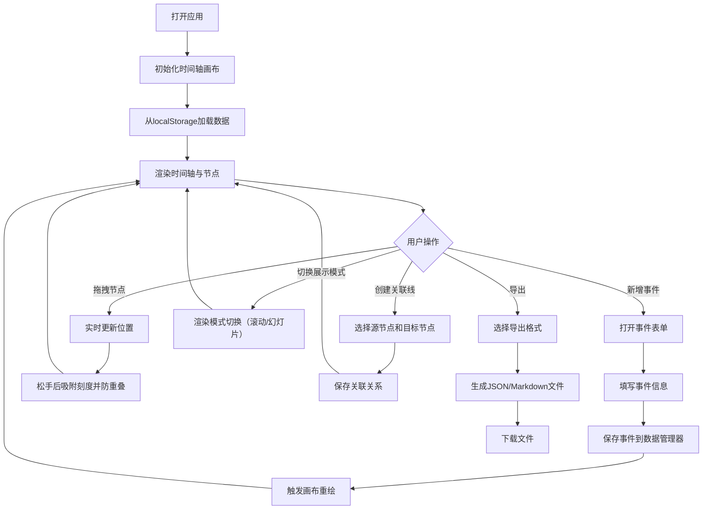

## 1. 产品概述

时光织机是一款在线互动时间轴编辑与展示应用，允许用户以可视化方式创建、编辑和分享个人或项目的时间线叙事。

- 主要用途：帮助用户记录人生重要时刻、项目进展历程、历史事件等，通过可视化时间轴呈现故事脉络
- 目标用户：个人用户（记录生活）、项目管理者（追踪进度）、教育工作者（展示历史）、内容创作者（叙事呈现）
- 市场价值：填补可视化时间轴编辑工具的空白，提供从创建到展示的一站式体验，支持多种内容类型和展示模式

## 2. 核心功能

### 2.1 用户角色
| 角色 | 注册方式 | 核心权限 |
|------|----------|----------|
| 普通用户 | 无需注册，直接使用 | 创建、编辑、保存、导出时间轴，支持本地存储 |

### 2.2 功能模块
1. **编辑器主页**：时间轴画布、工具栏、右侧编辑面板
2. **事件节点管理**：添加/编辑/删除事件节点（文本/图片/视频类型）
3. **拖拽交互**：节点拖拽排序、自动吸附、防重叠
4. **关联线条**：节点间关联线、自定义样式和动画
5. **展示模式**：滚动模式、幻灯片模式切换
6. **导入导出**：JSON导入导出、Markdown导出

### 2.3 页面详情
| 页面名称 | 模块名称 | 功能描述 |
|----------|----------|----------|
| 编辑器主页 | 顶部工具栏 | 新增事件、切换展示模式、导出按钮、通知区域 |
| 编辑器主页 | 时间轴画布 | SVG绘制的时间轴线、刻度、事件节点、关联线条 |
| 编辑器主页 | 右侧编辑面板 | 事件表单编辑、关联线样式编辑、节点属性配置 |
| 编辑器主页 | 底部抽屉（移动端） | 响应式面板折叠，底部抽屉形式展示编辑内容 |
| 编辑器主页 | 导出弹窗 | JSON/Markdown格式选择、导入文件选择 |

## 3. 核心流程

用户打开应用后，默认看到空的时间轴画布。点击"新增事件"按钮打开事件表单，填写标题、描述、日期、类型后保存，事件节点出现在时间轴上。用户可拖拽节点调整位置，通过右键或拖拽端点创建关联线。完成编辑后点击导出按钮选择格式下载。切换展示模式可预览最终效果。

## 4. 用户界面设计

### 4.1 设计风格
- **主色调**：#6366F1（靛蓝），悬停态 #4F46E5
- **背景色**：#F4F4F6（浅灰）
- **节点底色**：#FFFFFFCC（半透明白），磨砂玻璃 backdrop-filter: blur(8px)
- **类型色**：文本 #3B82F6、图片 #10B981、视频 #F59E0B
- **刻度色**：#D1D5DB（细线）、#6B7280（文字）
- **按钮样式**：圆角8px，过渡动画0.2秒
- **字体**：展示字体使用 Noto Serif SC 体现时间沉淀感，正文字体使用 PingFang SC 保证可读性
- **布局风格**：三栏式布局（顶部工具栏 + 中央画布 + 右侧面板）
- **图标风格**：线性图标（lucide-react），线条粗细统一

### 4.2 页面设计概览
| 页面名称 | 模块名称 | UI元素 |
|----------|----------|----------|
| 编辑器主页 | 顶部工具栏 | 左侧Logo标题区、中部模式切换按钮组、右侧导入导出按钮组 |
| 编辑器主页 | 时间轴画布 | SVG画布：水平时间轴线贯穿、小时刻度线（1px/2px分级）、事件节点（圆角矩形120x60px）、关联线条（虚线/动画） |
| 编辑器主页 | 事件节点 | 类型色边框（2px）、标题文字、悬停放大110%、阴影从0-4px→0-8px过渡 |
| 编辑器主页 | 右侧编辑面板 | 宽320px、白色背景10px内边距、表单元素圆角8px、节点表单/关联线样式表单 |
| 编辑器主页 | 幻灯片模式 | 全屏卡片、上下翻转动画0.6秒、深度阴影效果 |
| 编辑器主页 | 导出弹窗 | 居中模态框、格式卡片选择、文件上传区域 |

### 4.3 响应式
- **桌面端（>768px）**：三栏式，右侧面板固定320px宽度
- **移动端（≤768px）**：右侧面板折叠为底部抽屉，点击编辑按钮滑出，画布占满全屏
- **触摸优化**：节点拖拽支持触摸事件，热区增大至44x44px，抽屉支持手势滑出

### 4.4 动画与交互细节
- 节点折叠/展开：0.3秒缓动过渡
- 幻灯片切换：上下翻转0.6秒，带3D透视与深度阴影
- 关联线动画：流动光点（dashoffset动画）、波浪（path形变）
- 滚动阻尼：0.05，平滑自然
- 拖拽反馈：节点阴影跟随，透明度微降
