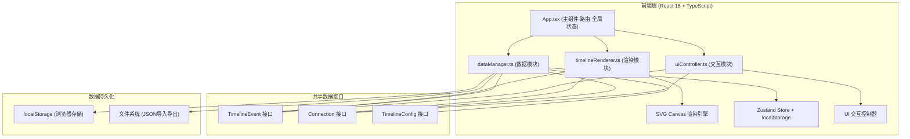
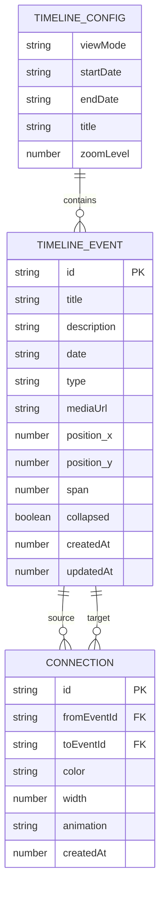

## 1. 架构设计



## 2. 技术说明

- **前端框架**：React 18 + TypeScript
- **构建工具**：Vite（开发端口3000）
- **状态管理**：Zustand
- **路由**：react-router-dom
- **日期处理**：date-fns（支持公元前日期）
- **ID生成**：uuid
- **UI组件**：自研组件库（无额外UI框架依赖，避免臃肿）
- **图标**：lucide-react
- **样式方案**：CSS Modules + 内联样式（动画部分）
- **后端**：无（纯前端应用，数据存储在localStorage）
- **数据库**：无（使用浏览器localStorage + 文件导入导出）

## 3. 路由定义

| 路由 | 用途 |
|------|------|
| / | 编辑器主页，包含时间轴画布和编辑面板 |
| /view/:id | （可选）只读展示模式，使用幻灯片或滚动模式展示 |

## 4. API 定义（接口类型）

### 4.1 核心数据接口

```typescript
// 事件类型枚举
export type EventType = 'text' | 'image' | 'video';

// 事件节点数据结构
export interface TimelineEvent {
  id: string;
  title: string;
  description: string; // 最大500字符
  date: string; // ISO 8601格式，支持公元前（如 "-044-03-15" 表示公元前44年）
  type: EventType;
  mediaUrl?: string; // 图片/视频的URL
  position: {
    x: number; // 水平位置（时间轴像素坐标）
    y: number; // 垂直位置（防止重叠的纵向排列）
  };
  span: number; // 时间跨度（分钟），用于长事件
  collapsed: boolean; // 是否折叠
  createdAt: number;
  updatedAt: number;
}

// 关联线条动画类型
export type LineAnimation = 'none' | 'flowing' | 'wave';

// 节点关联关系
export interface Connection {
  id: string;
  fromEventId: string;
  toEventId: string;
  color: string; // 16种预设颜色之一
  width: number; // 2-6px
  animation: LineAnimation;
  createdAt: number;
}

// 展示模式
export type ViewMode = 'scroll' | 'slides';

// 时间线全局配置
export interface TimelineConfig {
  viewMode: ViewMode;
  startDate: string;
  endDate: string;
  title: string;
  zoomLevel: number; // 缩放级别
}

// 预设16色
export const PRESET_COLORS = [
  '#000000', '#374151', '#6B7280', '#9CA3AF',
  '#EF4444', '#F97316', '#F59E0B', '#EAB308',
  '#84CC16', '#22C55E', '#10B981', '#14B8A6',
  '#06B6D4', '#3B82F6', '#6366F1', '#EC4899'
];
```

### 4.2 模块API

```typescript
// dataManager.ts 接口
export interface DataManager {
  addEvent(event: Omit<TimelineEvent, 'id' | 'createdAt' | 'updatedAt'>): TimelineEvent;
  removeEvent(id: string): void;
  updateEvent(id: string, updates: Partial<TimelineEvent>): TimelineEvent;
  getEvent(id: string): TimelineEvent | undefined;
  getAllEvents(): TimelineEvent[];
  
  addConnection(conn: Omit<Connection, 'id' | 'createdAt'>): Connection;
  removeConnection(id: string): void;
  updateConnection(id: string, updates: Partial<Connection>): Connection;
  getConnectionsForEvent(eventId: string): Connection[];
  getAllConnections(): Connection[];
  
  getConfig(): TimelineConfig;
  updateConfig(updates: Partial<TimelineConfig>): TimelineConfig;
  
  exportJSON(): string;
  importJSON(json: string): boolean;
  exportMarkdown(): string;
  
  saveToStorage(): void;
  loadFromStorage(): void;
  
  subscribe(callback: () => void): () => void; // 订阅数据变更，返回取消订阅函数
}

// timelineRenderer.ts 接口
export interface TimelineRenderer {
  mount(container: HTMLElement): void;
  unmount(): void;
  update(events: TimelineEvent[], connections: Connection[], config: TimelineConfig): void;
  addEventListener(type: RendererEventType, handler: RendererEventHandler): void;
  removeEventListener(type: RendererEventType, handler: RendererEventHandler): void;
}

// uiController.ts 接口
export interface UIController {
  showEventForm(event?: TimelineEvent | null): void;
  hideEventForm(): void;
  showConnectionForm(connection?: Connection | null): void;
  hideConnectionForm(): void;
  toggleEditMode(): void;
  exportJSON(): void;
  importJSON(file: File): Promise<boolean>;
  exportMarkdown(): void;
  showNotification(message: string, type: 'success' | 'error' | 'info'): void;
}
```

## 5. 数据模型

### 5.1 数据模型ER图



### 5.2 localStorage 存储键

| 键名 | 数据结构 | 说明 |
|------|----------|------|
| timeline_events | TimelineEvent[] | 所有事件节点 |
| timeline_connections | Connection[] | 所有关联线条 |
| timeline_config | TimelineConfig | 全局配置 |

### 5.3 性能优化策略

- **虚拟滚动**：画布仅渲染可视区域内的事件节点（200节点时优化渲染）
- **requestAnimationFrame**：拖拽时使用RAF节流，保证<50ms响应延迟
- **useMemo / useCallback**：React层面缓存计算结果和回调
- **SVG局部更新**：仅更新变化的节点，避免整画布重绘
- **防抖保存**：数据变更后300ms再写入localStorage
- **CSS transforms**：拖拽使用transform而非top/left，触发GPU加速
