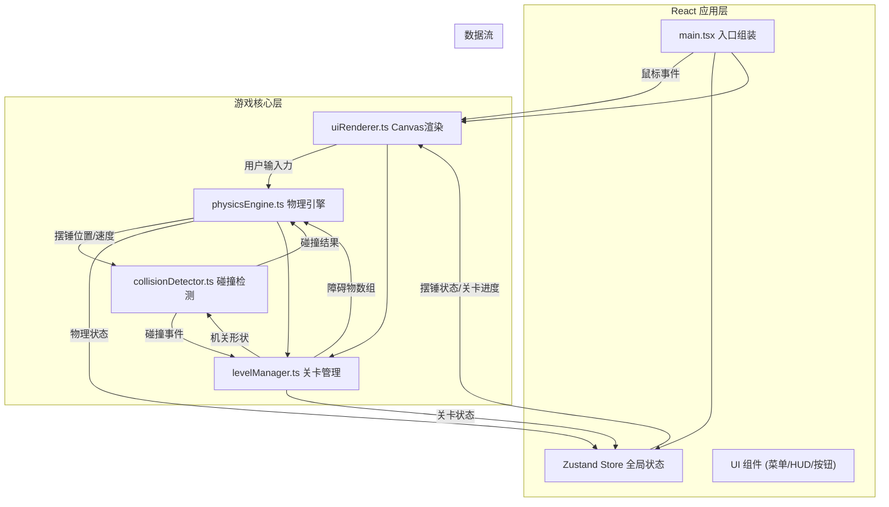

## 1. 架构设计



## 2. 技术说明

- **前端框架**：React@18 + TypeScript@5
- **构建工具**：Vite@5 + @vitejs/plugin-react@4
- **状态管理**：Zustand@4（轻量级高性能状态管理）
- **辅助库**：uuid@9（生成唯一实体ID）
- **渲染技术**：Canvas 2D API（硬件加速）
- **物理模拟**：自研物理引擎（单摆运动学 + 分离轴定理碰撞）
- **游戏循环**：requestAnimationFrame 60fps，固定时间步长16.67ms

## 3. 模块接口定义

### 3.1 共享游戏状态接口 (src/types.ts)

```typescript
// 坐标向量
export interface Vector2D { x: number; y: number; }

// 摆锤物理状态
export interface PendulumState {
  pivot: Vector2D;        // 悬挂点
  angle: number;          // 当前角度(弧度)
  angularVelocity: number; // 角速度
  ropeLength: number;     // 绳长(px)
  bobRadius: number;      // 摆锤半径
  bobPosition: Vector2D;  // 摆锤中心位置(计算得出)
}

// 障碍物/机关基础类型
export type MechanismType = 'trigger' | 'portal' | 'moving_plank' | 'goal' | 'gem';

export interface BaseMechanism {
  id: string;
  type: MechanismType;
  position: Vector2D;
  active: boolean;
  triggered?: boolean;
}

export interface RectMechanism extends BaseMechanism {
  shape: 'rectangle';
  width: number;
  height: number;
  rotation: number; // 旋转角度(弧度)
}

export interface CircleMechanism extends BaseMechanism {
  shape: 'circle';
  radius: number;
}

export interface PortalMechanism extends CircleMechanism {
  pairedPortalId: string;
}

export interface MovingPlank extends RectMechanism {
  motionAxis: 'x' | 'y';
  motionRange: number;   // 移动幅度
  motionPeriod: number;  // 周期(秒)
  phase: number;         // 初始相位
}

export type Mechanism = RectMechanism | CircleMechanism | PortalMechanism | MovingPlank;

// 碰撞结果
export interface CollisionResult {
  collided: boolean;
  mechanism?: Mechanism;
  point?: Vector2D;
  normal?: Vector2D;  // 碰撞法线
  penetrationDepth?: number;
}

// 关卡数据
export interface LevelConfig {
  id: number;
  name: string;
  pivot: Vector2D;
  initialAngle: number;
  ropeLength: number;
  timeLimit?: number; // 秒，可选
  mechanisms: Mechanism[];
  totalGems: number;
}

// 粒子效果
export interface Particle {
  id: string;
  position: Vector2D;
  velocity: Vector2D;
  radius: number;
  color: string;
  life: number;  // 剩余生命(毫秒)
  maxLife: number;
}

// 游戏全局状态
export interface GameStore {
  // UI状态
  currentView: 'menu' | 'playing';
  currentLevelIndex: number;
  completedLevels: number[];  // 已通关关卡索引
  
  // 交互状态
  interactionMode: 'idle' | 'dragging' | 'swinging';
  dragStart: Vector2D | null;
  dragCurrent: Vector2D | null;
  
  // 物理状态
  pendulum: PendulumState;
  
  // 关卡状态
  mechanisms: Mechanism[];
  collectedGems: number;
  swingCount: number;
  timeRemaining: number;
  levelStartTime: number;
  
  // 视觉状态
  particles: Particle[];
  levelWon: boolean;
  
  // Actions
  setView: (view: 'menu' | 'playing') => void;
  selectLevel: (index: number) => void;
  resetLevel: () => void;
  completeLevel: () => void;
  startDrag: (pos: Vector2D) => void;
  updateDrag: (pos: Vector2D) => void;
  releaseDrag: () => void;
  updatePendulum: (state: PendulumState) => void;
  collectGem: (mechanismId: string) => void;
  triggerMechanism: (mechanismId: string) => void;
  teleportPendulum: (targetPos: Vector2D, preserveVelocity: boolean) => void;
  addParticles: (origin: Vector2D, count: number) => void;
  updateParticles: (dt: number) => void;
  setLevelWon: (won: boolean) => void;
  updateTime: (elapsedMs: number) => void;
  updateMechanisms: (timeSec: number) => void;
}
```

## 4. 文件结构

```
auto386/
├── .trae/documents/
│   ├── PRD.md
│   └── ARCHITECTURE.md
├── package.json
├── vite.config.js
├── tsconfig.json
├── index.html
└── src/
    ├── types.ts                 # 共享类型定义
    ├── physicsEngine.ts         # 物理引擎核心
    ├── levelManager.ts          # 关卡管理(含5关JSON配置)
    ├── collisionDetector.ts     # 分离轴定理碰撞检测
    ├── uiRenderer.ts            # Canvas 2D渲染+鼠标事件
    ├── store.ts                 # Zustand全局状态store
    ├── components/
    │   ├── LevelSelect.tsx      # 关卡选择菜单
    │   ├── GameCanvas.tsx       # Canvas组件容器
    │   ├── HUD.tsx              # 叠加HUD信息
    │   └── ControlButtons.tsx   # 重置/返回按钮
    ├── App.tsx                  # 根组件
    └── main.tsx                 # React入口
```

## 5. 关键算法实现说明

### 5.1 单摆物理引擎 (physicsEngine.ts)

```
核心方程:
  角加速度 α = -(g/L) × sin(θ) - k × ω
  其中: g=重力加速度(9.8m/s²转像素单位), L=绳长, θ=摆角, ω=角速度, k=阻力系数(0.01)

数值积分: (半隐式欧拉法, 稳定且简单)
  ω_new = ω_old + α × dt
  θ_new = θ_old + ω_new × dt

摆锤位置计算:
  x = pivot_x + L × sin(θ)
  y = pivot_y + L × cos(θ)

拖拽输入映射:
  切向位移 dt = 鼠标位置相对摆锤的切向分量
  初始角速度 ω₀ = clamp(dt × K, -ω_max, ω_max)  (K为增益系数)

碰撞响应:
  v' = -e × (v · n) × n + (v - (v · n) × n)
  其中 e=0.6(反弹系数), n=碰撞法线
  ω' = 切向速度分量 / L
```

### 5.2 分离轴定理碰撞 (collisionDetector.ts)

```
圆 vs 矩形(带旋转):
  1. 将圆心变换到矩形局部坐标系(平移+逆旋转)
  2. 计算局部最近点 c' = clamp(c_local, -w/2, -h/2 到 w/2, h/2)
  3. 若 |c_local - c'| < r 则碰撞，法线为 (c_local - c').normalize()
  4. 将法线变换回世界坐标系

圆 vs 圆:
  d = |p1 - p2|, 若 d < r1 + r2 则碰撞
  法线 = (p1 - p2) / d, 穿透深度 = r1 + r2 - d

圆 vs 线段(绳索):
  1. 计算最近点 t = clamp((c - p1) · (p2 - p1) / |p2-p1|², 0, 1)
  2. closest = p1 + t × (p2 - p1)
  3. 若 |c - closest| < r 则碰撞
```

### 5.3 游戏循环 (App.tsx)

```
requestAnimationFrame 驱动:
  lastTime = performance.now()
  accumulator = 0
  
  function tick(now):
    dt = now - lastTime
    lastTime = now
    accumulator += dt
    
    // 固定步长物理更新 (16.67ms per step)
    while accumulator >= 16.67:
      updateMechanisms(游戏时间)
      physicsEngine.step(16.67 / 1000)
      collisionDetector.detectAll()
      更新时间限制
      accumulator -= 16.67
    
    更新粒子效果
    uiRenderer.render(插值状态)
    requestAnimationFrame(tick)
```

## 6. 脏矩形渲染优化

```
uiRenderer维护脏区域列表:
  - 摆锤旧包围盒 + 新包围盒
  - 机关状态变化的包围盒
  - 粒子变化区域
  
每帧仅重绘脏区域的并集:
  1. ctx.save()
  2. ctx.beginPath()，对每个脏矩形执行 rect()
  3. ctx.clip()
  4. 重绘背景(仅限裁剪区域)
  5. 重绘该区域内的所有元素
  6. ctx.restore()
  
无变化时跳过重绘，大幅降低CPU占用
```
