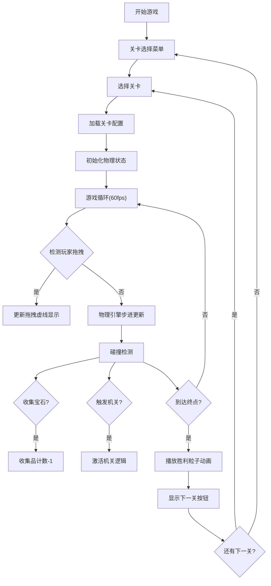

## 1. 产品概述

灵摆奇缘是一款基于2D物理模拟的解谜游戏，玩家通过拖拽并释放钟摆状的灵摆，利用摆动物理特性撞击场景机关、收集宝石，最终抵达终点解锁下一关。游戏融合物理模拟、关卡解谜与精美视觉效果，为玩家带来神秘而富有挑战的游戏体验。

- 核心玩法：鼠标拖拽灵摆产生初速度，利用摆动物理规律完成关卡目标
- 目标用户：休闲解谜游戏爱好者，对物理模拟和视觉美学有追求的玩家

## 2. 核心功能

### 2.1 功能模块

1. **关卡选择菜单**：展示5个关卡的进度状态，支持点击进入关卡
2. **物理模拟引擎**：实现单摆运动学、重力、空气阻力、碰撞响应
3. **关卡管理器**：加载5个不同难度关卡，管理机关与收集品状态
4. **碰撞检测系统**：摆锤与矩形/圆形/线段机关的精确碰撞判定
5. **UI渲染模块**：Canvas 2D渲染场景、HUD信息、粒子动画
6. **游戏状态管理**：当前关卡、收集品状态、摆动次数、交互模式

### 2.2 页面详情

| 页面名称 | 模块名称 | 功能描述 |
|-----------|-------------|---------------------|
| 关卡选择页 | 关卡列表 | 垂直列表展示5个关卡，显示通关状态图标，悬停高亮，点击进入关卡 |
| 游戏主场景 | 物理画布 | 800x600居中画布，渲染摆锤、绳索、机关、收集品，支持鼠标拖拽交互 |
| 游戏主场景 | HUD面板 | 右上角显示当前关卡、剩余收集品、摆动次数、剩余时间（第4/5关） |
| 游戏主场景 | 控制按钮 | 重置按钮（重新开始当前关）、返回菜单按钮（回到关卡选择） |
| 游戏主场景 | 胜利弹窗 | 关卡通过时显示胜利信息、粒子绽放动画、下一关按钮 |

## 3. 核心流程

玩家进入游戏后首先看到关卡选择菜单，选择关卡后进入游戏场景。在场景中玩家需要：
1. 在摆锤附近（50px内）按下鼠标并拖拽，显示金色虚线指示拖拽方向
2. 松开鼠标，摆锤获得初始角速度开始摆动
3. 摆锤摆动过程中撞击触发板激活机关、穿过传送门瞬移、收集宝石
4. 摆锤撞击终点机关，播放胜利粒子动画，显示下一关按钮
5. 全部通关后返回关卡选择菜单

## 4. 用户界面设计

### 4.1 设计风格

- **主题色调**：暗色神秘主题，深蓝渐变背景 (#0B0B2B → #1B1B3B)
- **主色**：青色 #4ECDC4（边框、机关、高亮）
- **辅色**：金色 #FFD700（摆锤、拖拽指示）
- **点缀色**：红色 #FF6B6B（宝石）、紫色 #9B59B6/#8E44AD（传送门）、橙色 #FFA07A（粒子）、蓝色 #45B7D1（粒子）
- **按钮风格**：圆角矩形，半透明深色背景，悬停变亮，0.3s平滑过渡
- **字体**：衬线字体（Georgia / "Times New Roman"）营造古典神秘氛围
- **动画**：所有交互带 transition: all 0.3s ease；传送门5秒旋转一周；宝石2秒脉动缩放0.9-1.1

### 4.2 页面设计概要

| 页面名称 | 模块名称 | UI元素 |
|-----------|-------------|-------------|
| 关卡选择页 | 页面容器 | 深蓝渐变背景，居中白色大标题"灵摆奇缘"带发光效果 |
| 关卡选择页 | 关卡按钮 | 宽200px高50px圆角矩形，背景#2C3E50，悬停#34495E，左侧进度图标 |
| 游戏主场景 | 画布容器 | 800x600居中，圆角12px，2px青色发光边框 |
| 游戏主场景 | 摆锤 | 金色渐变填充圆形(半径10px)，白色半透明绳线 |
| 游戏主场景 | 触发板 | 半透明青色边框矩形，可带旋转角度 |
| 游戏主场景 | 传送门 | 椭圆环，内部紫色渐变，带旋转动画 |
| 游戏主场景 | 宝石收集品 | 八边形，#FF6B6B鲜艳颜色，脉动缩放动画 |
| 游戏主场景 | HUD | 右上角衬线字体，白色文字带微弱阴影，显示关卡/收集品/摆动/时间 |
| 游戏主场景 | 控制按钮 | 左上角小按钮，重置与返回菜单 |
| 游戏主场景 | 胜利粒子 | 从终点发射20个彩色粒子，随机颜色大小速度，1.5秒后消失 |

### 4.3 响应式适配

- 桌面端优先设计
- 当视口宽度 < 900px 时：
  - 画布宽度缩放至视口90%，高度按比例自动调整
  - HUD和按钮元素跟随等比缩放
  - 关卡选择按钮宽度适配容器

## 5. 关卡设计详述

| 关卡编号 | 主题 | 关卡元素 | 特殊机制 |
|----------|------|----------|----------|
| 第1关 | 新手教学 | 2个触发板、1个终点、2颗宝石 | 基础摆动物理教学 |
| 第2关 | 移动障碍 | 1个水平匀速移动木板（周期3s）、2个触发板、3颗宝石、1个终点 | 移动障碍物碰撞 |
| 第3关 | 传送门 | 1对传送门、2个触发板、3颗宝石、1个终点 | 触碰瞬移并保持动量 |
| 第4关 | 计时挑战 | 15秒倒计时、2个触发板、2颗宝石、1个终点 | 超时自动重置关卡 |
| 第5关 | 综合挑战 | 触发板+传送门+移动障碍+计时器+4颗宝石+1终点 | 所有机制组合 |
