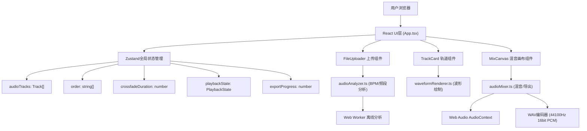

## 1. 架构设计



## 2. 技术栈说明

- **前端框架**：React 18 + TypeScript (strict模式)
- **构建工具**：Vite 5 + @vitejs/plugin-react
- **状态管理**：Zustand
- **唯一ID**：uuid
- **音频处理**：Web Audio API (AudioContext, OfflineAudioContext, AudioBuffer)
- **UI渲染**：Canvas 2D API（波形图、混音画布）
- **样式方案**：原生CSS（CSS Variables主题系统，无需Tailwind）

## 3. 目录结构

```
d:\Pro\tasks\auto387\
├── index.html                      # 入口HTML
├── package.json                    # 依赖与脚本
├── vite.config.ts                  # Vite配置
├── tsconfig.json                   # TypeScript配置(strict:true)
└── src/
    ├── main.tsx                    # React挂载入口
    ├── App.tsx                     # 主组件，组合所有子组件
    ├── audioAnalyzer.ts            # BPM/频段分析模块(Web Worker)
    ├── waveformRenderer.ts         # Canvas波形绘制模块
    ├── audioMixer.ts               # 混音合并+WAV导出模块
    ├── store.ts                    # Zustand状态管理(新增)
    └── components/
        ├── FileUploader.tsx        # 文件拖拽上传组件
        ├── TrackCard.tsx           # 单轨道卡片组件
        └── MixCanvas.tsx           # 混音画布组件
```

## 4. 核心数据模型

### Track 轨道数据结构
```typescript
interface Track {
  id: string;
  name: string;
  file: File;
  size: number;
  duration: number;
  sampleRate: number;
  channels: number;
  audioBuffer: AudioBuffer | null;
  channelData: Float32Array[];        // 解码后的PCM数据
  bpm: number | null;                 // 分析结果
  dominantBand: 'low' | 'mid' | 'high' | null;
  volume: number;                     // 0-1, 默认1
  analysisStatus: 'pending' | 'analyzing' | 'done' | 'error';
  analysisError?: string;
}
```

### 全局状态 Store
```typescript
interface MixStore {
  tracks: Track[];
  trackOrder: string[];               // track id 有序数组
  crossfadeDuration: number;          // 0.1-1秒, 默认0.3
  isPlaying: boolean;
  currentPlayTime: number;            // 秒
  totalDuration: number;              // 总时长(计算得出)
  isExporting: boolean;
  exportProgress: number;             // 0-100
  playbackCtx: AudioContext | null;
  playbackSource: AudioBufferSourceNode | null;
  
  // actions
  addTrack: (file: File) => Promise<void>;
  removeTrack: (id: string) => void;
  reorderTracks: (newOrder: string[]) => void;
  setTrackVolume: (id: string, volume: number) => void;
  setCrossfadeDuration: (v: number) => void;
  playMix: () => Promise<void>;
  pauseMix: () => void;
  exportMix: () => Promise<void>;
  updatePlayTime: (t: number) => void;
}
```

## 5. 关键模块算法

### 5.1 BPM检测(audioAnalyzer.ts)
1. 取单声道混合数据，降采样到8kHz降低计算量
2. 计算全波整流+低通滤波得到能量包络
3. 对能量信号做自相关分析(ACF)
4. 在合理BPM范围(60-180)寻找自相关峰值
5. 峰值对应lag换算为BPM = 60 * sampleRateDown / lag

### 5.2 主频段识别
1. 将音频切成多个50ms帧
2. 每帧应用Hann窗减少频谱泄漏
3. FFT(或Web Audio AnalyserNode getByteFrequencyData)得到频谱
4. 按频段累计能量: Low(<250Hz), Mid(250-2000Hz), High(>2000Hz)
5. 全曲平均后取能量最大的频段

### 5.3 混音合并算法(audioMixer.ts)
```
对于N个轨道按order排列:
  totalLength = Σ track_i.length - (N-1)*crossfadeSamples
  分配输出Float32Array(interleaved或多声道)
  
  offset = 0
  对于每个轨道 i:
    fadeOutStart = offset + track_i.length - crossfadeSamples
    fadeInEnd   = offset_prev + track_i.length  (对于i>0)
    
    对于每个采样点 s:
      计算当前音量包络 envelope(t)
      将 track_i.channelData[ch][s-local] * envelope * volume
      累加到输出 buffer[ch][offset+s]
    
    offset += track_i.length - crossfadeSamples (i>0时减去重叠)
```

### 5.4 WAV编码
1. 写入RIFF/WAVE文件头(44字节)
2. 按16bit PCM有符号整数格式写入样本: sample = clamp(-1,1,value) * 32767
3. 小端序写入每个声道的采样值(交错存储)
4. 更新文件头中的data chunk size和RIFF size
5. 封装为Blob, type='audio/wav'

## 6. 性能优化

- BPM分析在Web Worker中执行，避免阻塞UI
- 波形渲染使用降采样取极值(每N个样本取min/max)而非逐点绘制
- 混音导出过程分块处理，每处理约10%进度更新一次UI
- 播放使用AudioContext.decodeAudioData一次性预解码，避免重复解码
- 所有DOM动画使用transform/opacity，配合180ms ease-out

## 7. 模块接口

### audioAnalyzer.ts
```typescript
export function analyzeAudio(buffer: ArrayBuffer, sampleRate: number): Promise<{
  bpm: number;
  dominantBand: 'low' | 'mid' | 'high';
}>;
// 内部创建Blob Worker代码字符串
```

### waveformRenderer.ts
```typescript
export function renderWaveform(
  canvas: HTMLCanvasElement,
  channelData: Float32Array,
  options: { color?: string; bgColor?: string; gradient?: [string, string] }
): void;

export function renderWaveformThumbnail(
  canvas: HTMLCanvasElement,
  channelData: Float32Array,
  width: number,
  height: number,
  gradientColors: [string, string]
): void;
```

### audioMixer.ts
```typescript
export function computeTotalDuration(tracks: Track[], crossfadeSec: number): number;

export function mixdownToWavBlob(
  tracks: Track[],
  order: string[],
  crossfadeSec: number,
  targetSampleRate: number,   // 44100
  onProgress: (pct: number) => void
): Promise<Blob>;
```
