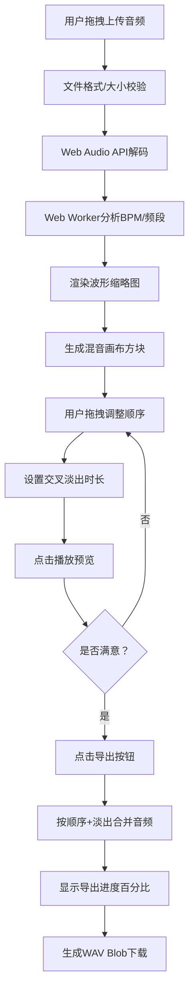

## 1. 产品概述

音频自动混音拼接Web应用，解决手动剪辑和混音耗时且缺乏节奏感的问题。用户可上传2-6个音频文件，系统自动分析BPM和频段，可视化调整顺序，应用交叉淡入淡出，一键导出连续混音。

- 核心用户：音乐爱好者、DJ、播客制作人、内容创作者
- 核心价值：无需专业DAW软件，浏览器内快速完成多轨道音频拼接混音

## 2. 核心功能

### 2.1 功能模块

1. **音频上传区**：拖拽上传、文件校验、波形预览、音量控制
2. **音频分析模块**：自动检测BPM、识别主频段（低/中/高）
3. **混音画布**：可视化排序、拖拽调整顺序、交叉淡入淡出设置
4. **播放预览**：混音实时播放、进度条指示
5. **导出模块**：合并音频为WAV、显示导出进度、浏览器下载

### 2.2 页面详情

| 页面名称 | 模块名称 | 功能描述 |
|-----------|-------------|---------------------|
| 主页面 | 上传区 | 虚线框拖拽上传，支持MP3/WAV，单文件≤10MB，共2-6个文件 |
| 主页面 | 轨道卡片列表 | 每个文件显示波形缩略图（120×60px）、播放按钮、音量滑块、BPM和频段标签 |
| 主页面 | 混音画布 | 900×160px画布，彩色方块表示片段，可拖拽排序，相邻间显示淡出条 |
| 主页面 | 控制面板 | 淡出时长滑块（0.1-1s）、播放/暂停按钮、导出按钮 |
| 主页面 | 播放进度条 | 底部4px高进度条，#00E676色，实时显示播放位置 |
| 主页面 | 导出进度弹窗 | 导出时显示百分比进度条 |

## 3. 核心流程

用户上传音频文件 → 系统解码并分析BPM/频段 → 渲染波形和混音画布 → 用户拖拽调整顺序/设置淡出时长 → 点击播放预览 → 满意后点击导出 → 显示导出进度 → 浏览器下载WAV文件

## 4. 用户界面设计

### 4.1 设计风格
- **主色调**：深色主题，主背景#121220，卡片#1C1C30，文字#E0E0F0
- **强调色**：波形渐变#64FFDA→#B388FF，拖拽高亮#00FF88，进度条#00E676
- **交互**：按钮hover升高4px阴影，滑块拖动颜色变化，所有过渡180ms ease-out
- **字体**：主字体现代无衬线，数值显示12px等宽字体（mono）
- **布局**：卡片式布局，顶部上传区，中部轨道列表，下部混音画布+控制面板

### 4.2 页面设计概述

| 页面名称 | 模块名称 | UI元素 |
|-----------|-------------|-------------|
| 主页面 | 上传区 | 虚线边框#1E1E2E背景，圆角12px，拖拽时边框#00FF88+缩放102% |
| 主页面 | 轨道卡片 | #2A2A3E背景波形Canvas，#64FFDA波形色，渐变填充缩略图 |
| 主页面 | 混音画布 | #1A1A2E背景，彩色方块按频段着色，拖拽交换位置 |
| 主页面 | 滑块控件 | 音量/淡出时长滑块，12px mono数值显示 |
| 主页面 | 进度条 | 4px高#00E676，圆角2px，实时更新 |
| 主页面 | 导出进度 | 模态层，百分比文字+进度条 |

### 4.3 响应性
- Desktop-first设计，主内容区域固定宽度居中
- 混音画布最小宽度900px，小屏幕可水平滚动
- 触摸设备适配拖拽手势
