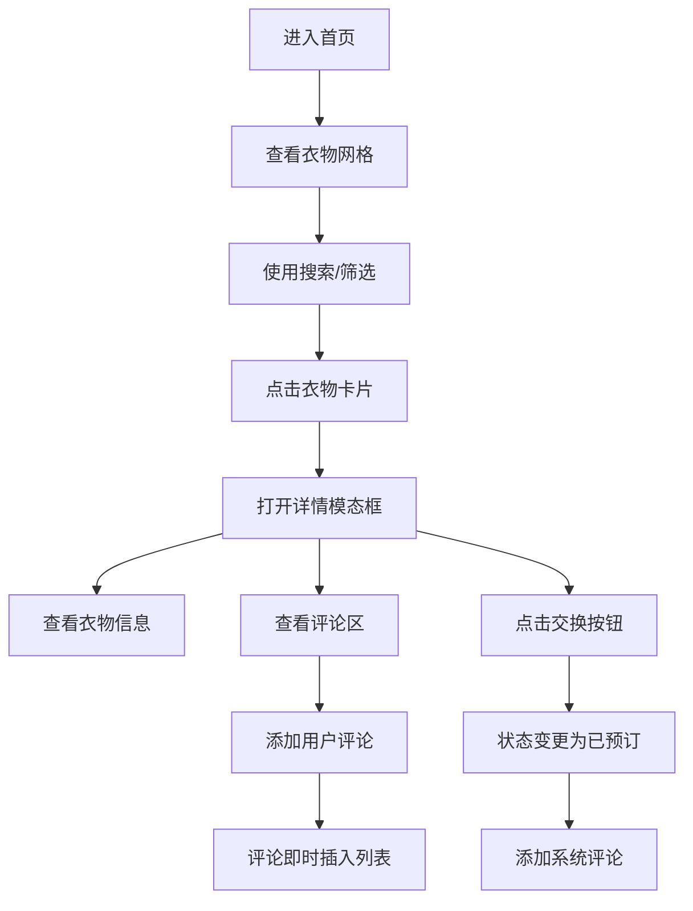

## 1. 产品概述
社区衣橱是一个虚拟衣物交换平台，让用户浏览、发布和交换闲置衣物，通过共享经济模式减少衣物浪费，打造可持续的时尚消费社区。

- 主要目的：提供便捷的闲置衣物交换平台，连接有闲置衣物和需要衣物的用户
- 解决的问题：减少衣物浪费，降低时尚消费成本，促进可持续生活方式
- 目标用户：关注环保、喜欢时尚、有闲置衣物需要处理的年轻人群
- 市场价值：推动循环经济，降低消费成本，构建社区化的衣物共享生态

## 2. 核心功能

### 2.1 用户角色
| 角色 | 注册方式 | 核心权限 |
|------|----------|----------|
| 普通用户 | 模拟用户数据 | 浏览衣物、查看详情、发起交换、发表评论 |

### 2.2 功能模块
1. **首页**：衣物卡片网格展示、搜索框、尺码筛选、顶部导航
2. **衣物详情模态框**：大图展示、衣物信息、交换按钮、评论区
3. **评论系统**：评论列表展示、评论输入、评论提交

### 2.3 页面详情
| 页面名称 | 模块名称 | 功能描述 |
|----------|----------|----------|
| 首页 | 衣物网格 | 5列自适应网格布局展示衣物卡片，支持stagger入场动画 |
| 首页 | 搜索过滤 | 搜索框实时过滤（防抖300ms），尺码下拉筛选 |
| 详情模态框 | 衣物信息 | 大图、名称、尺码、描述、状态标签展示 |
| 详情模态框 | 交换功能 | 点击交换按钮更新衣物状态，添加评论 |
| 详情模态框 | 评论区 | 展示最近5条评论，支持添加新评论并滚动到底部 |

## 3. 核心流程

用户浏览主页面 → 查看衣物卡片网格 → 使用搜索/筛选功能 → 点击衣物卡片 → 打开详情模态框 → 查看衣物信息和评论 → 点击交换按钮 → 衣物状态更新 → 添加系统评论 → 用户可添加个人评论

## 4. 用户界面设计

### 4.1 设计风格
- 主背景：#0F0F23（深色科技感背景）
- 卡片背景：#1E1E2E
- 边框颜色：#3A3A5C
- 文字颜色：#E0E0E0
- 可交换状态：绿色#4ECDC4
- 已预订状态：橙色#FF6B6B
- 按钮渐变：从#6C63FF到#4ECDC4
- 设计风格：深色科技感，现代简约，卡片式布局

### 4.2 页面设计概述
| 页面名称 | 模块名称 | UI元素 |
|----------|----------|--------|
| 首页 | 顶部导航 | 左侧搜索框（圆角20px），右侧尺码筛选（圆角8px） |
| 首页 | 衣物网格 | 卡片宽度220px，圆角14px，1px边框，hover上浮5px，阴影效果 |
| 首页 | 状态标签 | 左上角彩色标签，绿色/橙色区分状态 |
| 详情模态框 | 左侧大图 | 300x300px，圆角12px，渐变占位 |
| 详情模态框 | 右侧信息 | 名称、尺码、描述（200字）、交换按钮 |
| 详情模态框 | 交换按钮 | 渐变背景，hover渐变方向变换，点击缩放动画 |
| 详情模态框 | 评论区 | 圆形头像（32px），1px分割线，输入框400px宽 |

### 4.3 响应式
- 大屏（≥1280px）：5列网格，卡片等宽填充
- 中屏（≥768px）：3列网格
- 小屏（<768px）：2列网格
- 小屏详情模态框：全屏显示，圆角0

### 4.4 动画效果
- 卡片加载：stagger动画，依次从下方淡入，间隔50ms
- 模态框：流畅的打开/关闭动画，60fps
- 按钮hover：渐变方向变化
- 按钮点击：transform: scale(0.95) 缩放动画
