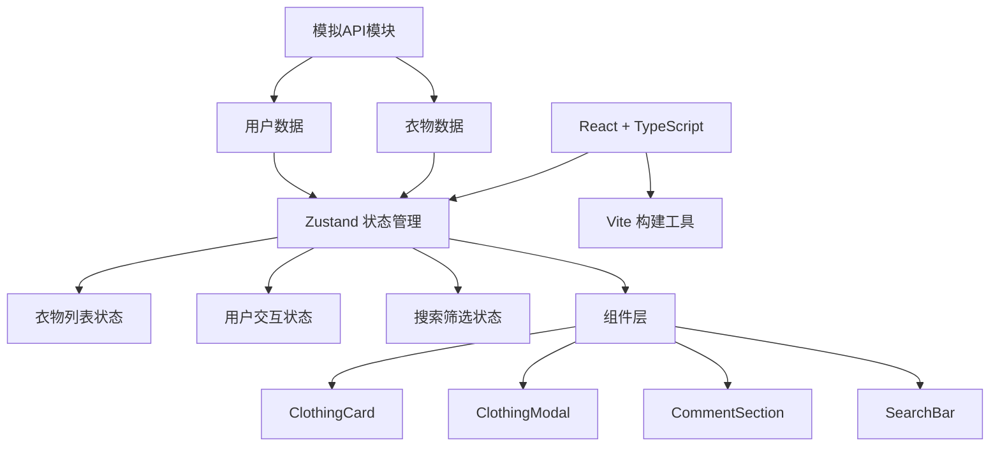

## 1. 架构设计



## 2. 技术描述
- 前端：React@18 + TypeScript + Zustand + Vite
- 初始化工具：vite-init react-ts 模板
- 后端：无，使用模拟API模块提供数据
- 数据库：无，使用内存模拟数据
- 样式：CSS Modules / 内联样式

## 3. 目录结构
```
src/
├── api/
│   └── mockApi.ts        # 模拟API模块
├── components/
│   ├── ClothingCard.tsx  # 衣物卡片组件
│   ├── ClothingModal.tsx # 详情模态框组件
│   ├── CommentSection.tsx # 评论区组件
│   └── SearchBar.tsx     # 搜索栏组件
├── store/
│   └── useSwapStore.ts   # Zustand状态管理
├── types/
│   └── index.ts          # TypeScript类型定义
├── utils/
│   └── helpers.ts        # 工具函数
├── App.tsx               # 根组件
├── main.tsx              # 入口文件
└── index.css             # 全局样式
```

## 4. 路由定义
| 路由 | 用途 |
|------|------|
| / | 首页，展示衣物网格和搜索功能 |

## 5. 数据模型

### 5.1 类型定义
```typescript
type ClothingStatus = 'available' | 'reserved';

interface Clothing {
  id: string;
  name: string;
  description: string;
  size: 'S' | 'M' | 'L' | 'XL';
  status: ClothingStatus;
  imageUrl: string;
  ownerId: string;
  createdAt: string;
}

interface User {
  id: string;
  name: string;
  avatar: string;
}

interface Comment {
  id: string;
  content: string;
  userId: string;
  clothingId: string;
  createdAt: string;
}

interface SwapStore {
  clothings: Clothing[];
  users: User[];
  comments: Comment[];
  selectedClothing: Clothing | null;
  searchQuery: string;
  sizeFilter: string;
  isModalOpen: boolean;
  // actions
  setSearchQuery: (query: string) => void;
  setSizeFilter: (size: string) => void;
  selectClothing: (clothing: Clothing | null) => void;
  openModal: (clothing: Clothing) => void;
  closeModal: () => void;
  swapClothing: (clothingId: string) => void;
  addComment: (clothingId: string, content: string, userId: string) => void;
  getFilteredClothings: () => Clothing[];
  getCommentsByClothingId: (clothingId: string) => Comment[];
  getUserById: (userId: string) => User | undefined;
}
```

## 6. 性能优化
- 防抖搜索：300ms防抖处理搜索输入
- 虚拟列表：衣物卡片使用CSS优化渲染
- 状态选择：Zustand使用selector避免不必要重渲染
- 图片懒加载：衣物图片使用懒加载
- 组件拆分：合理拆分组件，减少重渲染范围
- CSS动画：使用transform和opacity属性实现60fps动画
