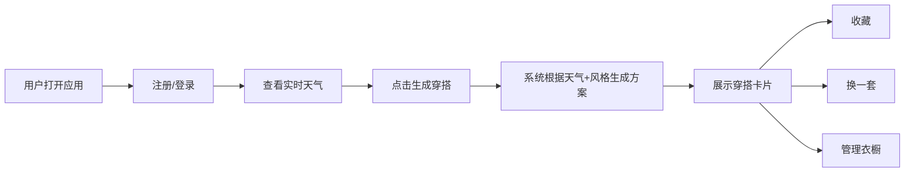

## 1. 产品概述

每日穿搭推荐应用，根据用户心情与实时天气自动生成个性化穿搭方案，解决每日穿衣纠结难题。

- 核心价值：基于天气数据和用户风格偏好，智能推荐合适穿搭，节省决策时间
- 目标用户：关注穿搭、追求效率的年轻群体

## 2. 核心功能

### 2.1 用户角色

| 角色 | 注册方式 | 核心权限 |
|------|----------|----------|
| 普通用户 | 用户名注册 | 注册登录、生成穿搭、管理衣橱、收藏搭配 |

### 2.2 功能模块

1. **首页**：天气卡片、穿搭生成、穿搭结果展示、收藏/换一套
2. **衣橱页**：单品列表、添加单品、编辑删除单品
3. **注册登录**：用户信息注册、风格偏好设置

### 2.3 页面详情

| 页面名称 | 模块名称 | 功能描述 |
|-----------|-----------|------------|
| 首页 | 天气卡片 | 显示城市、温度、天气图标、湿度，每5分钟随机更新 |
| 首页 | 穿搭生成按钮 | 点击生成基于天气和风格偏好生成穿搭方案 |
| 首页 | 穿搭结果卡片 | 展示上衣、下装、鞋子、配饰及推荐理由 |
| 首页 | 收藏/换一套 | 收藏当前搭配或重新生成 |
| 衣橱页 | 单品列表 | 展示用户衣橱中的所有单品 |
| 衣橱页 | 添加单品表单 | 添加单品类型、名称、季节、颜色 |
| 注册页 | 用户注册 | 用户名、风格偏好、身高体重 |

## 3. 核心流程

用户打开应用 → 注册/登录 → 查看天气 → 点击生成穿搭 → 查看穿搭结果 → 收藏或换一套 → 管理衣橱单品

## 4. 用户界面设计

### 4.1 设计风格

- **主色调**：米白 #F5F0EB、驼色 #B8A49E
- **强调色**：珊瑚橙 #FF7F6E（按钮、天气图标）
- **背景**：径向渐变 #F5F0EB 到 #E8DED5
- **按钮**：圆角设计，hover 放大 105%，加深阴影
- **字体**：温暖柔和的无衬线字体
- **图标**：使用 emoji 表示穿搭单品（🧥👖👟🧣）

### 4.2 页面设计概览

| 页面名称 | 模块名称 | UI 元素 |
|-----------|-----------|----------|
| 首页 | 天气卡片 | 宽 280px，圆角 20px，背景 #FFFFFF 加模糊效果 |
| 首页 | 穿搭结果卡片 | 宽 320px，圆角 16px，浅阴影，从下向上滑入动画 0.4s |
| 首页 | 收藏按钮 | 心形动画，点击后变色 #FF3366 |
| 衣橱页 | 单品卡片 | 网格布局，响应式设计 |

### 4.3 响应式设计

- 桌面端：卡片横向并排布局
- 移动端（<640px）：卡片纵向堆叠，宽度自适应
- 触摸优化：按钮最小尺寸 44x44px

### 4.4 动画效果

- 穿搭卡片入场：从下向上滑入 + 淡入，0.4s ease-out
- 按钮 hover：放大 105%，加深阴影
- 收藏按钮：缩小动画 + 变色 #FF3366
- 天气卡片：毛玻璃效果 backdrop-filter: blur(8px)
