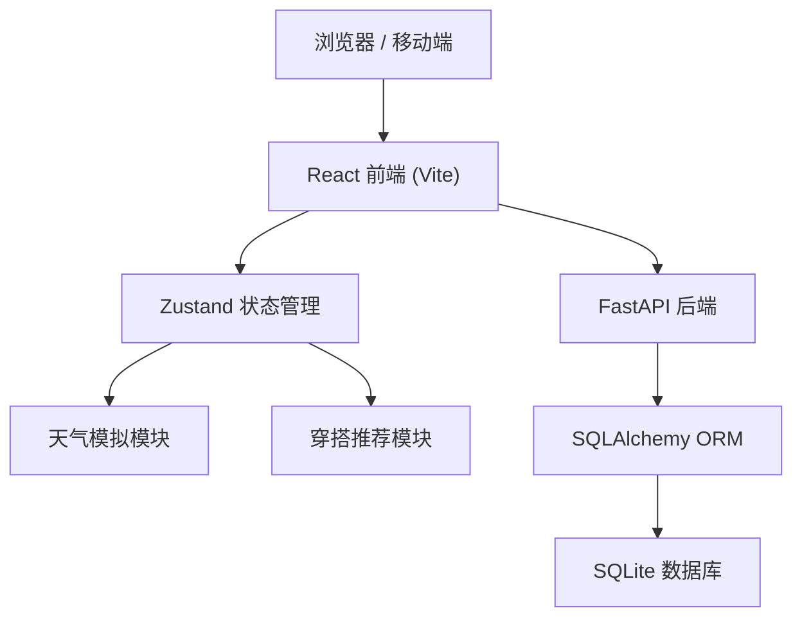
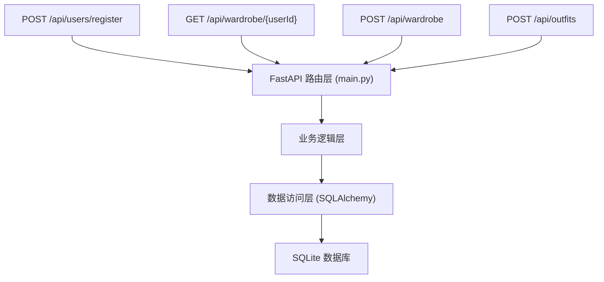
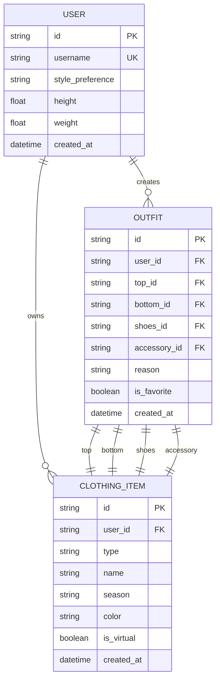

## 1. 架构设计



## 2. 技术栈描述

- **前端**：React 18 + TypeScript + Vite + Zustand + React Router DOM
- **构建工具**：Vite 5.x
- **状态管理**：Zustand 4.x
- **后端**：FastAPI + Uvicorn
- **数据库**：SQLite + SQLAlchemy ORM
- **HTTP 客户端**：Fetch API (原生)
- **包管理**：npm

## 3. 项目目录结构

```
auto390/
├── package.json
├── vite.config.js
├── tsconfig.json
├── index.html
├── src/
│   ├── main.tsx
│   ├── App.tsx
│   ├── store/
│   │   └── useStore.ts
│   ├── utils/
│   │   ├── weatherSimulator.ts
│   │   └── outfitRecommender.ts
│   └── pages/
│       ├── HomePage.tsx
│       └── WardrobePage.tsx
└── backend/
    ├── main.py
    ├── database.py
    └── models.py
```

## 4. 路由定义

| 路由 | 页面 | 说明 |
|------|------|------|
| / | 首页 | 天气展示、生成穿搭、结果展示 |
| /wardrobe | 衣橱页 | 单品管理（增删改查） |
| /register | 注册页 | 用户注册表单 |

## 5. API 定义

### TypeScript 类型定义

```typescript
interface User {
  id: string;
  username: string;
  stylePreference: 'casual' | 'business' | 'sports' | 'vintage';
  height: number;
  weight: number;
}

interface Weather {
  city: string;
  temperature: number;
  condition: 'sunny' | 'cloudy' | 'rainy' | 'snowy';
  humidity: number;
  icon: string;
}

interface ClothingItem {
  id: string;
  userId: string;
  type: 'top' | 'bottom' | 'shoes' | 'accessory';
  name: string;
  season: 'spring' | 'summer' | 'autumn' | 'winter' | 'all';
  color: string;
  isVirtual?: boolean;
}

interface Outfit {
  id: string;
  userId: string;
  top: ClothingItem;
  bottom: ClothingItem;
  shoes: ClothingItem;
  accessory: ClothingItem;
  reason: string;
  createdAt: string;
  isFavorite: boolean;
}
```

### RESTful API 接口

| 方法 | 路径 | 说明 | 请求体 | 响应 |
|------|------|------|--------|------|
| POST | /api/users/register | 用户注册 | { username, stylePreference, height, weight } | User |
| POST | /api/users/login | 用户登录 | { username } | User |
| GET | /api/users/{id} | 获取用户信息 | - | User |
| GET | /api/wardrobe/{userId} | 获取衣橱列表 | - | ClothingItem[] |
| POST | /api/wardrobe | 添加单品 | ClothingItem (without id) | ClothingItem |
| PUT | /api/wardrobe/{id} | 更新单品 | ClothingItem | ClothingItem |
| DELETE | /api/wardrobe/{id} | 删除单品 | - | { success: boolean } |
| GET | /api/outfits/{userId} | 获取穿搭历史 | - | Outfit[] |
| POST | /api/outfits | 保存穿搭 | Outfit (without id) | Outfit |
| PUT | /api/outfits/{id}/favorite | 切换收藏 | { isFavorite: boolean } | Outfit |

## 6. 服务端架构图



## 7. 数据模型

### 7.1 ER 图



### 7.2 核心模块说明

**天气模拟模块 (weatherSimulator.ts)**
- 生成随机天气数据（城市、温度、天气状况、湿度）
- 每 5 分钟自动更新一次
- 温度范围：-10°C ~ 35°C
- 天气状况：晴、多云、雨、雪

**穿搭推荐模块 (outfitRecommender.ts)**
- 基于温度区间的穿搭规则
- 结合天气状况（晴/雨/雪）调整推荐
- 匹配用户风格偏好（休闲/商务/运动/复古）
- 优先使用衣橱中的真实单品
- 不足时补充虚拟单品

**状态管理 (useStore.ts)**
- user：当前登录用户信息
- weather：当前天气数据
- currentOutfit：当前生成的穿搭方案
- wardrobe：用户衣橱单品列表
- outfits：历史穿搭记录

## 8. 性能指标

- 穿搭生成到渲染完成：≤ 800ms
- 页面首屏加载：≤ 2s
- 天气数据更新：每 5 分钟
- 动画流畅度：60fps
