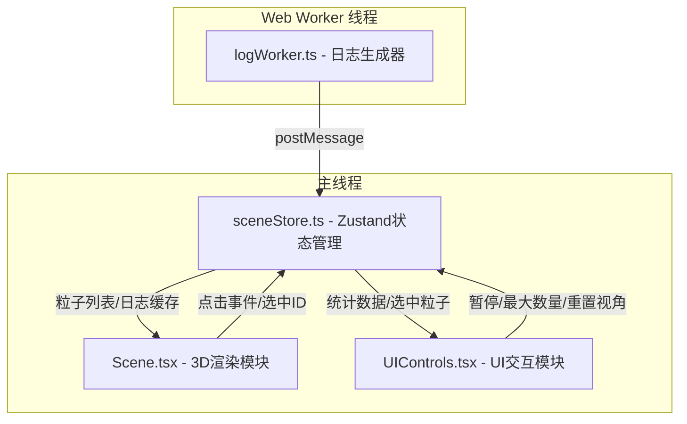

## 1. 架构设计



## 2. 技术说明

- **前端框架**：React 18 + TypeScript
- **3D渲染**：Three.js + @react-three/fiber + @react-three/drei
- **状态管理**：Zustand
- **构建工具**：Vite（开发服务器端口3000）
- **唯一ID**：uuid
- **无后端**：纯前端项目，日志由Web Worker模拟生成

## 3. 路由定义

| 路由 | 用途 |
|------|------|
| / | 主页面，包含3D粒子瀑布场景和所有UI叠加层 |

## 4. 文件结构

```
├── package.json
├── index.html
├── tsconfig.json
├── vite.config.js
└── src/
    ├── types.ts              # 类型定义（LogEvent, ParticleState, SceneState）
    ├── worker/
    │   └── logWorker.ts      # Web Worker日志生成器
    ├── store/
    │   └── sceneStore.ts     # Zustand状态管理
    ├── components/
    │   ├── Scene.tsx          # Three.js场景渲染
    │   └── UIControls.tsx    # React UI组件
    └── main.tsx              # 应用入口
```

## 5. 数据模型

### 5.1 类型定义

```typescript
interface LogEvent {
  id: string;
  timestamp: number;
  level: 'INFO' | 'WARN' | 'ERROR';
  message: string;
  source: string;
}

interface ParticleState {
  id: string;
  logEvent: LogEvent;
  position: { x: number; y: number; z: number };
  startTime: number;
  duration: number;
  sinOffsetX: number;
  sinOffsetZ: number;
  phaseX: number;
  phaseZ: number;
}

interface SceneState {
  logs: LogEvent[];
  particles: ParticleState[];
  isPaused: boolean;
  maxParticles: number;
  selectedParticleId: string | null;
  addLogs: (logs: LogEvent[]) => void;
  setPaused: (paused: boolean) => void;
  setMaxParticles: (max: number) => void;
  setSelectedParticleId: (id: string | null) => void;
  updateParticles: () => void;
}
```

### 5.2 粒子渲染映射

| 日志级别 | 颜色 | 形状 | 16进制 |
|---------|------|------|--------|
| INFO | 青色 | 小圆球（SphereGeometry） | #00E5FF |
| WARN | 橙黄 | 八面体（OctahedronGeometry） | #FFAB00 |
| ERROR | 绯红 | 星形（自定义几何体） | #FF1744 |

### 5.3 粒子运动参数

- 起始位置：y=10，x和z在[-3, 3]范围随机
- 终止位置：y=-10
- 坠落时长：2-5秒随机
- S形漂移：正弦函数偏移x和z轴，幅度0.5，相位随机
- 大小变化：从0.3线性缩小到0.1
- 透明度：0.3
- 呼吸脉冲：频率0.8Hz

## 6. 性能策略

- Web Worker每100ms生成日志，避免阻塞主线程
- 粒子达到最大数量时自动丢弃最旧的粒子
- 使用instancedMesh或逐帧更新优化大量粒子渲染
- 目标帧率55FPS以上
