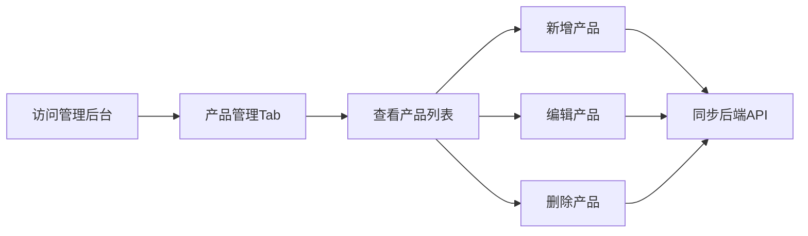

# 皮具工坊 - 产品需求文档 (PRD)

## 1. 产品概述

皮具工坊是一个面向小型手工艺工作室的在线产品展示与库存管理平台，帮助手工皮具产品进行线上展示，客户可浏览产品详情并提交定制化询价请求，作坊主则能在后台管理产品信息和查看询价记录。

- **目标用户**：手工皮具工作室负责人（管理员）和潜在客户（访客）
- **核心价值**：简化产品展示流程，收集客户询价需求，提供高效的库存管理工具

## 2. 核心功能

### 2.1 用户角色

| 角色 | 访问方式 | 核心权限 |
|------|----------|----------|
| 访客 | 公开访问 | 浏览产品列表、查看产品详情、提交询价请求 |
| 管理员 | `/admin` 路由 | 产品 CRUD 管理、查看询价记录 |

### 2.2 功能模块

1. **产品展示页面** (`/`)：响应式产品卡片网格、产品详情 Modal、定制询价表单
2. **后台管理页面** (`/admin`)：产品管理表格、询价记录表格、Tab 切换导航

### 2.3 页面详情

| 页面名称 | 模块名称 | 功能描述 |
|----------|----------|----------|
| 产品展示页 | 产品卡片网格 | 响应式布局（桌面4列/平板2列/手机1列），卡片阴影、圆角、悬停上浮动画 |
| 产品展示页 | 产品详情 Modal | 产品大图、描述、价格、库存状态、定制询价表单 |
| 产品展示页 | 询价表单 | 姓名、联系方式、消息文本框，提交成功后绿色勾选反馈动画 |
| 后台管理页 | 产品管理 Tab | 产品表格（名称、价格、库存、操作），新增/编辑/删除产品 |
| 后台管理页 | 询价管理 Tab | 询价记录表格（产品名称、客户名、联系方式、消息、提交时间），按时间倒序，只读 |
| 后台管理页 | 产品表单 Modal | 新增/编辑产品的表单弹窗 |
| 后台管理页 | 删除确认对话框 | 删除产品前的二次确认 |

## 3. 核心流程

### 3.1 访客浏览与询价流程

访客访问首页 → 浏览产品卡片网格 → 点击"查看详情"按钮 → 弹出产品详情 Modal → 填写询价表单（姓名、联系方式、消息）→ 提交表单 → 显示成功反馈动画

### 3.2 管理员产品管理流程

管理员访问 `/admin` → 切换到"产品管理"Tab → 查看产品表格 → 新增/编辑/删除产品 → 数据同步到后端

### 3.3 管理员查看询价流程

管理员访问 `/admin` → 切换到"询价管理"Tab → 查看按时间倒序排列的询价记录

## 4. 用户界面设计

### 4.1 设计风格

- **主色调**：皮革棕 `#8B5A2B`
- **背景色**：米白 `#FFF8F0`
- **深色导航/按钮**：深棕 `#5C3A21`
- **文字主色**：深灰 `#2E2E2E`
- **圆角**：卡片/表格 12px，Modal 16px
- **阴影**：柔和盒阴影 `0 2px 8px rgba(0,0,0,0.08)`
- **按钮交互**：悬停背景色渐变过渡 0.2s ease-in-out，点击缩放 scale 0.96
- **卡片悬停**：上浮动画 `translateY(-4px)`，过渡 0.2s

### 4.2 页面设计概览

| 页面名称 | 模块名称 | UI 元素 |
|----------|----------|---------|
| 产品展示页 | 顶部导航 | 品牌名称、管理后台入口 |
| 产品展示页 | 产品网格 | 响应式卡片、图片、名称、价格、查看详情按钮 |
| 产品展示页 | 详情 Modal | 半透明遮罩、产品大图、描述、价格库存、询价表单、成功反馈 |
| 后台管理页 | Tab 导航 | 产品管理/询价管理切换 |
| 后台管理页 | 产品表格 | 数据行、操作按钮、新增按钮 |
| 后台管理页 | 询价表格 | 数据行、按时间倒序 |

### 4.3 响应式设计

- **桌面端**：最大宽度 1200px 居中，产品网格 4 列
- **平板端**：产品网格 2 列
- **手机端**：产品网格 1 列，适当缩小字体

### 4.4 动画效果

- **页面切换**：React Router 淡入动画，opacity 0→1，0.3s
- **卡片悬停**：上浮 translateY(-4px)，0.2s
- **按钮悬停**：背景色过渡，0.2s ease-in-out
- **按钮点击**：缩放 scale 0.96
- **Modal 成功反馈**：绿色勾选淡入，opacity 0→1，0.5s
