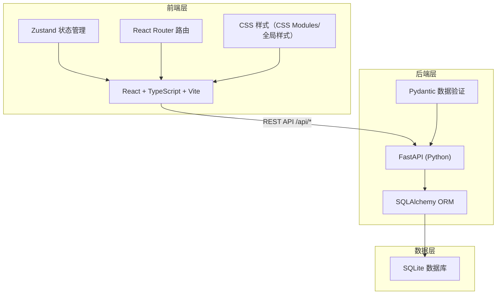
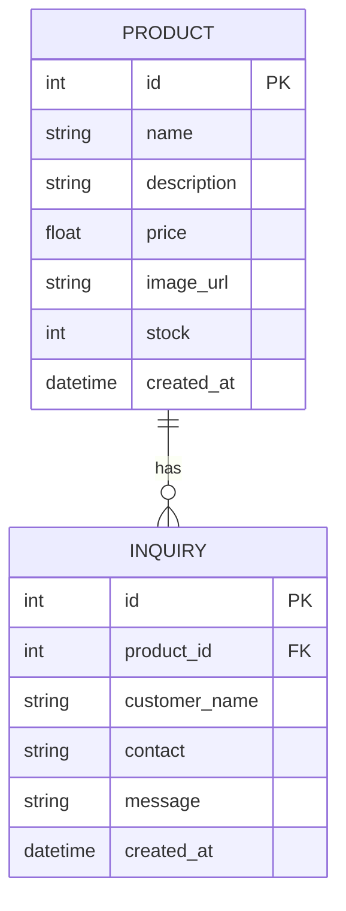

# 皮具工坊 - 技术架构文档

## 1. 架构设计



## 2. 技术说明

| 层级 | 技术栈 | 说明 |
|------|--------|------|
| 前端框架 | React 18 + TypeScript | 使用函数组件 + Hooks |
| 构建工具 | Vite | 快速开发构建，代理 `/api` 到后端 8000 端口 |
| 状态管理 | Zustand | 管理 productList、inquiryList、loading、error |
| 路由 | react-router-dom v6 | `/` 产品展示，`/admin` 后台管理 |
| 唯一ID | uuid | 前端临时 ID 生成 |
| 后端框架 | FastAPI | Python 异步 Web 框架 |
| ORM | SQLAlchemy | 操作 SQLite 数据库 |
| 数据验证 | Pydantic | 请求/响应数据模型验证 |
| 数据库 | SQLite | 轻量级本地数据库 |

## 3. 项目结构

```
auto392/
├── backend/
│   └── main.py              # FastAPI 应用入口
├── frontend/
│   ├── index.html           # 入口页面
│   ├── package.json         # 前端依赖
│   ├── vite.config.ts       # Vite 构建配置
│   ├── tsconfig.json        # TypeScript 配置
│   └── src/
│       ├── App.tsx          # 主应用组件
│       ├── store.ts         # Zustand 状态管理
│       └── pages/
│           ├── ProductList.tsx  # 产品展示页
│           └── Admin.tsx        # 后台管理页
└── .trae/
    └── documents/
        ├── prd.md
        └── technical-architecture.md
```

### 文件调用关系与数据流向

1. **数据流向（产品列表）**：
   - `ProductList.tsx` → `store.ts` (fetchProducts) → `fetch('/api/products')` → `backend/main.py` (GET /api/products) → SQLAlchemy → SQLite
   - 返回数据存入 Zustand store → 组件响应式渲染

2. **数据流向（提交询价）**：
   - `ProductList.tsx` 表单提交 → `store.ts` (submitInquiry) → `fetch('/api/inquiries', POST)` → `backend/main.py` (POST /api/inquiries) → SQLAlchemy → SQLite

3. **数据流向（产品管理）**：
   - `Admin.tsx` → `store.ts` (增删改 actions) → `fetch('/api/products', POST/PUT/DELETE)` → `backend/main.py` → SQLAlchemy → SQLite

## 4. 路由定义

| 路由 | 页面 | 说明 |
|------|------|------|
| `/` | 产品展示页 | 公开访问，产品卡片网格 + 详情 Modal + 询价表单 |
| `/admin` | 后台管理页 | 产品管理 + 询价管理，Tab 切换 |

## 5. API 定义

### 5.1 产品相关 API

#### GET /api/products
获取产品列表

**响应：**
```json
[
  {
    "id": 1,
    "name": "产品名称",
    "description": "产品描述",
    "price": 299.0,
    "image_url": "https://...",
    "stock": 10,
    "created_at": "2024-01-01T00:00:00"
  }
]
```

#### POST /api/products
新增产品

**请求体：**
```json
{
  "name": "产品名称",
  "description": "产品描述",
  "price": 299.0,
  "image_url": "https://...",
  "stock": 10
}
```

#### GET /api/products/{id}
获取单个产品详情

#### PUT /api/products/{id}
更新产品信息

#### DELETE /api/products/{id}
删除产品

### 5.2 询价相关 API

#### POST /api/inquiries
提交询价

**请求体：**
```json
{
  "product_id": 1,
  "customer_name": "客户姓名",
  "contact": "联系方式",
  "message": "询价消息"
}
```

#### GET /api/inquiries
获取所有询价记录（按时间倒序）

## 6. 数据模型

### 6.1 ER 图



### 6.2 表结构

**products 表：**
| 字段 | 类型 | 约束 | 说明 |
|------|------|------|------|
| id | Integer | PK, AUTOINCREMENT | 主键 |
| name | String | NOT NULL | 产品名称 |
| description | Text | | 产品描述 |
| price | Float | NOT NULL | 价格 |
| image_url | String | | 图片 URL |
| stock | Integer | NOT NULL, DEFAULT 0 | 库存数量 |
| created_at | DateTime | DEFAULT NOW | 创建时间 |

**inquiries 表：**
| 字段 | 类型 | 约束 | 说明 |
|------|------|------|------|
| id | Integer | PK, AUTOINCREMENT | 主键 |
| product_id | Integer | FK, NOT NULL | 关联产品 ID |
| customer_name | String | NOT NULL | 客户姓名 |
| contact | String | NOT NULL | 联系方式 |
| message | Text | | 询价消息 |
| created_at | DateTime | DEFAULT NOW | 提交时间 |

### 6.3 索引

- `products` 表：`id` 主键索引
- `inquiries` 表：`id` 主键索引，`product_id` 外键索引，`created_at` 索引（用于排序优化）

### 6.4 初始数据

应用启动时若数据库为空，自动插入 5 条预设产品示例数据：
1. 手工皮革钱包
2. 复古皮质笔记本
3. 皮带（棕色）
4. 皮革钥匙扣
5. 手工皮包

## 7. 性能要求

- 前端初始数据请求 ≤ 200ms（本地环境）
- 后端 API 响应 ≤ 100ms（本地环境）
- Zustand store 数据缓存，避免重复请求
- 数据库查询使用索引优化
