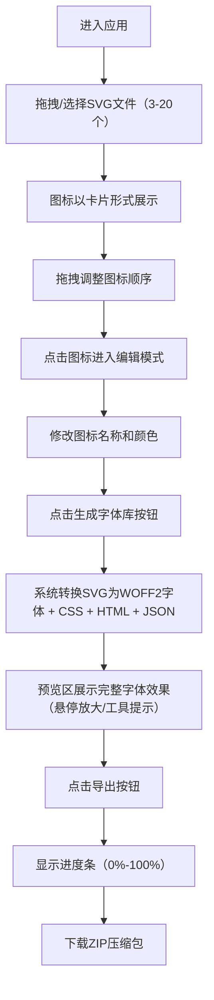

## 1. 产品概述

字体工坊是一款Web端SVG图标批量转换工具，旨在将本地SVG图标文件一键转换为统一风格的Web字体图标库，解决设计师和开发者手动整理、转换多种格式图标为字体文件的繁琐过程。

- 核心价值：提升图标字体制作效率，从上传到生成仅需数秒
- 目标用户：前端开发者、UI设计师、需要批量管理图标资源的团队

## 2. 核心功能

### 2.1 用户角色

| 角色 | 注册方式 | 核心权限 |
|------|----------|----------|
| 普通用户 | 无需注册，直接使用 | 上传SVG、编辑图标、生成字体、导出资源 |

### 2.2 功能模块

1. **主界面**：顶部导航栏、拖拽上传区、图标网格展示区、编辑面板、字体预览区、导出操作区

### 2.3 页面详情

| 页面名称 | 模块名称 | 功能描述 |
|----------|----------|----------|
| 主界面 | 顶部导航栏 | 显示应用名称"字体工坊"、生成字体按钮、导出按钮 |
| 主界面 | 拖拽上传区 | 支持拖拽上传/点击选择SVG文件（3-20个，每个≤500KB），带拖拽状态反馈和脉冲动画 |
| 主界面 | 图标网格展示 | 以卡片形式展示已上传图标（80×80px），支持拖拽排序、悬停缩放投影效果 |
| 主界面 | 编辑面板 | 选中图标后可修改名称（输入框）和颜色（8色预置色板选择器） |
| 主界面 | 字体预览区 | 实时预览所有图标以16×16网格排布的字体效果，生成后展示完整字体预览（含悬停放大和工具提示） |
| 主界面 | 导出操作区 | 一键导出ZIP包（含.woff2、.css、.html、.json），带进度条动画 |

## 3. 核心流程

## 4. 用户界面设计

### 4.1 设计风格

- **主色调**：深色主题
  - 主背景：#0F0F1A
  - 卡片背景：#1A1A2E
  - 强调色：#00D4AA（薄荷绿）
  - 警告色：#FF6B6B
  - 文字色：#E0E0E0
  - 次级背景：#1E1E2E / #282840 / #2A2A3E / #3A3A50 / #121218
  - 边框色：#4A4A5E
- **按钮风格**：圆角按钮，悬停背景变亮10%，加载时显示旋转圆圈动画
- **字体**：现代无衬线字体，清晰易读
- **布局风格**：左右分栏Flexbox响应式布局，左侧上传+图标网格，右侧编辑+预览
- **图标/视觉细节**：使用SVG原生图标，强调色投影效果

### 4.2 页面设计概览

| 页面名称 | 模块名称 | UI元素 |
|----------|----------|--------|
| 主界面 | 顶部导航栏 | 高度60px，背景#1A1A2E，底部2px强调色线条，左侧应用名称，右侧操作按钮 |
| 主界面 | 拖拽上传区 | 背景#1E1E2E，圆角16px，虚线边框#4A4A5E；拖拽中背景#2A2A3E，边框#00D4AA + 脉冲动画 |
| 主界面 | 图标卡片 | 80×80px，圆角8px，背景#282840，悬停缩放105% + #00D4AA投影，淡入动画0.3s ease-out |
| 主界面 | 编辑输入框 | 背景#3A3A50，圆角6px，文字#E0E0E0 |
| 主界面 | 颜色选择器 | 8种预置色板的色块选择器 |
| 主界面 | 字体预览框 | 宽600px高400px，背景#121218，圆角12px，16×16网格排布，图标32px间距8px，悬停放大1.2倍+工具提示 |
| 主界面 | 进度条 | 绿色#00D4AA，高度8px，圆角4px，带百分比文字 |

### 4.3 响应式设计

- 设计优先：桌面端优先
- 响应式：图标网格采用 `grid-template-columns: repeat(auto-fill, minmax(80px, 120px))` 自动填充
- 移动端：左右分栏在窄屏下自动变为上下堆叠布局
- 触控优化：按钮和可点击区域最小尺寸44px

### 4.4 动画与过渡

- 图标卡片淡入：0.3s ease-out
- 所有交互过渡：0.2s平滑过渡
- 拖拽上传脉冲动画：边框呼吸闪烁效果
- 按钮悬停：背景变亮10%
- 选中状态：2px #00D4AA边框
- 加载状态：旋转圆圈动画
- 导出进度条：从0%平滑过渡到100%
