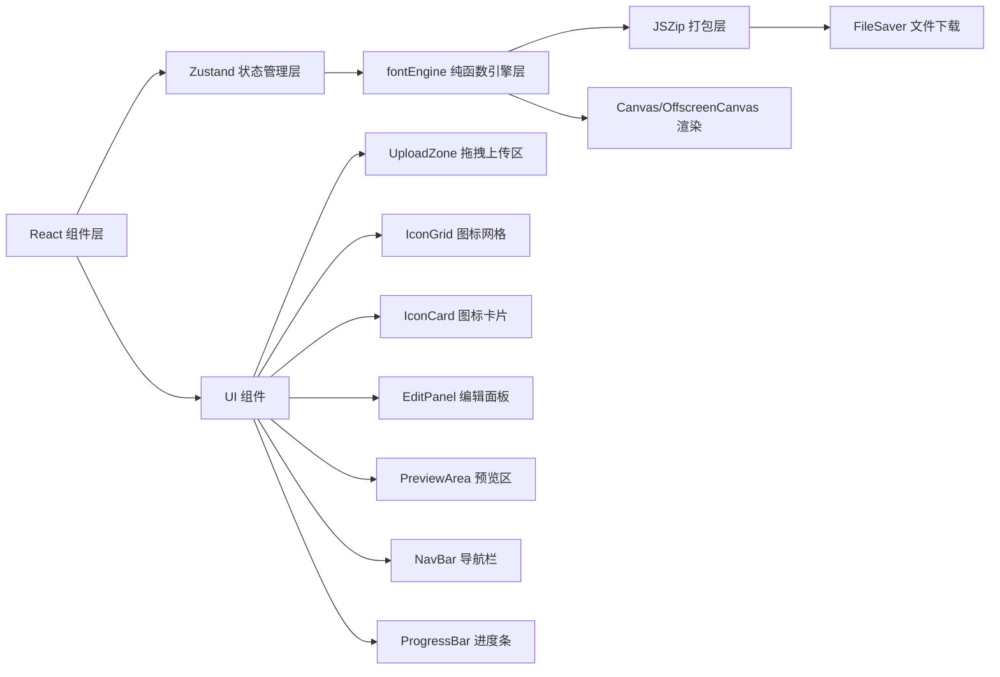

## 1. 架构设计



## 2. 技术描述

- **前端框架**：React@18 + TypeScript
- **构建工具**：Vite（开发端口3000）
- **状态管理**：Zustand（全局状态管理）
- **核心依赖**：
  - `uuid`：生成图标唯一ID
  - `jszip`：ZIP压缩包生成
  - `file-saver`：触发浏览器下载
  - `@vitejs/plugin-react`：Vite React插件
- **字体转换**：fontEngine纯函数模块，使用Canvas渲染SVG并编码为base64模拟WOFF2格式
- **无后端**：纯前端应用，所有处理在浏览器端完成

## 3. 文件结构

```
├── package.json
├── vite.config.js
├── tsconfig.json
├── index.html
└── src/
    ├── types.ts          # 类型定义（IconData接口等）
    ├── store.ts          # Zustand全局状态管理
    ├── fontEngine.ts     # 字体转换纯函数引擎
    └── App.tsx           # 主应用组件（含所有子组件）
```

## 4. 数据模型

### 4.1 核心数据结构

```typescript
interface IconData {
  id: string;           // UUID唯一标识
  name: string;         // 图标名称
  svgContent: string;   // SVG原始内容
  order: number;        // 排序序号
  color: string;        // 图标颜色（十六进制）
}

interface PreviewConfig {
  iconSize: number;     // 预览图标大小
  gap: number;          // 图标间距
}

interface FontResult {
  fontData: string;     // base64编码的字体数据
  cssContent: string;   // 生成的CSS样式表
  htmlDemo: string;     // HTML演示页
  jsonMetadata: string; // JSON元数据
}
```

### 4.2 Zustand Store State

```typescript
interface AppState {
  icons: IconData[];
  selectedIconId: string | null;
  previewConfig: PreviewConfig;
  isProcessing: boolean;
  isGenerating: boolean;
  exportProgress: number;
  fontResult: FontResult | null;
  
  // Actions
  addIcons: (files: File[]) => Promise<void>;
  removeIcon: (id: string) => void;
  reorderIcons: (fromIndex: number, toIndex: number) => void;
  updateIcon: (id: string, updates: Partial<IconData>) => void;
  selectIcon: (id: string | null) => void;
  generateFont: () => Promise<void>;
  exportZip: () => Promise<void>;
}
```

## 5. 性能指标

| 指标 | 目标值 |
|------|--------|
| 20个SVG批量转换（上传→预览） | ≤ 1秒（Intel i5或同等CPU） |
| ZIP文件生成 | ≤ 500毫秒 |
| 首次加载 | ≤ 2秒 |
| 交互响应延迟 | ≤ 100毫秒 |

## 6. 核心算法说明

### 6.1 SVG转字体模拟流程

1. 使用Canvas/OffscreenCanvas将SVG渲染为位图
2. 将位图数据编码为base64字符串模拟WOFF2字体数据
3. 为每个图标分配Unicode码点（从U+E000私有区开始）
4. 生成包含@font-face和.icon-*类的CSS样式表
5. 生成展示所有图标的HTML演示页
6. 生成包含名称、Unicode、颜色映射的JSON元数据

### 6.2 Unicode码点分配

- 起始码点：U+E000（私有使用区）
- 递增步长：1
- 最多支持：20个图标（U+E000 ~ U+E013）
