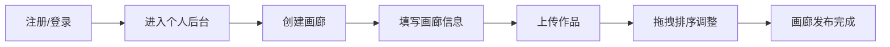
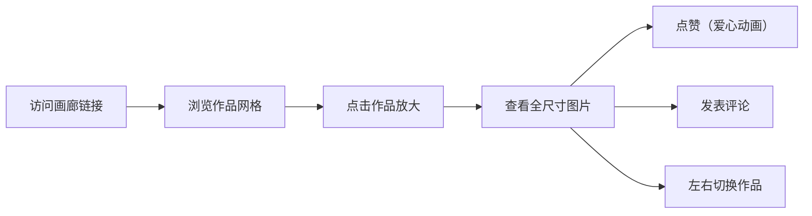

## 1. 产品概述

灵感画廊是一个面向插画师和设计师的虚拟在线画廊平台，允许创作者上传、策展和展示自己的插画作品，访客可以沉浸式漫游画廊并与作品互动。

- 目标用户：插画师、设计师（创作者）；艺术爱好者、潜在客户（访客）
- 核心价值：为创作者提供沉浸式的作品展示空间，为访客提供优秀的艺术浏览体验

## 2. 核心功能

### 2.1 用户角色

| 角色 | 注册方式 | 核心权限 |
|------|---------|---------|
| 画廊创建者 | 邮箱/用户名注册 | 创建/管理画廊、上传作品、设置展览信息 |
| 访客 | 无需注册 | 浏览画廊、查看作品、点赞、发表评论 |

### 2.2 功能模块

1. **用户认证模块**：注册、登录、个人信息管理
2. **画廊管理模块**：创建画廊、编辑画廊信息、删除画廊、封面设置
3. **作品管理模块**：批量上传图片、拖拽排序、删除作品、生成缩略图
4. **作品展示模块**：虚拟漫游网格布局、全尺寸图片查看器、导航切换
5. **用户交互模块**：点赞动画、评论发布、评论列表展示

### 2.3 页面详情

| 页面名称 | 模块名称 | 功能描述 |
|---------|---------|---------|
| 登录页 | 登录表单 | 用户名/密码登录，跳转注册链接 |
| 注册页 | 注册表单 | 用户名、邮箱、密码注册，跳转登录链接 |
| 个人后台页 | 画廊列表 | 展示所有画廊卡片、创建新画廊按钮、画廊管理操作 |
| 个人后台页 | 创建画廊弹窗 | 画廊名称、简介、封面图上传 |
| 个人后台页 | 作品上传区 | 批量上传、拖拽排序、删除作品、限制20张 |
| 画廊详情页 | 画廊封面区 | 大图展示+渐变遮罩、画廊信息、展览时间 |
| 画廊详情页 | 作品网格区 | 响应式网格（桌面4列/平板2列/手机1列）、缩略图卡片 |
| 画廊详情页 | 毛玻璃导航栏 | 页面底部固定、透明模糊背景 |
| 作品查看页 | 全尺寸查看器 | 居中弹窗、半透明背景、左右导航箭头、淡入淡出动画 |
| 作品查看页 | 作品信息区 | 作品标题、点赞按钮（带动画）、点赞数 |
| 作品查看页 | 评论区 | 评论输入框、提交按钮、评论列表（头像+时间戳） |

## 3. 核心流程

### 3.1 创作者主流程

创作者注册登录 → 进入个人后台 → 创建画廊（填写名称/简介/封面）→ 上传作品（批量/拖拽排序）→ 生成画廊链接 → 分享给访客

### 3.2 访客主流程

访问画廊链接 → 浏览画廊封面和作品网格 → 点击作品放大查看 → 点赞/发表评论 → 切换下一张作品

## 4. 用户界面设计

### 4.1 设计风格

- **主色调**：#E94560（霓虹玫瑰红）
- **辅助色**：#0F3460（深海蓝）
- **主背景**：#1A1A2E（深夜蓝紫）
- **卡片背景**：#16213E（暗蓝紫灰）
- **文字色**：#EEEEEE（浅灰白）
- **按钮风格**：圆角8px、主色调按钮悬停变暗、有按压反馈
- **字体**：Noto Sans SC（Google Fonts）
- **布局风格**：深色主题、卡片式布局、沉浸式视觉
- **图标风格**：线性图标、与主色调呼应

### 4.2 页面设计概览

| 页面名称 | 模块名称 | UI元素 |
|---------|---------|---------|
| 登录/注册页 | 表单区 | 居中卡片、渐变边框、输入框圆角8px、主色调提交按钮 |
| 个人后台页 | 画廊卡片 | 封面大图+渐变遮罩、悬浮上移-6px、0.2秒过渡、显示名称/作品数 |
| 画廊详情页 | 作品网格 | 4列响应式、缩略图200x200px、圆角12px、悬停105%缩放+阴影 |
| 作品查看页 | 图片弹窗 | 居中、圆角16px、半透明背景#000000CC、左右箭头导航、0.3秒淡入淡出 |
| 作品查看页 | 点赞按钮 | 灰#888→红#FF3366、放大1.3倍回弹动画 |
| 作品查看页 | 评论区 | textarea圆角8px、背景#F5F5F5、提交按钮#4A90D9悬停#357ABD |
| 所有页面 | 底部导航栏 | 毛玻璃backdrop-filter:blur(10px)、高度60px、淡入效果 |

### 4.3 响应式设计

- **桌面端**（≥1024px）：作品网格4列、画廊卡片横向排列
- **平板端**（768px-1023px）：作品网格2列、画廊卡片横向排列
- **手机端**（<768px）：作品网格1列、画廊卡片纵向堆叠、导航栏简化

### 4.4 动画与交互

- 页面切换：内容区域淡入动画0.5秒
- 画廊卡片：悬停translateY(-6px)，0.2秒过渡
- 作品缩略图：悬停scale(1.05) + 阴影
- 点赞动画：scale(1) → scale(1.3) → scale(1)，颜色渐变
- 图片切换：opacity 0→1淡入淡出0.3秒
- 导航栏：页面加载后淡入
