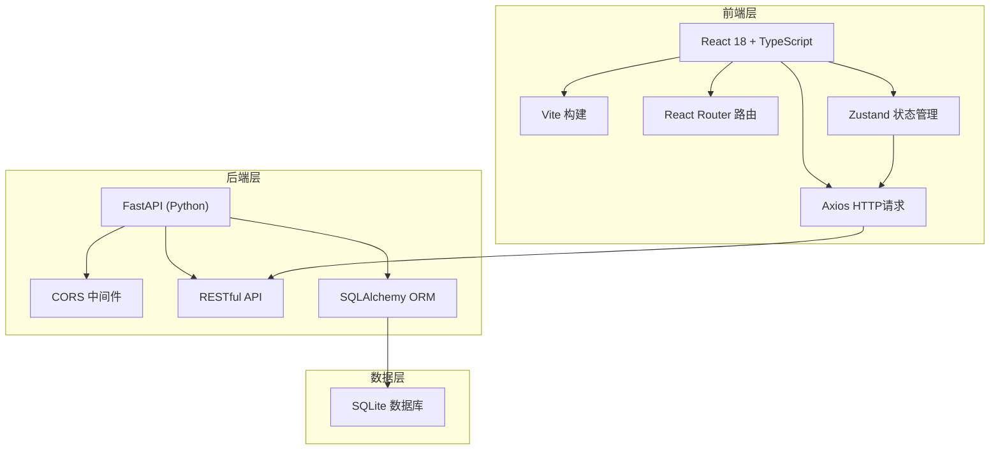
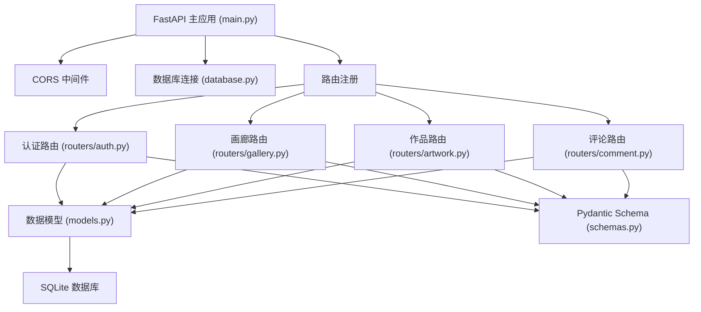
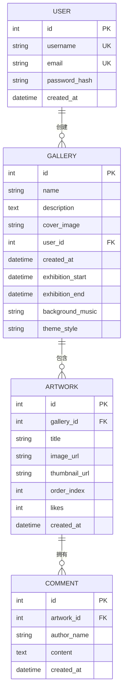

## 1. 架构设计



## 2. 技术说明

- **前端框架**：React 18 + TypeScript
- **构建工具**：Vite
- **路由管理**：react-router-dom v6
- **状态管理**：Zustand
- **HTTP客户端**：Axios
- **唯一ID生成**：uuid
- **后端框架**：FastAPI (Python)
- **ORM**：SQLAlchemy
- **数据库**：SQLite
- **ASGI服务器**：uvicorn

## 3. 路由定义

| 路由路径 | 页面组件 | 用途 |
|---------|---------|------|
| /login | LoginPage | 用户登录页 |
| /register | RegisterPage | 用户注册页 |
| /dashboard | DashboardPage | 个人后台（画廊管理） |
| /gallery/:id | GalleryDetailPage | 画廊详情页（作品网格漫游） |
| /view/:id | ArtworkViewPage | 作品查看页（全尺寸+评论） |

## 4. API定义

### 4.1 认证API (authApi)

| 方法 | 端点 | 请求体 | 响应 | 说明 |
|------|------|--------|------|------|
| POST | /api/auth/register | {username, email, password} | {id, username, email, token} | 用户注册 |
| POST | /api/auth/login | {username, password} | {id, username, email, token} | 用户登录 |

### 4.2 画廊API (galleryApi)

| 方法 | 端点 | 请求体 | 响应 | 说明 |
|------|------|--------|------|------|
| GET | /api/galleries | - | Gallery[] | 获取当前用户画廊列表 |
| POST | /api/galleries | FormData{name, description, cover_image} | Gallery | 创建新画廊 |
| GET | /api/galleries/:id | - | Gallery | 获取画廊详情 |
| PUT | /api/galleries/:id | {name, description} | Gallery | 更新画廊信息 |
| DELETE | /api/galleries/:id | - | {success} | 删除画廊 |

### 4.3 作品API (artworkApi)

| 方法 | 端点 | 请求体 | 响应 | 说明 |
|------|------|--------|------|------|
| GET | /api/galleries/:id/artworks | - | Artwork[] | 获取画廊作品列表 |
| POST | /api/galleries/:id/artworks | FormData{files[], titles[]} | Artwork[] | 批量上传作品 |
| DELETE | /api/artworks/:id | - | {success} | 删除作品 |
| PUT | /api/artworks/order | {gallery_id, order: [{id, order_index}]} | {success} | 更新作品排序 |
| POST | /api/artworks/:id/like | - | {likes, liked} | 点赞作品 |

### 4.4 评论API (commentApi)

| 方法 | 端点 | 请求体 | 响应 | 说明 |
|------|------|--------|------|------|
| GET | /api/artworks/:id/comments | - | Comment[] | 获取作品评论列表 |
| POST | /api/artworks/:id/comments | {content, author_name} | Comment | 发表评论 |

### 4.5 数据模型接口 (TypeScript)

```typescript
interface User {
  id: number;
  username: string;
  email: string;
}

interface Gallery {
  id: number;
  name: string;
  description: string;
  cover_image: string;
  user_id: number;
  created_at: string;
  exhibition_start: string | null;
  exhibition_end: string | null;
  background_music: string | null;
  theme_style: string;
  artwork_count: number;
}

interface Artwork {
  id: number;
  gallery_id: number;
  title: string;
  image_url: string;
  thumbnail_url: string;
  order_index: number;
  likes: number;
  created_at: string;
}

interface Comment {
  id: number;
  artwork_id: number;
  author_name: string;
  content: string;
  created_at: string;
}
```

## 5. 服务端架构图



## 6. 数据模型

### 6.1 ER图



### 6.2 表结构说明

**User 表**
- id: 主键，自增
- username: 用户名，唯一索引
- email: 邮箱，唯一索引
- password_hash: 密码哈希值（bcrypt）
- created_at: 创建时间

**Gallery 表**
- id: 主键，自增
- name: 画廊名称
- description: 画廊简介
- cover_image: 封面图片路径
- user_id: 外键关联User
- created_at: 创建时间
- exhibition_start: 展览开始时间（可选）
- exhibition_end: 展览结束时间（可选）
- background_music: 背景音乐URL（可选）
- theme_style: 主题样式

**Artwork 表**
- id: 主键，自增
- gallery_id: 外键关联Gallery
- title: 作品标题
- image_url: 原图路径
- thumbnail_url: 缩略图路径
- order_index: 排序索引
- likes: 点赞数
- created_at: 创建时间

**Comment 表**
- id: 主键，自增
- artwork_id: 外键关联Artwork
- author_name: 评论者昵称
- content: 评论内容
- created_at: 评论时间
