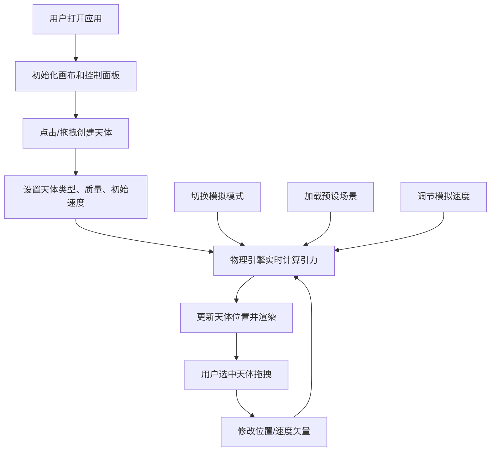

## 1. 产品概述
引力沙盒是一个交互式物理模拟应用，通过可视化方式展示牛顿万有引力定律和多体天体运动规律。用户可以创建恒星和行星，观察它们在引力作用下的运动轨迹，直观理解宇宙天体的运行机制。

- 核心目的：提供直观的引力物理教学工具，让用户通过动手操作理解天体力学
- 目标用户：物理爱好者、学生、教师、对宇宙感兴趣的普通用户
- 市场价值：将抽象的物理公式转化为可交互的可视化体验，降低学习门槛

## 2. 核心功能

### 2.1 功能模块
1. **模拟画布**：1200x800px深空背景，支持天体创建、选择和拖拽交互
2. **物理引擎**：实时计算万有引力，使用Verlet积分更新天体位置
3. **控制面板**：模式切换、天体创建、模拟速度调节、清除功能
4. **信息状态栏**：实时显示FPS、天体数量等运行数据
5. **预设场景**：内置双星系统、三体运动、太阳系缩影三个演示场景

### 2.3 页面详情
| 页面名称 | 模块名称 | 功能描述 |
|-----------|-------------|---------------------|
| 主页面 | 模拟画布 | 点击创建天体，拖拽调整质量和初始速度，选中天体可拖拽修改位置和速度 |
| 主页面 | 控制面板 | 切换三种模拟模式（自由/稳定/演示），调节模拟速度0.1x-3.0x，清除所有天体 |
| 主页面 | 信息状态栏 | 底部40px高度区域，实时显示FPS和天体总数 |
| 主页面 | 天体渲染 | 圆形天体显示名称标签，选中时显示旋转虚线圆环，速度矢量箭头指示方向 |

## 3. 核心流程

用户打开应用 → 看到深空背景画布和左侧控制面板 → 点击画布创建天体（拖动调整质量和速度）→ 天体在引力作用下开始运动 → 用户可选中天体拖拽调整 → 切换模拟模式观察不同效果 → 加载预设场景观看演示 → 调节速度快慢观察细节

## 4. 用户界面设计

### 4.1 设计风格
- **主色调**：深空背景 #0A0A1A，控件区 #1A1A2E，文字 #E0E0FF
- **强调色**：#00FFAA（选中、投影、交互反馈）
- **天体色板**：恒星 #FF8800，行星 #FF4466 / #44AAFF / #88FF44 / #FFAA44 / #CC44FF
- **控件风格**：半透明毛玻璃效果（backdrop-filter: blur(8px)），圆角16px，内边距16px
- **按钮交互**：悬停缩放105% + #00FFAA投影，点击缩放95% + 0.1秒反冲动画
- **字体**：选择科技感强的无衬线字体，标题和正文形成层次对比

### 4.2 页面设计概述
| 页面名称 | 模块名称 | UI Elements |
|-----------|-------------|-------------|
| 主页面 | 模拟画布 | 1200x800px深空背景，渐变星空效果，点击/拖拽交互，天体选中状态 |
| 主页面 | 控制面板 | 左侧毛玻璃面板，垂直排列控制按钮和滑块，深色科幻风格 |
| 主页面 | 信息状态栏 | 底部40px高信息条，FPS计数器，天体数量统计 |
| 主页面 | 天体组件 | 圆形渐变球体，名称标签（白色12px，半透明背景），速度矢量箭头 |

### 4.3 响应式
- 桌面端（≥768px）：控制面板在左侧，画布在右侧
- 移动端（<768px）：控制面板移至顶部，纵向堆叠布局
- 触摸优化：增大触控区域，支持双指缩放画布

### 4.4 3D场景指引
- **环境**：深空背景，使用径向渐变营造空间纵深感，添加微弱星点粒子效果
- **光照**：环境光 + 点光源，恒星自发光效果，行星接收光照形成明暗对比
- **相机**：正交投影，保持2D平面视图，固定视角聚焦于模拟区域
- **后处理**：Bloom泛光效果增强恒星发光感，FXAA抗锯齿
- **性能预算**：10个天体以内稳定55-60FPS，超过10个时自动降低渲染精度（80%缩放）

## 5. 性能要求
- 10个天体以内：帧率稳定55-60FPS
- 11-12个天体：自动降低渲染精度（天体描边、标签字号缩小至80%）
- 物理计算：每帧60次更新，使用Verlet积分确保数值稳定性
- 渲染优化：Three.js InstancedMesh批量渲染，减少draw call
