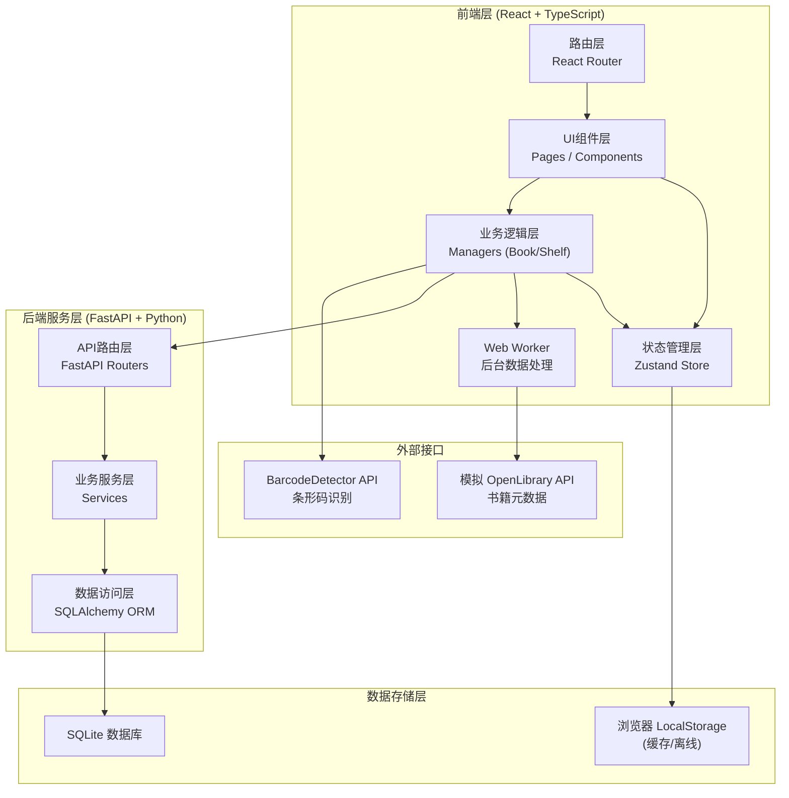
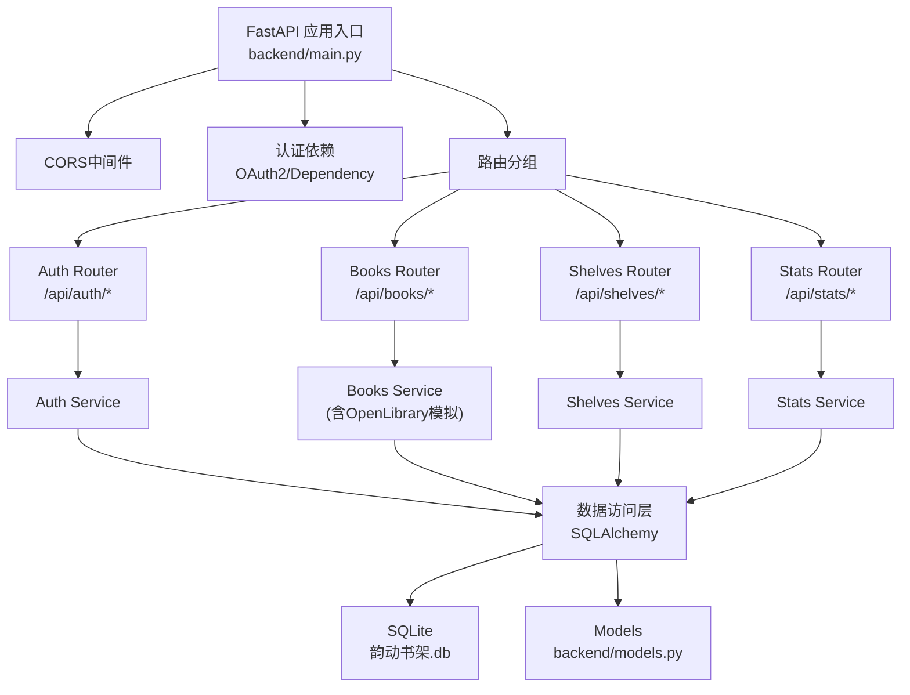
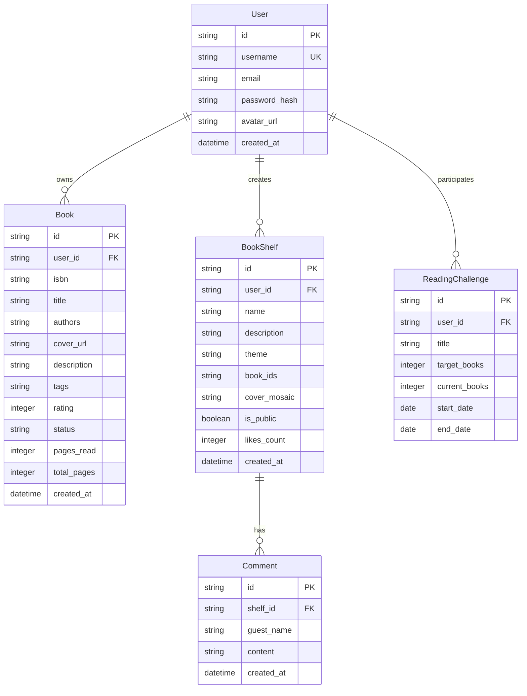

## 1. 架构设计



## 2. 技术说明

### 2.1 前端技术栈
| 技术 | 版本/说明 | 用途 |
|------|-----------|------|
| React | 18.x | UI框架，函数式组件+Hooks |
| TypeScript | 5.x | 类型安全，strict模式 |
| Vite | 5.x | 构建工具，HMR热更新 |
| React Router DOM | 6.x | 路由管理，嵌套路由 |
| Zustand | 4.x | 轻量级状态管理 |
| uuid | 9.x | 唯一ID生成 |
| BarcodeDetector API | 浏览器原生 | ISBN条形码扫描 |
| Web Worker | 浏览器原生 | 后台数据获取处理 |
| IntersectionObserver | 浏览器原生 | 图片懒加载 |

### 2.2 后端技术栈
| 技术 | 版本/说明 | 用途 |
|------|-----------|------|
| FastAPI | 最新 | 异步Web框架，自动API文档 |
| Uvicorn | 最新 | ASGI服务器 |
| SQLAlchemy | 2.x | ORM对象关系映射 |
| SQLite | 内置 | 轻量级关系数据库 |
| Pydantic | 最新 | 数据校验与序列化 |

### 2.3 开发工具
- **初始化方式**: 手动创建配置文件（用户指定了精确的文件清单）
- **包管理**: npm
- **运行命令**:
  - 后端: `cd backend && pip install fastapi uvicorn sqlalchemy && uvicorn main:app --reload`
  - 前端: `npm install && npm run dev`

## 3. 路由定义

| 路由路径 | 页面组件 | 权限 | 用途 |
|----------|----------|------|------|
| `/login` | LoginPage | 公开 | 用户登录/注册 |
| `/` | ShelfDashboard | 需登录 | 主面板：阅读统计 + 我的书架 |
| `/book/add` | AddBookPage | 需登录 | 添加书籍：ISBN输入/条形码扫描 |
| `/book/:id` | BookDetailPage | 需登录 | 书籍详情：元数据/标签/评分 |
| `/shelves` | ShelfListPage | 需登录 | 书单列表管理 |
| `/shelf/:id` | ShelfDetailPage | 需登录 | 书单详情：内容/互动/分享 |
| `/share/:encodedId` | SharePage | 公开 | 公开分享书单页面（无需登录） |

## 4. API 接口定义

### 4.1 认证接口

```typescript
// POST /api/auth/login
interface LoginRequest {
  username: string;
  password: string;
}
interface LoginResponse {
  token: string;
  user: { id: string; username: string; avatar?: string };
}

// POST /api/auth/register
interface RegisterRequest {
  username: string;
  password: string;
  email?: string;
}
interface RegisterResponse extends LoginResponse {}
```

### 4.2 书籍接口

```typescript
// GET /api/books?isbn=xxx  (模拟OpenLibrary)
interface BookMetadataResponse {
  isbn: string;
  title: string;
  authors: string[];
  coverUrl: string;
  description: string;
  publishDate?: string;
  pageCount?: number;
}

// POST /api/books (保存到用户书架)
interface AddBookRequest {
  isbn: string;
  title: string;
  authors: string[];
  coverUrl: string;
  description: string;
  tags?: string[];
  rating?: number; // 1-5
  status: 'reading' | 'finished' | 'wishlist';
  pagesRead?: number;
}
interface BookResponse extends AddBookRequest {
  id: string;
  userId: string;
  createdAt: string;
}

// GET /api/books (获取用户书架)
// GET /api/books/:id
// PUT /api/books/:id
// DELETE /api/books/:id
```

### 4.3 书单接口

```typescript
interface BookShelfRequest {
  name: string;
  description?: string;
  theme?: string;
  bookIds: string[];
  isPublic: boolean;
}
interface BookShelfResponse extends BookShelfRequest {
  id: string;
  userId: string;
  coverMosaic: string[];
  likes: number;
  comments: Comment[];
  createdAt: string;
}
interface Comment {
  id: string;
  username: string;
  content: string;
  createdAt: string;
}

// GET /api/shelves
// POST /api/shelves
// GET /api/shelves/:id
// PUT /api/shelves/:id
// DELETE /api/shelves/:id
// POST /api/shelves/:id/like
// POST /api/shelves/:id/comment
// GET /api/shelves/shared/:encodedId (公开书单，无需token)
```

### 4.4 阅读统计接口

```typescript
// GET /api/stats/reading
interface ReadingStats {
  totalBooksRead: number;
  monthlyPages: number;
  averageRating: number;
  currentStreak: number;
}
```

## 5. 后端服务架构图



## 6. 数据模型

### 6.1 ER 图



### 6.2 前端 Zustand Store 状态模型

```typescript
// src/store/index.ts
interface AppState {
  // 用户状态
  user: { id: string; username: string; token: string } | null;
  isAuthenticated: boolean;

  // 书籍数据
  books: Book[];
  currentBook: Book | null;
  isLoadingBooks: boolean;

  // 书单数据
  shelves: BookShelf[];
  currentShelf: BookShelf | null;

  // 阅读统计
  stats: ReadingStats | null;

  // UI状态
  activeModal: 'addBook' | 'createShelf' | null;
  theme: 'dark';

  // Actions
  login: (username: string, password: string) => Promise<void>;
  logout: () => void;
  fetchBooks: () => Promise<void>;
  addBook: (data: AddBookRequest) => Promise<void>;
  updateBook: (id: string, data: Partial<Book>) => Promise<void>;
  createShelf: (data: BookShelfRequest) => Promise<BookShelf>;
  likeShelf: (shelfId: string) => void;
  generateShareLink: (shelfId: string) => string;
}
```

### 6.3 数据库初始化 DDL

```sql
-- 用户表
CREATE TABLE IF NOT EXISTS users (
    id TEXT PRIMARY KEY,
    username TEXT UNIQUE NOT NULL,
    email TEXT,
    password_hash TEXT NOT NULL,
    avatar_url TEXT,
    created_at DATETIME DEFAULT CURRENT_TIMESTAMP
);

-- 书籍表
CREATE TABLE IF NOT EXISTS books (
    id TEXT PRIMARY KEY,
    user_id TEXT NOT NULL REFERENCES users(id),
    isbn TEXT,
    title TEXT NOT NULL,
    authors TEXT NOT NULL,
    cover_url TEXT,
    description TEXT,
    tags TEXT DEFAULT '[]',
    rating INTEGER CHECK (rating BETWEEN 1 AND 5),
    status TEXT DEFAULT 'wishlist',
    pages_read INTEGER DEFAULT 0,
    total_pages INTEGER DEFAULT 0,
    created_at DATETIME DEFAULT CURRENT_TIMESTAMP
);

-- 书单表
CREATE TABLE IF NOT EXISTS book_shelves (
    id TEXT PRIMARY KEY,
    user_id TEXT NOT NULL REFERENCES users(id),
    name TEXT NOT NULL,
    description TEXT,
    theme TEXT,
    book_ids TEXT NOT NULL DEFAULT '[]',
    cover_mosaic TEXT NOT NULL DEFAULT '[]',
    is_public INTEGER DEFAULT 0,
    likes_count INTEGER DEFAULT 0,
    created_at DATETIME DEFAULT CURRENT_TIMESTAMP
);

-- 评论表
CREATE TABLE IF NOT EXISTS comments (
    id TEXT PRIMARY KEY,
    shelf_id TEXT NOT NULL REFERENCES book_shelves(id),
    guest_name TEXT NOT NULL,
    content TEXT NOT NULL,
    created_at DATETIME DEFAULT CURRENT_TIMESTAMP
);

-- 阅读挑战表
CREATE TABLE IF NOT EXISTS reading_challenges (
    id TEXT PRIMARY KEY,
    user_id TEXT NOT NULL REFERENCES users(id),
    title TEXT NOT NULL,
    target_books INTEGER NOT NULL,
    current_books INTEGER DEFAULT 0,
    start_date DATE NOT NULL,
    end_date DATE NOT NULL,
    created_at DATETIME DEFAULT CURRENT_TIMESTAMP
);

-- 索引
CREATE INDEX IF NOT EXISTS idx_books_user_id ON books(user_id);
CREATE INDEX IF NOT EXISTS idx_shelves_user_id ON book_shelves(user_id);
CREATE INDEX IF NOT EXISTS idx_comments_shelf_id ON comments(shelf_id);
```
