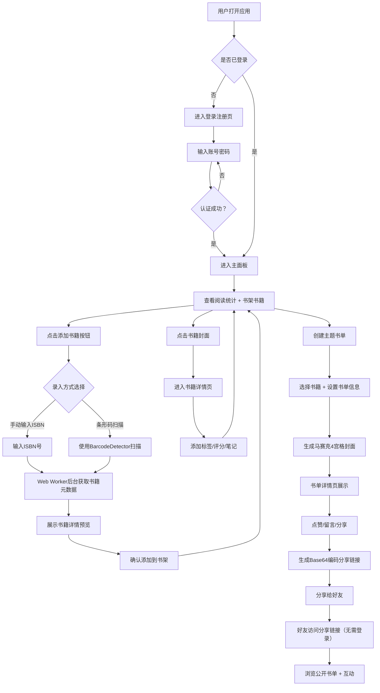

## 1. 产品概述

韵动书架是一款面向爱读书人群的虚拟书架管理与社交阅读应用，旨在帮助用户构建个性化的数字阅读空间，通过书籍录入、主题书单创建、阅读挑战和社交分享等功能，激发用户的阅读热情并促进阅读社区的互动交流。

- 核心价值：将实体阅读体验数字化，通过精美界面和社交化功能提升阅读乐趣
- 目标用户：热爱阅读、注重阅读体验、喜欢分享书单和参与阅读挑战的读者群体

## 2. 核心功能

### 2.1 用户角色

| 角色 | 注册方式 | 核心权限 |
|------|----------|----------|
| 注册用户 | 用户名密码注册 | 完整功能：书架管理、书籍录入、书单创建、分享、阅读挑战 |
| 访客用户 | 无需登录（通过分享链接访问） | 查看公开书单、点赞、留言 |

### 2.2 功能模块

1. **登录注册页**：用户注册、登录表单、表单验证、登录状态管理
2. **主面板/书架页**：个人阅读统计卡片、书架网格展示、添加书籍入口
3. **书籍详情页**：书籍元数据展示、个人标签管理、星级评分、阅读笔记
4. **添加书籍页**：ISBN手动输入、条形码扫描（BarcodeDetector API）、书籍自动识别
5. **书单管理页**：创建/编辑主题书单、马赛克封面生成、书单列表展示
6. **书单详情页**：书单内容展示、点赞互动、留言评论、分享链接
7. **分享页面**：公开书单展示、无需登录访问、点赞/留言功能

### 2.3 页面详情

| 页面名称 | 模块名称 | 功能描述 |
|----------|----------|----------|
| 登录注册页 | 认证模块 | 用户名/密码输入、表单校验、注册/登录切换、错误提示 |
| 主面板页 | 阅读统计卡片 | 已读书目数量、本月阅读页数、平均评分展示，毛玻璃效果 |
| 主面板页 | 书架网格 | 响应式网格布局（桌面4列/平板2列/手机1列）、封面缩略图展示、悬停动效 |
| 添加书籍页 | ISBN录入模块 | 手动输入ISBN、条形码扫描、Web Worker后台数据获取 |
| 书籍详情页 | 信息展示 | 完整元数据、标签管理、1-5星评分（弹性动画）、阅读状态标记 |
| 书单管理页 | 书单列表 | 书单卡片展示、马赛克4宫格封面、创建/编辑/删除操作 |
| 书单详情页 | 互动模块 | 点赞（粒子爆发动画）、留言评论、生成Base64编码分享链接 |
| 分享页面 | 公开展示 | 书单封面随机切换（每3秒fade过渡）、点赞、留言、无需登录 |

## 3. 核心流程

## 4. 用户界面设计

### 4.1 设计风格

- **主色调**：深蓝灰 `#1A1A2E`（背景）、柔和紫罗兰 `#6C63FF`（强调色）
- **悬停色**：`#5A52E0`（强调色加深）
- **毛玻璃效果**：`backdrop-filter: blur(10px)`，背景半透明 `#FFFFFF15`，边框 `#FFFFFF20`
- **圆角规范**：卡片 `16px`、封面缩略图 `8px`
- **字体**：系统无衬线字体（-apple-system, BlinkMacSystemFont, "Segoe UI", Roboto等）
- **布局风格**：卡片式布局 + 网格系统
- **动效风格**：优雅平滑过渡、弹性动画、粒子特效

### 4.2 页面设计概述

| 页面名称 | 模块名称 | UI元素 |
|----------|----------|----------|
| 登录注册页 | 表单区域 | 毛玻璃卡片、渐变背景、柔和阴影、输入框聚焦动效 |
| 主面板页 | 阅读统计卡 | 毛玻璃效果、图标+数字展示、悬停微抬升、渐入动画 |
| 主面板页 | 书架网格 | 响应式Grid、封面悬停translateY+阴影过渡、懒加载图片 |
| 添加书籍页 | 录入区域 | 大输入框、扫描按钮（相机图标）、进度指示、结果预览卡片 |
| 书籍详情页 | 评分组件 | 五星排列、点击缩放弹性动画（spring）、颜色渐变填充 |
| 书单详情页 | 点赞按钮 | 心形图标、粒子爆发canvas动画、计数跳动效果 |
| 分享页面 | 封面轮播 | 4宫格图片随机位置切换、3秒间隔fade opacity过渡 |

### 4.3 响应式设计

- **设计策略**：桌面优先（Desktop-first），渐进式适配移动设备
- **断点规范**：
  - 桌面端（≥1280px）：书架每行4本书
  - 平板端（768px-1279px）：书架每行2本书，统计卡片横向堆叠
  - 手机端（<768px）：书架每行1本书，全宽布局，导航底部化，触摸优化（增大点击区域≥44px）

### 4.4 性能指标

| 指标 | 目标值 |
|------|--------|
| 书架页面加载时间 | ≤ 2秒（首屏渲染） |
| 滚动/翻页动画帧率 | ≥ 55 FPS |
| 图片加载策略 | 懒加载（IntersectionObserver）+ 占位骨架屏 |
| 数据处理 | Web Worker后台处理API请求，主线程空闲度≥90% |
