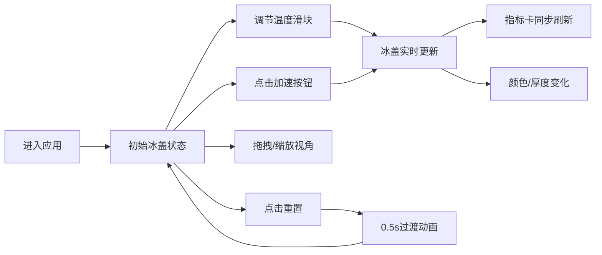

## 1. 产品概述

冰盖消融模拟器是一款面向极地研究机构的3D交互可视化应用，通过直观的三维场景展示南极冰盖在不同气候条件下随时间的动态变化，帮助公众和科研人员理解冰川消融的速度与环境影响。

- **主要目的**：以沉浸式3D可视化方式模拟冰盖消融过程，提升气候变暖认知
- **目标用户**：科研人员、教育工作者、公众参观者
- **核心价值**：将复杂的冰川学数据转化为直观可交互的视觉体验

## 2. 核心功能

### 2.1 功能模块

1. **3D冰盖渲染模块**：基于高度图的动态冰盖几何体，带着色器材质的冰面颜色渐变
2. **交互控制面板**：温度滑块、时间加速按钮、地形网格切换
3. **实时指标显示**：海平面贡献量、冰盖体积占比、温度偏移三大指标卡
4. **视角控制**：OrbitControls轨道控制、一键复位视角
5. **模拟重置**：一键重置所有参数，带过渡动画

### 2.2 页面详情

| 页面名称 | 模块名称 | 功能描述 |
|---------|---------|---------|
| 主场景 | 3D冰盖渲染 | 100x100网格地形，冰盖厚度动态变化，白到蓝颜色渐变 |
| 主场景 | 控制面板 | 温度滑块(-2°C~+6°C)、时间加速(1x/2x/4x循环)、网格开关 |
| 主场景 | 指标卡 | 海平面等效毫米、冰盖体积占比、当前温度偏移实时显示 |
| 主场景 | 视角控制 | 鼠标拖拽旋转、滚轮缩放、右下角复位按钮 |
| 主场景 | 重置功能 | 左上角重置按钮，0.5秒过渡动画 |

## 3. 核心流程

用户进入应用后，默认展示初始冰盖状态。通过调节温度滑块和时间加速，观察冰盖消融过程。可随时重置或切换视角。

## 4. 用户界面设计

### 4.1 设计风格

- **设计风格**：深色科幻风格，极地科研主题
- **主背景色**：#0B0F19（深空蓝黑）
- **高亮色**：#00D4AA（青绿色），悬停变亮至#00F0C0
- **毛玻璃效果**：半透明深色背景(#0B0F1980)，边框#FFFFFF20
- **字体**：系统无衬线字体，数字使用等宽字体(monospace)
- **按钮风格**：圆角设计，悬停高亮，点击缩放至95%
- **滑块风格**：轨道#2A2A3E，圆形手柄#00D4AA，直径16px

### 4.2 页面设计概述

| 页面名称 | 模块名称 | UI元素 |
|---------|---------|-------|
| 主场景 | 3D场景 | 全屏3D画布，冰盖与地形，柔和环境光 |
| 主场景 | 控制面板 | 左下角卡片布局，半透明毛玻璃，圆角12px |
| 主场景 | 指标卡 | 右上角三列并排，间距8px，圆角8px，等宽数字 |
| 主场景 | 重置按钮 | 左上角圆形按钮，↺图标 |
| 主场景 | 复位视角 | 右下角透明圆形按钮，悬停#00D4AA边框 |

### 4.3 响应式设计

- **桌面端**（≥768px）：指标卡三列并排，控制面板左下角悬浮
- **移动端**（<768px）：指标卡纵向堆叠，控制面板变为底部固定栏（高度56px），滑块和按钮水平排列

### 4.4 3D场景指引

- **环境**：深色背景，柔和的环境光和平行光模拟极地光照
- **光照设置**：AmbientLight环境光 + DirectionalLight主光源，营造冰川质感
- **相机**：PerspectiveCamera，初始45°俯视角度
- **构图**：冰盖居中，留足空间供视角旋转
- **交互**：OrbitControls轨道控制，阻尼效果，限制最大俯仰角
- **材质**：ShaderMaterial实现冰面颜色渐变，根据厚度从白到浅蓝
- **性能**：顶点更新节流至30FPS，使用requestAnimationFrame优化滑块连续拖动

## 5. 性能约束

- 整体动画帧率保持60FPS
- 冰盖顶点更新频率不超过每秒30次
- 滑块连续拖动时使用requestAnimationFrame节流
