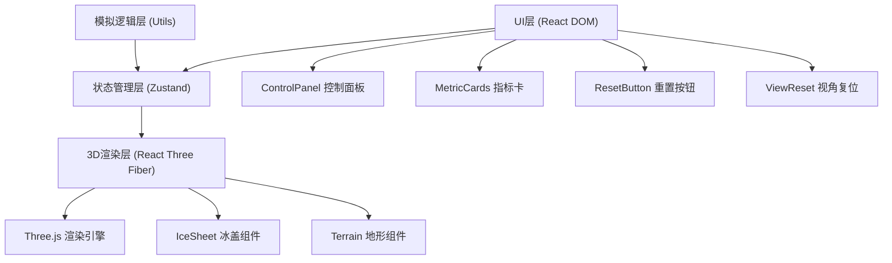

## 1. 架构设计

本项目为纯前端3D可视化应用，采用React + Three.js技术栈，状态管理使用Zustand，构建工具为Vite。



## 2. 技术描述

- **前端框架**：React 18 + TypeScript
- **3D引擎**：Three.js + @react-three/fiber + @react-three/drei
- **状态管理**：Zustand
- **构建工具**：Vite + @vitejs/plugin-react
- **工具库**：uuid

### 依赖清单

| 依赖包 | 用途 |
|--------|------|
| react | UI框架 |
| react-dom | DOM渲染 |
| three | 3D引擎核心 |
| @react-three/fiber | React Three.js渲染器 |
| @react-three/drei | Three.js辅助组件库 |
| zustand | 轻量级状态管理 |
| uuid | 唯一ID生成 |
| vite | 构建与开发服务器 |
| @vitejs/plugin-react | Vite React插件 |
| typescript | 类型系统 |
| @types/react | React类型定义 |
| @types/react-dom | React DOM类型定义 |
| @types/three | Three.js类型定义 |

## 3. 文件结构与调用关系

```
src/
├── main.tsx                    # 应用入口，挂载Canvas与UI
├── store/
│   └── useSimulationStore.ts   # Zustand状态管理
├── components/
│   ├── IceSheet.tsx            # 冰盖3D组件
│   └── ControlPanel.tsx        # 控制面板UI组件
├── utils/
│   └── iceSimulation.ts        # 冰盖模拟计算工具
└── styles/
    └── global.css              # 全局样式
```

### 数据流向

```
ControlPanel (UI输入)
    ↓ (调用action)
useSimulationStore (状态更新)
    ↓ (订阅变化)
IceSheet + MetricCards (视图更新)
    ↑ (提供计算逻辑)
iceSimulation.ts (工具函数)
```

### 调用关系说明

| 文件 | 被谁调用 | 调用谁 | 职责 |
|------|---------|-------|------|
| main.tsx | - | ControlPanel, IceSheet, useSimulationStore | 应用入口，组装3D画布和UI |
| useSimulationStore.ts | ControlPanel, IceSheet, main.tsx | iceSimulation | 管理温度、时间、冰盖数据 |
| IceSheet.tsx | main.tsx | useSimulationStore, Three.js | 渲染冰盖几何体，动态更新顶点 |
| ControlPanel.tsx | main.tsx | useSimulationStore | 温度滑块、加速按钮、网格开关 |
| iceSimulation.ts | useSimulationStore | - | 计算冰盖厚度变化、生成高度图 |

## 4. 数据模型

### 4.1 Store状态定义

```typescript
// 冰盖模拟状态
interface SimulationState {
  // 温度偏移量 (°C)，范围 -2 ~ +6
  temperatureOffset: number;
  // 时间加速倍率 1 / 2 / 4
  timeSpeed: number;
  // 时间进度 (0 ~ 1)
  timeProgress: number;
  // 是否显示地形网格
  showWireframe: boolean;
  // 冰盖高度图数组 (100x100)
  heightMap: number[];
  // 冰盖体积
  iceVolume: number;
  // 初始冰盖体积（用于计算百分比）
  initialIceVolume: number;
  
  // Actions
  setTemperature: (temp: number) => void;
  cycleTimeSpeed: () => void;
  toggleWireframe: () => void;
  updateSimulation: (delta: number) => void;
  resetSimulation: () => void;
}
```

### 4.2 高度图数据结构

- 100x100 的一维数组，共10000个数值
- 每个值代表该网格点的冰盖厚度（归一化 0~1）
- 地形基底高度 + 冰盖厚度 = 最终顶点高度

## 5. 核心算法

### 5.1 冰盖消融计算

```
消融速率 = f(温度偏移) × 时间步长 × 加速倍率
冰盖厚度 = max(0, 初始厚度 - 累积消融量)
体积损失 = 初始体积 - 当前体积
海平面贡献 = 体积损失 × 转换系数
```

### 5.2 高度图生成

使用多层 Simplex 噪声算法生成自然的冰盖地形：
- 基础地形提供基底高度
- 冰盖叠加层模拟冰川分布
- 边缘衰减实现平滑过渡

## 6. 性能优化策略

- **顶点更新节流**：使用 `useRef` + `requestAnimationFrame` 限制顶点更新频率 ≤ 30FPS
- **几何体复用**：仅更新顶点位置，不重建整个几何体
- **着色器计算**：颜色渐变在片元着色器中完成，减少CPU计算
- **滑块节流**：连续拖动滑块时使用 rAF 合并更新请求
- **状态订阅**：使用 Zustand 选择器避免不必要的重渲染

## 7. 启动脚本

| 命令 | 说明 |
|------|------|
| npm run dev | 启动开发服务器 |
