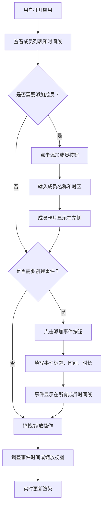

## 1. 产品概述
时区桥梁是一款面向远程工作者的智能日程协调应用，帮助分布在不同时区的团队成员快速协商会议时间，并自动生成可视化的日程时间线。
- 核心价值：解决跨时区团队协作中会议时间协调困难的问题，通过可视化时间线直观展示各成员时区下的会议时间
- 目标用户：远程工作团队、跨国协作团队、分布式办公组织

## 2. 核心功能

### 2.1 功能模块
1. **主页面**：成员卡片列表、24小时时间线视图、事件管理面板
2. **Header区域**：应用标题、时区选择器、添加事件按钮、视图缩放控制

### 2.2 页面详情
| 页面名称 | 模块名称 | 功能描述 |
|-----------|-------------|---------------------|
| 主页面 | 成员管理 | 添加团队成员（名称、首字母头像、时区），卡片形式展示在时间线左侧，行距32px |
| 主页面 | 事件创建 | 弹出面板输入事件标题、起始时间（15分钟步进）、持续时间（30/60/90/120分钟） |
| 主页面 | 时间线视图 | 168px宽24小时时间线（每刻度7px），当前时间红色闪烁竖线标记，事件块按成员时区偏移显示 |
| 主页面 | 事件拖拽 | 拖拽事件块左右移动调整时间，拖拽时半透明预览，实时更新位置 |
| 主页面 | 视图缩放 | 底部滑块0.5x-2x缩放，等比调整时间线宽度、事件块大小和文本 |

## 3. 核心流程

### 3.1 主要用户流程
用户打开应用 → 查看成员列表和时间线 → 添加团队成员（设置名称和时区）→ 点击添加事件按钮 → 填写事件信息（标题、时间、时长）→ 事件在所有成员时间线上显示（按时区偏移）→ 可拖拽调整事件时间 → 可缩放视图查看细节

### 3.2 Mermaid流程图

## 4. 用户界面设计

### 4.1 设计风格
- 主色调：深色主题，背景 #161B22，Header #0D1117，侧栏 #1E1E2E
- 强调色：#6366F1（靛蓝色）用于按钮和事件块，#EF4444（红色）用于当前时间标记
- 按钮风格：圆角6px，悬停时背景加深为 #4F46E5
- 字体：系统默认无衬线字体，标题24px白色，刻度标签10px灰色，事件名12px白色
- 布局：左右分栏，左侧成员列表固定240px，右侧时间线自适应
- 图标：使用简洁的UI图标，汉堡菜单用于移动端响应式

### 4.2 页面设计概述
| 页面名称 | 模块名称 | UI元素 |
|-----------|-------------|-------------|
| 主页面 | Header | 高度64px，背景#0D1117，左侧标题24px白色，右侧时区选择器和添加按钮（#6366F1，圆角6px） |
| 主页面 | 成员卡片列表 | 宽度240px，背景#1E1E2E，右圆角8px，卡片行距32px，首字母圆形头像（直径32px，#6366F1背景） |
| 主页面 | 时间线区域 | 背景#161B22，刻度10px #8B949E，当前时间1px红色闪烁竖线，事件块圆角4px内边距4px |
| 主页面 | 事件块 | 成员HSL颜色（饱和度60%亮度50%），悬停亮度+15%，删除按钮16px红色圆形 |
| 主页面 | 缩放滑块 | 时间线底部，范围0.5x-2x，步进0.1 |

### 4.3 响应式
- 桌面端优先设计（>768px）：左右分栏布局
- 移动端（<768px）：左侧成员列表折叠为可展开侧栏，点击汉堡图标弹出，时间线占满全宽
- 触摸优化：事件块和按钮增大点击区域

### 4.4 动画效果
- 事件块位置变化：CSS transition 300ms ease
- 新事件出现：从opacity 0和scale(0.8)过渡到正常
- 当前时间线：1秒闪烁动画，透明度0.6↔1.0切换
- 悬停状态：事件块背景亮度提升15%，显示删除按钮
