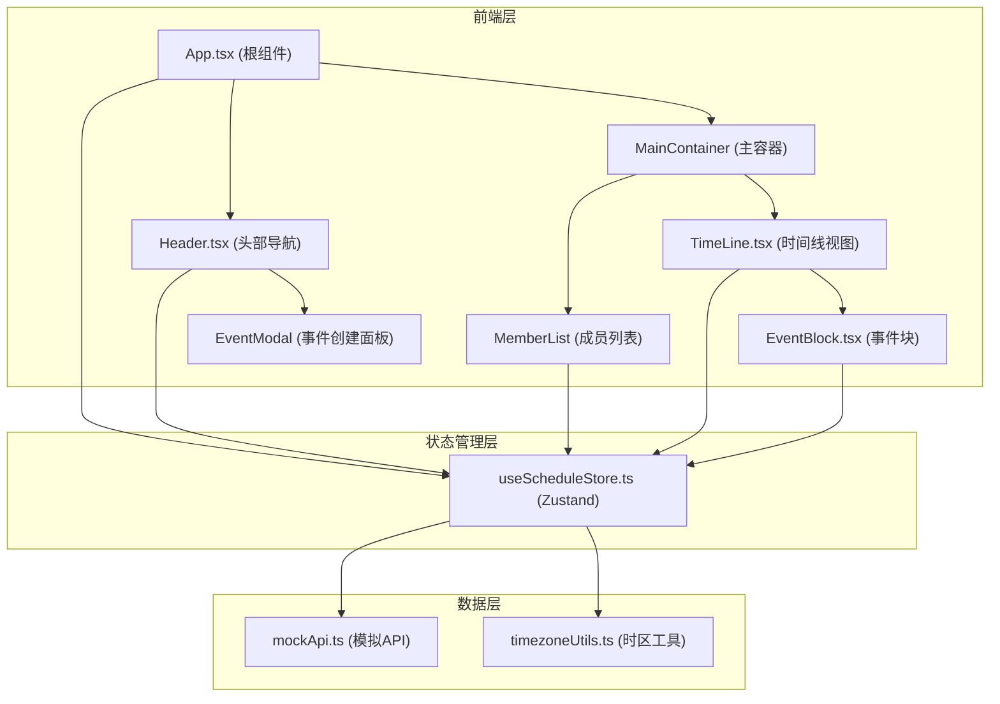
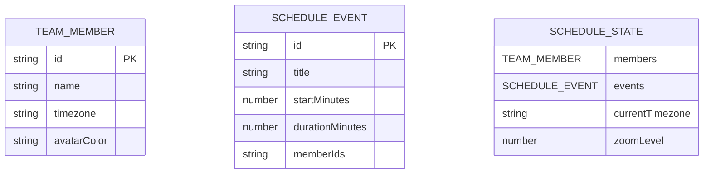

## 1. 架构设计



## 2. 技术描述
- 前端框架：React 18 + TypeScript
- 构建工具：Vite + @vitejs/plugin-react
- 状态管理：Zustand
- 样式方案：原生CSS（CSS Modules风格内联样式 + 全局样式表）
- 数据来源：模拟API模块（mockApi.ts）提供初始数据

## 3. 目录结构

```
src/
├── App.tsx                    # 根组件，布局页面
├── main.tsx                   # 应用入口
├── index.css                  # 全局样式
├── store/
│   └── useScheduleStore.ts    # Zustand全局状态管理
├── components/
│   ├── Header.tsx             # 头部组件
│   ├── TimeLine.tsx           # 时间线组件
│   ├── EventBlock.tsx         # 事件块组件
│   ├── MemberCard.tsx         # 成员卡片组件
│   ├── MemberList.tsx         # 成员列表组件
│   ├── EventModal.tsx         # 事件创建弹窗
│   ├── MemberModal.tsx        # 成员添加弹窗
│   └── ZoomSlider.tsx         # 缩放滑块组件
├── api/
│   └── mockApi.ts             # 模拟API模块
├── types/
│   └── index.ts               # TypeScript类型定义
└── utils/
    ├── timezone.ts            # 时区转换工具
    └── color.ts               # 颜色工具
```

## 4. 数据模型

### 4.1 数据模型定义



### 4.2 类型定义

```typescript
interface TeamMember {
  id: string;
  name: string;
  timezone: string;
  avatarColor: string;
}

interface ScheduleEvent {
  id: string;
  title: string;
  startMinutes: number;
  durationMinutes: number;
  memberIds: string[];
}

interface TimezoneOption {
  value: string;
  label: string;
  offset: number;
}

interface ScheduleState {
  members: TeamMember[];
  events: ScheduleEvent[];
  currentTimezone: string;
  zoomLevel: number;
  addMember: (member: Omit<TeamMember, 'id' | 'avatarColor'>) => void;
  removeMember: (id: string) => void;
  addEvent: (event: Omit<ScheduleEvent, 'id'>) => void;
  removeEvent: (id: string) => void;
  updateEventTime: (id: string, startMinutes: number) => void;
  setTimezone: (timezone: string) => void;
  setZoom: (zoom: number) => void;
}
```

## 5. 核心组件数据流向

| 组件 | 数据输入 | 数据输出 | 调用关系 |
|------|---------|---------|---------|
| App.tsx | useScheduleStore (全部状态) | - | 读取store，传递给Header和MainContainer |
| Header.tsx | currentTimezone, setTimezone, addEvent | setTimezone, addEvent | dispatch时区变更，触发addEvent |
| MemberList.tsx | members | removeMember | 读取成员列表，派发删除动作 |
| MemberCard.tsx | member | removeMember | 显示单个成员，提供删除功能 |
| TimeLine.tsx | events, members, currentTimezone, zoomLevel | updateEventTime | 渲染时间轴，传递事件数据给EventBlock |
| EventBlock.tsx | event, member, timezone, zoom | updateEventTime, removeEvent | 拖拽事件更新时间，派发删除事件 |
| EventModal.tsx | - | addEvent | 创建事件数据，派发addEvent |
| MemberModal.tsx | - | addMember | 创建成员数据，派发addMember |
| ZoomSlider.tsx | zoomLevel | setZoom | 读取缩放级别，派发缩放变更 |
