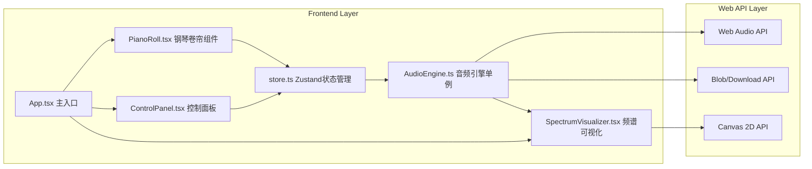

## 1. 架构设计



## 2. 技术说明

- **前端框架**：React 18 + TypeScript 5
- **构建工具**：Vite 5（开发端口5173）
- **状态管理**：Zustand 4（集中管理音符数据、播放状态、参数配置）
- **音频引擎**：纯 Web Audio API（AudioContext / OscillatorNode / GainNode / ConvolverNode / AnalyserNode），零第三方音频库
- **工具库**：uuid（音符唯一ID生成）
- **后端服务**：无（纯前端应用，所有逻辑运行在浏览器端）

## 3. 路由定义

| 路由 | 用途 |
|------|------|
| / | 主创作页（单页应用，唯一入口） |

## 4. 数据模型

### 4.1 核心类型定义

```typescript
interface Note {
  id: string;          // uuid v4
  pitch: number;       // MIDI音高编号，36-79 (C2-C6，共44个半音)
  startTime: number;   // 起始时间（秒），0-7.8，步长0.2
  duration: number;    // 时长（秒），最小0.2，步长0.2
}

interface PlaybackState {
  isPlaying: boolean;
  isPaused: boolean;
  currentTime: number;       // 当前播放指针（秒）
  bpm: number;               // 60-200，默认120
  volume: number;            // 0-100，线性映射到Gain 0-1
  reverb: number;            // 0-100，控制干湿比
  waveform: 'sine' | 'square' | 'sawtooth';
  selectedNoteIds: string[];
}

interface MusicStore {
  notes: Note[];
  playback: PlaybackState;
  // Actions
  addNote: (note: Omit<Note, 'id'>) => void;
  deleteNote: (id: string) => void;
  deleteSelectedNotes: () => void;
  moveNote: (id: string, pitchDelta: number, timeDelta: number) => void;
  resizeNote: (id: string, durationDelta: number) => void;
  selectNote: (id: string, multi?: boolean) => void;
  clearSelection: () => void;
  clearNotes: () => void;
  loadTemplate: (template: Note[]) => void;
  play: () => void;
  pause: () => void;
  stop: () => void;
  setBpm: (bpm: number) => void;
  setVolume: (volume: number) => void;
  setReverb: (reverb: number) => void;
  setWaveform: (waveform: PlaybackState['waveform']) => void;
  setCurrentTime: (time: number) => void;
  exportMidi: (filename: string) => void;
}
```

### 4.2 常量定义

```
GRID: 总时长=8s，时间步长=0.2s，时间格数=40；音高范围=C2(36)~C6(79)，音高数=44
NOTE_MIN_DURATION: 0.2s
PIXEL_PER_SECOND: 75  (600px / 8s)
PIXEL_PER_SEMITONE: 约4.5  (200px / 44)
```

## 5. 预置模板定义

| 模板名称 | 描述 | 音符模式 |
|----------|------|----------|
| 和弦进行 | C大调I-V-vi-IV经典和声 | C/E/G → G/B/D → A/C/E → F/A/C 每和弦2秒 |
| 即兴蓝调 | 12小节蓝调简化版 | 蓝调音阶(A C D D# E G)上的即兴旋律片段 |
| 电子脉冲 | 16分音符电子律动 | 快速琶音+低音脉冲，锯齿波适合 |
| 东方五声 | 中国五声音阶 | C D E G A 构成的东方韵味旋律 |

## 6. 音频引擎架构

```
OscillatorNode (per note, sine/square/sawtooth)
    │
    ▼
GainNode (ADSR envelope per note)
    │
    ▼
GainNode (master volume, 0-1)
    │
    ├──────────────────────────┐
    │                          ▼
    │              ConvolverNode (reverb IR)
    │                          │
    │                          ▼
    │                   GainNode (reverb wet, 0-1)
    │                          │
    ▼                          ▼
AnalyserNode ◄─────── 混合节点 (ChannelMerger)
    │
    ▼
AudioContext.destination (扬声器输出)
```

### 6.1 MIDI导出实现

SMF Format 0 结构：
- Header Chunk: "MThd" + length(6) + format(0) + tracks(1) + division(480 PPQN)
- Track Chunk: "MTrk" + events
- Events: Set Tempo (基于BPM) → Note On/Off (按音符startTime/duration换算tick) → End of Track
- 文件名输入 → Blob(type:audio/midi) → URL.createObjectURL → a[download]触发下载

## 7. 文件结构

```
├── package.json
├── vite.config.js
├── tsconfig.json
├── index.html
└── src/
    ├── main.tsx              # React入口
    ├── App.tsx               # 主组件布局
    ├── store.ts              # Zustand store
    └── components/
        ├── PianoRoll.tsx         # 钢琴卷帘（交互核心）
        ├── ControlPanel.tsx      # 参数控制+模板+导出
        ├── SpectrumVisualizer.tsx # 频谱Canvas
        └── AudioEngine.ts        # Web Audio封装单例
```
