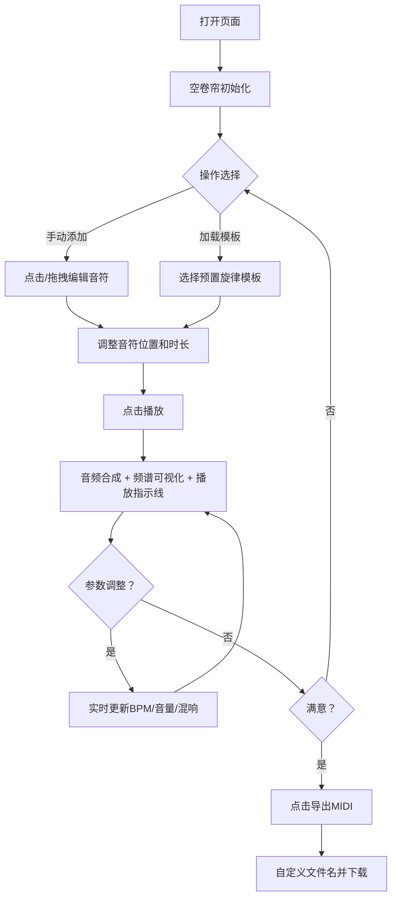

## 1. 产品概述

旋律工坊是一款面向非音乐专业人士的编程式音乐创作Web应用，通过可视化的钢琴卷帘界面让用户无需掌握乐理知识即可即兴创作旋律。

- 核心目的：降低音乐创作门槛，让普通人通过直观的拖拽交互体验音乐创作的乐趣
- 目标用户：音乐爱好者、创意工作者、想尝试创作但缺乏乐理基础的普通用户
- 产品价值：将复杂的音乐理论转化为直观的视觉操作，提供从创作、试听、到导出的完整工作流

## 2. 核心功能

### 2.1 用户角色

| 角色 | 注册方式 | 核心权限 |
|------|----------|----------|
| 普通用户 | 无需注册，直接使用 | 音符编辑、播放试听、参数调节、模板加载、MIDI导出 |

### 2.2 功能模块

1. **主创作页面**：播放控制栏、钢琴卷帘编辑器、参数控制面板、频谱可视化
2. **钢琴卷帘模块**：网格渲染、音符添加/编辑/删除、拖拽交互、多选操作
3. **音频引擎模块**：Web Audio合成播放、波形切换、混响效果、实时参数更新
4. **控制面板模块**：BPM调节、音量控制、混响强度、波形选择、预置模板、MIDI导出
5. **频谱可视化模块**：实时音频频谱柱状图绘制

### 2.3 页面详情

| 页面名称 | 模块名称 | 功能描述 |
|----------|----------|----------|
| 主创作页 | 播放控制栏 | 播放/暂停/停止按钮，圆形设计，hover反馈，状态联动图标切换 |
| 主创作页 | 钢琴卷帘 | 600×200px网格，44半音×8秒，点击添加音符，拖拽移动/调整时长，Shift多选 |
| 主创作页 | 控制面板 | BPM(60-200)、音量(0-100)、混响(0-100)滑块，4个预置模板，导出按钮 |
| 主创作页 | 频谱可视化 | 128条柱状频谱，颜色渐变，30fps+稳定帧率 |

## 3. 核心流程

用户打开页面 → 呈现空钢琴卷帘 → 点击网格添加音符/加载预置模板 → 调整音符位置与时长 → 点击播放试听 → 实时调整BPM/音量/混响/波形 → 满意后导出MIDI文件

## 4. 用户界面设计

### 4.1 设计风格

- **主色调**：暗色深空主题，主背景 `#0D0D1A`，卡片背景 `#1A1A2E`，边框 `#2A2A3E`
- **强调色**：音符蓝/橙双色系统 - 音符常态 `#4A9EFF`（蓝色），选中 `#FF6B35`（橙色），频谱渐变 `#00D4AA → #FF6B35`
- **按钮风格**：圆形按钮，背景 `#2A2A3E`，hover 过渡至 `#3A3A4E`，停止按钮强调红色 `#FF4444`
- **字体**：现代无衬线字体，文字颜色 `#E0E0F0`，半音标签浅灰色
- **布局**：卡片式垂直堆叠，顶部控制栏 + 中部卷帘+频谱 + 底部参数面板
- **动效**：音符入场透明度渐变（0.2s），播放指示线平滑移动，按钮hover状态过渡

### 4.2 页面设计概述

| 页面名称 | 模块名称 | UI 元素 |
|----------|----------|---------|
| 主创作页 | 顶部标题栏 | 应用Logo + "旋律工坊"标题 + 副标题描述 |
| 主创作页 | 播放控制栏 | 圆形播放/暂停/停止按钮组 + 波形切换下拉 |
| 主创作页 | 钢琴卷帘区 | 圆角12px深色卡片，半音侧标签，时间刻度，网格线，悬停行高亮，白色播放指示线 |
| 主创作页 | 频谱可视化 | Canvas绘制，128柱渐变色，与卷帘同宽卡片 |
| 主创作页 | 控制面板 | 两行网格布局，滑块+数值显示，模板按钮组，导出按钮 |

### 4.3 响应式

- **桌面端（≥1024px）**：卷帘宽度100%（最大600px居中），控制面板两行网格
- **平板端（768-1023px）**：卷帘缩放至90%宽度，控制面板自适应
- **手机端（<768px）**：竖排布局，卷帘高度增至300px，控制面板改为横向单行可滚动

### 4.4 性能指标

- 最大音符容量：200个（8秒×0.2秒粒度×44音高）
- 参数更新延迟：音量/混响调整 ≤ 50ms
- 可视化帧率：频谱绘制稳定 ≥ 30fps
- 动画流畅度：音符出现过渡0.2s，指示线逐帧平滑移动
