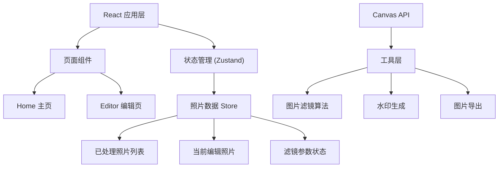

## 1. 架构设计



纯前端架构，所有图片处理在浏览器端通过Canvas API完成，无需后端服务。状态管理使用Zustand，路由使用React Router。

## 2. 技术栈说明

- **前端框架**：React 18 + TypeScript
- **构建工具**：Vite
- **状态管理**：Zustand
- **路由**：react-router-dom
- **图片处理**：Canvas API (原生)
- **文件下载**：file-saver
- **样式方案**：CSS Modules + CSS Variables

## 3. 路由定义

| 路由 | 页面 | 说明 |
|------|------|------|
| `/` | Home | 个人主页，照片展示与上传入口 |
| `/editor/:id` | Editor | 照片编辑页面 |
| `*` | 404 | 重定向到首页 |

## 4. 数据模型

### 4.1 照片数据结构

```typescript
interface Photo {
  id: string;
  name: string;
  originalDataUrl: string;
  editedDataUrl?: string;
  createdAt: number;
  width: number;
  height: number;
  filters: FilterParams;
  watermark: WatermarkConfig;
}

interface FilterParams {
  grain: number;      // 颗粒感 0-100，默认0
  fade: number;       // 褪色程度 0-100，默认20
  scratches: number;  // 划痕密度 0-100，默认10
  vignette: number;   // 暗角强度 0-100，默认30
  temperature: number; // 色温偏移 -50到50，默认0
}

interface WatermarkConfig {
  enabled: boolean;
  type: 'basic' | 'premium';  // 基础版/高级版
  position: 'top-left' | 'top-center' | 'top-right' | 'center-left' | 'center' | 'center-right' | 'bottom-left' | 'bottom-center' | 'bottom-right';
  opacity: number;   // 透明度 10-50
  text?: string;     // 高级版自定义文字
  color?: string;    // 高级版字体颜色
}

interface FilterPreset {
  name: string;
  label: string;
  params: Partial<FilterParams>;
}
```

### 4.2 状态管理 (Zustand Store)

```typescript
interface PhotoStore {
  photos: Photo[];
  currentPhotoId: string | null;
  addPhoto: (photo: Omit<Photo, 'id' | 'createdAt' | 'filters' | 'watermark'>) => void;
  updatePhotoFilters: (id: string, filters: FilterParams) => void;
  updatePhotoWatermark: (id: string, watermark: WatermarkConfig) => void;
  setCurrentPhoto: (id: string | null) => void;
  deletePhoto: (id: string) => void;
  getRecentPhotos: (limit?: number) => Photo[];
}
```

## 5. 文件结构

```
src/
├── App.tsx              # 应用入口，路由配置
├── main.tsx             # React挂载入口
├── index.css            # 全局样式与CSS变量
├── pages/
│   ├── Home.tsx         # 个人主页
│   └── Editor.tsx       # 编辑页面
├── components/
│   ├── PhotoCard.tsx    # 照片卡片组件
│   ├── FilterSlider.tsx # 滤镜滑块组件
│   ├── FilterPresets.tsx # 快速滤镜预设
│   ├── WatermarkPanel.tsx # 水印设置面板
│   ├── ImagePreview.tsx  # 图片预览组件
│   └── UploadArea.tsx    # 上传区域组件
├── store/
│   └── photoStore.ts    # Zustand状态管理
├── utils/
│   ├── imageFilters.ts  # 滤镜算法纯函数
│   ├── watermark.ts     # 水印生成工具
│   └── imageExport.ts   # 图片导出工具
├── types/
│   └── index.ts         # 类型定义
└── constants/
    └── presets.ts       # 滤镜预设常量
```

## 6. 核心技术要点

### 6.1 性能优化

- **Canvas离屏渲染**：使用OffscreenCanvas进行滤镜计算，避免阻塞主线程
- **节流/防抖**：滑块调节使用requestAnimationFrame节流，确保60fps且延迟<100ms
- **Web Workers**：复杂滤镜计算在Web Worker中执行（备选方案）
- **图片压缩**：预览时使用缩小尺寸渲染，导出时使用原始尺寸
- **内存管理**：及时释放大图片数据，避免内存泄漏

### 6.2 滤镜算法

- **颗粒感**：随机像素噪点叠加，基于正态分布
- **褪色**：降低对比度与饱和度，偏移色相向暖调
- **划痕**：随机白色细线，带透明度变化与方向随机性
- **暗角**：径向渐变遮罩，中心亮边缘暗
- **色温**：红蓝色通道偏移调节冷暖

### 6.3 构建配置

- **Vite配置**：端口3000，React插件
- **TypeScript**：严格模式，target ES2020，module ESNext
- **路径别名**：@ 指向 src 目录

### 6.4 预设滤镜

| 预设名称 | 颗粒感 | 褪色 | 划痕 | 暗角 | 色温 |
|----------|--------|------|------|------|------|
| 复古棕 | 40 | 60 | 25 | 50 | 20 |
| 冷调蓝 | 20 | 40 | 10 | 40 | -30 |
| 暖调橙 | 35 | 50 | 20 | 45 | 40 |
