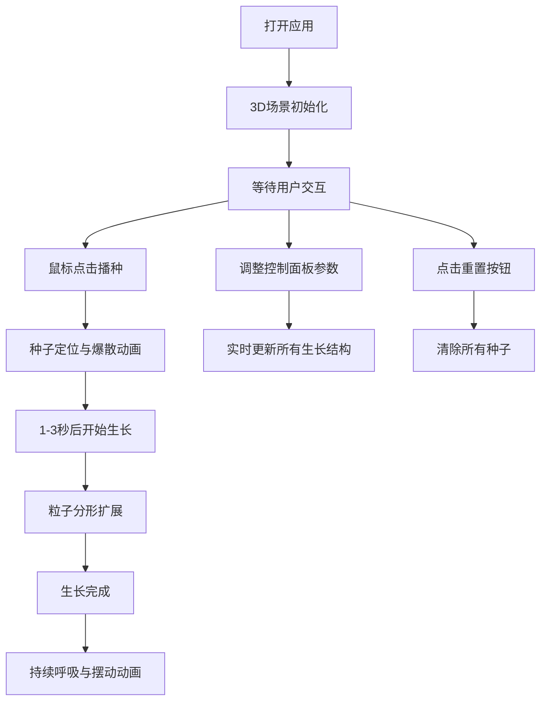
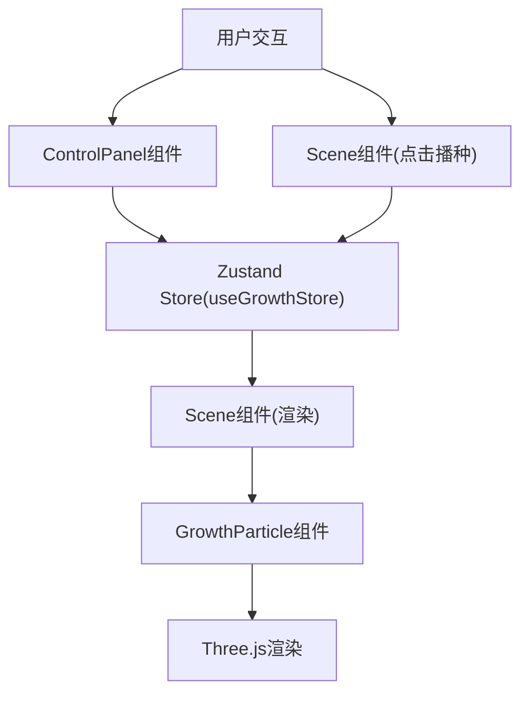

## 1. 产品概述

有机生长是一款面向数字艺术工作室的3D交互可视化应用，用户通过鼠标在三维空间播种种子，种子会随时间生长成由数百个粒子组成的动态有机形态，用于生成独特的抽象艺术作品或背景素材。

- 主要用途：创意设计、艺术作品生成、视觉素材创作
- 目标用户：数字艺术家、视觉设计师、创意工作者
- 产品价值：提供直观的有机形态生成工具，让非技术人员也能创作出独特的3D分形艺术作品

## 2. 核心功能

### 2.1 用户角色

| 角色 | 注册方式 | 核心权限 |
|------|----------|----------|
| 普通用户 | 无需注册，直接使用 | 播种种子、调整参数、实时预览、重置场景 |

### 2.2 功能模块

1. **主场景页面**：3D渲染画布、粒子生长系统、交互播种
2. **控制面板**：参数调节、颜色选择、重置功能

### 2.3 页面详情

| 页面名称 | 模块名称 | 功能描述 |
|----------|----------|----------|
| 主场景页面 | 3D渲染画布 | Three.js场景，深蓝渐变背景，半透明网格地面 |
| 主场景页面 | 粒子生长系统 | 播种种子、分形生长、呼吸动画、自然摆动效果 |
| 主场景页面 | 交互播种 | 鼠标点击3D空间播种，raycaster检测坐标 |
| 控制面板 | 参数调节 | 生长速度滑块(0.1-5)、分支密度滑块(1-8) |
| 控制面板 | 颜色选择 | 颜色渐变起始色和结束色选择器 |
| 控制面板 | 重置功能 | 清除所有种子，重置场景 |

## 3. 核心流程

用户打开应用后，看到深蓝渐变的3D场景。通过鼠标点击场景中的任意位置播种种子，种子在1-3秒后开始生长为分形树状结构。用户可以通过右下角的控制面板调整生长参数，实时观察效果。当场景中种子超过10个时，最早的种子会逐渐淡出消失。

## 4. 用户界面设计

### 4.1 设计风格
- 主色调：深蓝渐变(#0A0A1A 到 #1A1A3E)，营造深邃宇宙感
- 强调色：粒子颜色从起始色到结束色渐变，可由用户自定义
- 字体：14px，白色(#FFFFFF)
- 风格：科技感与有机自然结合，神秘优雅的数字艺术氛围

### 4.2 页面设计概述

| 页面名称 | 模块名称 | UI元素 |
|----------|----------|--------|
| 主场景页面 | 3D渲染画布 | 深蓝渐变背景、半透明网格地面、OrbitControls相机控制 |
| 主场景页面 | 粒子生长系统 | 白色发光种子点、粒子分形网络、连线结构、拖尾效果 |
| 控制面板 | 参数调节区 | 毛玻璃背景(280px宽，#FFFFFF15，圆角12px，边框#FFFFFF20)，自定义滑块轨道(4px高，圆角2px，圆形滑块直径16px) |
| 控制面板 | 颜色选择区 | 两个颜色选择器，分别控制渐变起始色和结束色 |
| 控制面板 | 操作按钮区 | 重置按钮，控件间距12px |

### 4.3 响应式
- 桌面端优先设计，控制面板固定在右下角
- 移动端自适应布局，控制面板可调整位置和大小

### 4.4 3D场景指引
- 环境：深蓝渐变背景，半透明网格地面辅助定位
- 光照：环境光 + 点光源，营造柔和的3D效果
- 相机：OrbitControls支持旋转、缩放、平移
- 动画：种子播种爆散动画(0.3秒)，生长拖尾效果，呼吸动画(0.95-1.05缩放，4-8秒周期)，粒子小幅摆动(振幅0.05，频率0.5-2Hz)
- 后处理：粒子发光效果，线条透明度渐变
- 性能：BufferGeometry优化，DrawCall合并，粒子总数不超过2000个

## 5. 数据流向与模块关系

