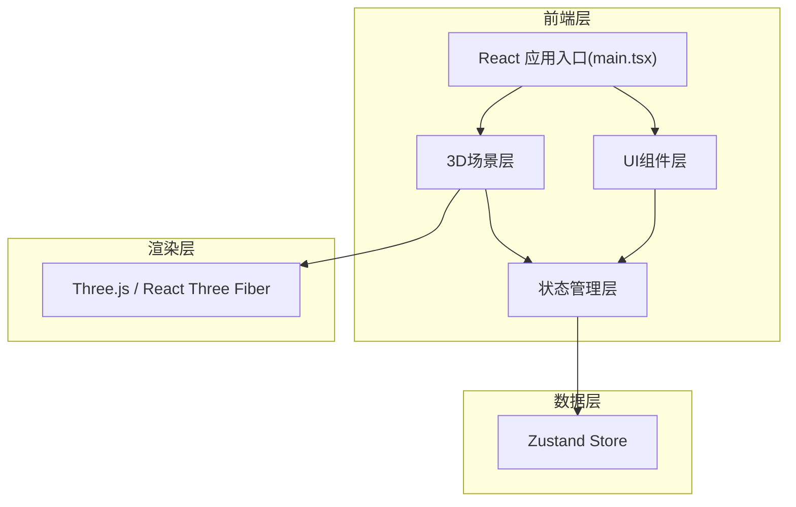

## 1. 架构设计



## 2. 技术描述

- 前端框架：React 18 + TypeScript
- 3D渲染：Three.js + @react-three/fiber + @react-three/drei
- 状态管理：Zustand
- 构建工具：Vite 5
- 唯一标识：uuid
- 路径别名：@ 指向 src 目录

### 依赖包说明
| 包名 | 版本 | 用途 |
|------|------|------|
| react | ^18.2.0 | 前端框架 |
| react-dom | ^18.2.0 | React DOM渲染 |
| three | ^0.160.0 | 3D渲染引擎 |
| @react-three/fiber | ^8.15.0 | React的Three.js渲染器 |
| @react-three/drei | ^9.92.0 | Three.js常用组件库 |
| zustand | ^4.4.0 | 轻量级状态管理 |
| uuid | ^9.0.0 | 唯一ID生成 |
| @types/react | ^18.2.0 | React类型定义 |
| @types/react-dom | ^18.2.0 | React DOM类型定义 |
| @vitejs/plugin-react | ^4.2.0 | Vite React插件 |
| typescript | ^5.3.0 | TypeScript编译器 |

## 3. 文件结构与调用关系

```
src/
├── main.tsx                    # React入口，渲染App，初始化store
│   └── 调用: App组件
├── App.tsx                     # 根组件，组合Scene和ControlPanel
│   ├── 调用: Scene组件
│   └── 调用: ControlPanel组件
├── store/
│   └── useGrowthStore.ts       # Zustand状态管理
│       ├── 状态: 种子列表、生长参数、时间步
│       ├── 方法: seed()播种、update()更新、reset()重置
│       └── 被调用: Scene、ControlPanel
├── components/
│   ├── Scene.tsx               # 3D场景容器
│   │   ├── 使用: Canvas、OrbitControls
│   │   ├── 读取: store种子数据
│   │   ├── 调用: GrowthParticle
│   │   └── 数据流向: store → Scene → GrowthParticle
│   ├── GrowthParticle.tsx      # 单个生长结构粒子系统
│   │   ├── 使用: useFrame动画循环
│   │   ├── 渲染: Points、LineSegments
│   │   └── 数据流向: Scene → GrowthParticle → 渲染
│   └── ControlPanel.tsx        # UI控制面板
│       ├── 绑定: store生长参数
│       ├── 组件: 滑块、颜色选择器、重置按钮
│       └── 数据流向: ControlPanel → store → Scene
└── types/
    └── index.ts                # TypeScript类型定义
```

## 4. 数据模型定义

### 4.1 类型定义

```typescript
// 种子状态
export type SeedStatus = 'waiting' | 'growing' | 'complete' | 'fading';

// 单个粒子数据
export interface Particle {
  id: string;
  position: [number, number, number];
  originalPosition: [number, number, number];
  depth: number;        // 分支深度
  parentId: string | null;
  phase: number;        // 摆动相位
  frequency: number;    // 摆动频率
  opacity: number;
}

// 种子数据
export interface Seed {
  id: string;
  position: [number, number, number];
  status: SeedStatus;
  startTime: number;    // 播种时间戳
  growthStartTime: number; // 开始生长时间戳
  particles: Particle[];
  connections: [string, string][]; // 粒子连接关系
  breathPhase: number;  // 呼吸动画相位
  breathCycle: number;  // 呼吸周期(秒)
  fadeStartTime: number | null; // 开始淡出时间
}

// 生长参数
export interface GrowthParams {
  growthSpeed: number;      // 0.1 - 5
  branchDensity: number;    // 1 - 8
  startColor: string;       // 起始色
  endColor: string;         // 结束色
}

// Store状态
export interface GrowthState {
  seeds: Seed[];
  params: GrowthParams;
  time: number;
  seed: (position: [number, number, number]) => void;
  update: (delta: number) => void;
  reset: () => void;
  setParams: (params: Partial<GrowthParams>) => void;
}
```

### 4.2 Store方法说明

| 方法名 | 参数 | 功能描述 |
|--------|------|----------|
| seed | position: [x, y, z] | 在指定3D位置播种新种子，超过10个时最早的开始淡出 |
| update | delta: number | 更新生长状态，推进时间，处理生长动画 |
| reset | 无 | 清除所有种子，重置场景 |
| setParams | params: Partial<GrowthParams> | 更新生长参数，实时影响所有结构 |

## 5. 核心算法

### 5.1 分形生长算法
1. 种子点作为第0层深度
2. 每层根据分支密度决定粒子数量(密度 × 2 + 1)
3. 每个新粒子从父粒子沿随机方向扩展，角度偏移±30度
4. 粒子间建立连接关系，形成网络结构
5. 生长速度控制时间步长，影响生长快慢

### 5.2 动画系统
- **生长动画**：粒子位置从种子点插值到目标位置，透明度从0渐变到1
- **呼吸动画**：整体缩放 sin(phase) × 0.05 + 1.0，周期4-8秒随机
- **摆动动画**：每个粒子 sin(time × frequency + phase) × 0.05 叠加在原始位置
- **淡出动画**：透明度从1线性降到0，持续3秒

### 5.3 性能优化
- 使用BufferGeometry存储所有粒子位置
- 粒子总数超过2000时自动降级为Points渲染
- 淡出完成后立即释放BufferGeometry资源
- 合并DrawCall减少渲染批次

## 6. 配置文件

### vite.config.js
```javascript
import { defineConfig } from 'vite';
import react from '@vitejs/plugin-react';
import path from 'path';

export default defineConfig({
  plugins: [react()],
  resolve: {
    alias: {
      '@': path.resolve(__dirname, './src'),
    },
  },
});
```

### tsconfig.json
```json
{
  "compilerOptions": {
    "target": "ESNext",
    "lib": ["DOM", "DOM.Iterable", "ESNext"],
    "module": "ESNext",
    "moduleResolution": "bundler",
    "strict": true,
    "jsx": "react-jsx",
    "baseUrl": ".",
    "paths": {
      "@/*": ["src/*"]
    }
  },
  "include": ["src"]
}
```
