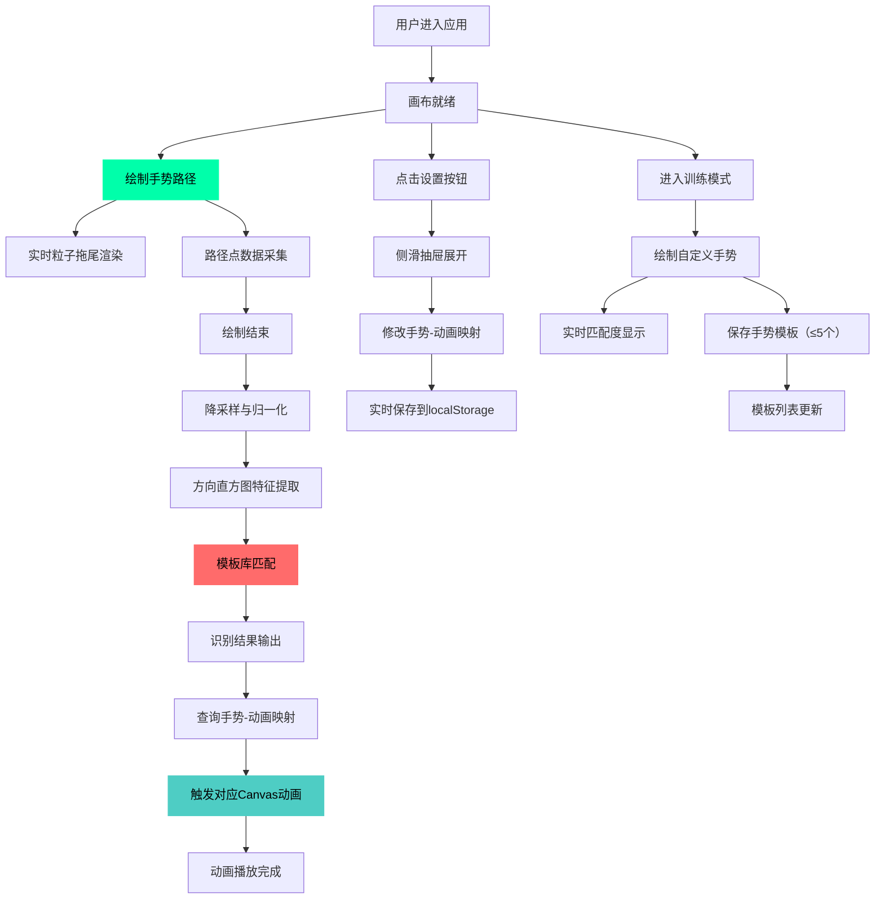

## 1. 产品概述

本项目是一款基于自定义手势动作控制页面元素交互的Web应用，解决传统点击拖拽交互缺乏趣味性和动态反馈的问题。用户通过在画布上绘制手势路径，系统实时识别手势形状并触发对应的视觉动画效果，支持手势-动画映射自定义和自定义手势模板训练。

- 核心用途：通过手势识别提供有趣、动态的交互体验
- 目标用户：创意设计爱好者、前端开发者、交互体验探索者
- 产品价值：将枯燥的界面交互转化为富有创造力的手势艺术体验

## 2. 核心功能

### 2.1 用户角色

| 角色 | 注册方式 | 核心权限 |
|------|----------|----------|
| 普通用户 | 无需注册 | 绘制手势、触发动画、自定义映射、训练手势模板 |

### 2.2 功能模块

1. **主画布页面**：手势绘制区域、实时识别反馈、粒子拖尾动画、工具栏
2. **设置面板**：侧滑抽屉式、手势-动画映射配置、实时保存
3. **训练面板**：自定义手势模板绘制、实时匹配度显示、模板列表管理

### 2.3 页面详情

| 页面名称 | 模块名称 | 功能描述 |
|----------|----------|----------|
| 主画布页面 | 画布区域 | 900×600px深色画布，支持鼠标/触控笔绘制手势路径 |
| 主画布页面 | 粒子拖尾 | 绘制过程中显示#00FFAA发光粒子（3-6px，30个，随机消散） |
| 主画布页面 | 手势识别引擎 | 实时识别圆形/三角形/S形/Z形，准确率>90% |
| 主画布页面 | 动画渲染 | 根据手势类型触发对应Canvas动画效果 |
| 主画布页面 | 顶部工具栏 | 手势选择器、设置按钮、训练模式切换按钮 |
| 设置面板 | 映射配置 | 下拉列表选择手势类型和对应动画效果 |
| 设置面板 | 数据持久化 | 配置实时保存到localStorage |
| 训练面板 | 模板绘制 | 绘制自定义手势模板（最多5个） |
| 训练面板 | 匹配反馈 | 绘制时显示实时匹配度百分比和预览动画 |
| 训练面板 | 模板列表 | 右侧展示保存的模板缩略图（80×80px） |

## 3. 核心流程

### 3.1 主流程描述

用户进入应用后，在画布区域按住鼠标/触控笔绘制手势路径→系统实时捕捉路径点并显示发光粒子拖尾→路径绘制完成后，手势识别引擎进行降采样、归一化、特征提取→与内置模板库匹配并返回识别结果→根据手势-动画映射关系触发对应动画效果→用户可通过设置面板修改映射或进入训练模式创建自定义模板。

### 3.2 核心流程图

## 4. 用户界面设计

### 4.1 设计风格

- **主色调**：深色主题，背景#0F0F23，辅助色#1A1A2E
- **强调色**：荧光绿#00FFAA（主要强调）、珊瑚红#FF6B6B（次要强调）、青蓝#4ECDC4（动画渐变）
- **按钮风格**：毛玻璃效果（背景#FFFFFF10，边框#FFFFFF20），圆角8px，悬停背景#FFFFFF20、边框#00FFAA，触发时缩放105%，过渡0.3s ease
- **字体**：使用现代无衬线字体，标题加粗，正文常规
- **布局**：居中画布 + 顶部工具栏 + 右侧侧滑抽屉，桌面端固定画布尺寸，平板端画布100%宽度

### 4.2 页面设计概览

| 页面名称 | 模块名称 | UI元素 |
|----------|----------|--------|
| 主画布页面 | 画布容器 | 居中900×600px，背景#0F0F23，圆角16px，阴影 |
| 主画布页面 | 粒子拖尾 | #00FFAA发光粒子，3-6px随机大小，30个粒子，随机消散 |
| 主画布页面 | 识别反馈 | 画布顶部显示识别结果标签（毛玻璃背景） |
| 主画布页面 | 顶部工具栏 | 左侧应用标题，右侧按钮组（手势选择/设置/训练） |
| 设置面板 | 抽屉容器 | 右侧滑出，宽360px，背景#1A1A2E，左侧圆角16px，遮罩#00000050 |
| 设置面板 | 映射配置项 | 每组包含手势下拉框 + 动画下拉框，间距均匀 |
| 设置面板 | 操作按钮 | 底部重置/保存按钮 |
| 训练面板 | 模板画布 | 主画布切换为训练模式，显示匹配度进度条 |
| 训练面板 | 模板列表 | 右侧网格布局，每项80×80px，圆角8px，背景#282840，白色2px路径 |

### 4.3 响应式设计

- **桌面端（>1024px）**：画布固定900×600px居中，工具栏和设置面板按规范尺寸渲染
- **平板端（768-1024px）**：画布宽度100%自适应，高度按比例缩放，设置抽屉宽度320px
- **触控优化**：所有按钮最小触控区域48×48px，支持触控笔压力感应（可选）
- **性能要求**：识别和渲染平均帧率≥55FPS，路径绘制延迟≤50ms

### 4.4 动画效果规范

| 手势类型 | 动画效果 | 参数规范 |
|----------|----------|----------|
| 圆形 | 旋转彩色粒子涡旋 | 持续3秒，100个粒子，颜色从#FF6B6B渐变到#4ECDC4 |
| 三角形 | 脉冲放大缩小几何图案 | 振幅1.2倍，周期1秒，重复3次 |
| S形 | 页面元素沿波浪路径浮动 | 振幅80px，周期2秒 |
| Z形 | 屏幕闪烁+自定义文本弹窗 | 闪烁3次后显示弹窗 |
