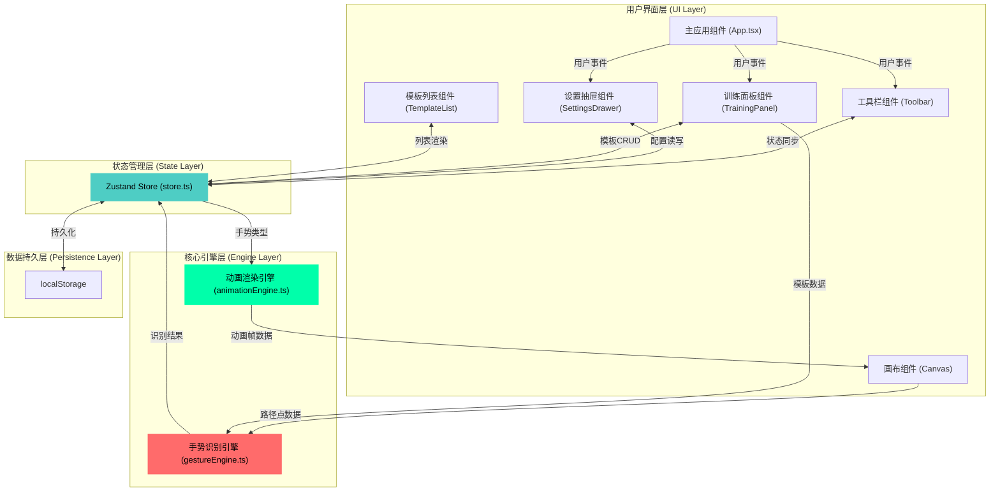

## 1. 架构设计



## 2. 技术描述

- **前端框架**：React@18 + TypeScript@5，严格模式
- **构建工具**：Vite@5 + @vitejs/plugin-react@4
- **状态管理**：Zustand@4（轻量级、无Provider嵌套、支持DevTools）
- **工具库**：uuid@9（生成手势模板唯一ID）
- **渲染方式**：Canvas 2D API（手势路径+粒子系统+动画效果）
- **样式方案**：原生CSS Modules + CSS Variables（无第三方UI库，保证性能）
- **初始化方式**：手动配置Vite项目（不使用create-vite脚手架）
- **后端**：无后端依赖，纯前端应用
- **数据存储**：localStorage存储手势映射配置和自定义模板

## 3. 项目文件结构

```
auto407/
├── package.json
├── vite.config.js
├── tsconfig.json
├── index.html
└── src/
    ├── main.tsx              # 应用入口，挂载React根节点
    ├── App.tsx               # 根组件，组合画布、工具栏、抽屉
    ├── store.ts              # Zustand状态管理
    ├── gestureEngine.ts      # 手势识别引擎模块
    ├── animationEngine.ts    # 动画渲染引擎模块
    ├── uiController.tsx      # UI控制组件（工具栏/抽屉/训练面板）
    ├── styles/
    │   ├── globals.css       # 全局样式+CSS变量
    │   └── components.css    # 组件级样式
    └── types/
        └── index.ts          # 全局TypeScript类型定义
```

## 4. 核心模块技术设计

### 4.1 手势识别引擎 (gestureEngine.ts)

**输入输出**：
- 输入：鼠标/触控事件序列 `Point[]`（x, y坐标+时间戳）
- 输出：识别结果 `RecognitionResult`（类型、置信度、匹配度百分比）

**核心算法流程**：
1. **路径捕捉**：监听pointerdown/pointermove/pointerup事件，收集原始坐标点
2. **降采样**：将N个点归一化为固定M个点（推荐M=64），使用等距重采样算法
3. **归一化**：平移到原点（质心对齐）+ 缩放至统一尺寸（长宽归一化）
4. **特征提取**：计算方向直方图（8个bin，每个45°）+ 起始点角度 + 闭合度
5. **模板匹配**：使用加权余弦相似度 + 动态时间规整(DTW)简化版
6. **阈值判定**：置信度>0.85判定有效识别，否则返回UNKNOWN

**内置模板库**：4个标准模板（CIRCLE、TRIANGLE、S_SHAPE、Z_SHAPE），每个模板包含3-5个变体样本。

### 4.2 动画渲染引擎 (animationEngine.ts)

**架构**：面向对象的粒子系统框架

**核心类**：
- `Particle`：粒子基类（位置、速度、加速度、颜色、生命周期）
- `VortexEffect`：圆形手势涡旋（极坐标运动+颜色渐变+旋转）
- `PulseEffect`：三角形脉冲（三角函数缩放+几何图形生成）
- `WaveEffect`：S形波浪浮动（正弦函数插值+多元素联动）
- `FlashEffect`：Z形闪烁弹窗（requestAnimationFrame控制亮度振荡）

**渲染循环**：单例`AnimationLoop`，使用`requestAnimationFrame`，支持多动画叠加，自动清理过期粒子，每帧执行时间<16ms（保证60FPS）。

### 4.3 UI控制组件 (uiController.tsx)

包含以下子组件：
- `Toolbar`：顶部工具栏，含手势选择器、设置按钮、训练模式开关
- `SettingsDrawer`：右侧侧滑抽屉，CSS transform动画，手势-动画映射表单
- `TrainingPanel`：训练模式UI，匹配度进度条、模板保存按钮
- `TemplateList`：自定义模板网格列表，Canvas缩略图渲染

**交互反馈**：所有按钮/可点击元素统一使用`useTransition` Hook封装hover/active过渡效果。

### 4.4 状态管理 (store.ts)

```typescript
// Store 切片划分
interface AppState {
  // 手势配置
  gestureMappings: GestureMapping[];      // 手势-动画映射
  customTemplates: CustomTemplate[];      // 自定义模板（≤5）
  
  // 运行时状态
  currentGesture: GestureType | null;     // 当前识别手势
  currentAnimation: AnimationType | null; // 当前播放动画
  isTrainingMode: boolean;                // 训练模式标志
  isSettingsOpen: boolean;                // 设置抽屉开关
  
  // 统计数据
  recognitionHistory: HistoryItem[];      // 最近识别历史
  matchPercentage: number;                // 训练模式匹配度
  
  // Actions
  setGestureMapping: (gesture: GestureType, animation: AnimationType) => void;
  addCustomTemplate: (template: Omit<CustomTemplate, 'id'>) => void;
  removeCustomTemplate: (id: string) => void;
  setCurrentRecognition: (gesture: GestureType, animation: AnimationType) => void;
  toggleTrainingMode: () => void;
  toggleSettings: () => void;
  persistToStorage: () => void;
  hydrateFromStorage: () => void;
}
```

**持久化策略**：使用Zustand `persist`中间件，自动同步`gestureMappings`和`customTemplates`到localStorage，键名`gesture-app-state-v1`。

## 5. 性能优化策略

| 优化点 | 方案 |
|--------|------|
| Canvas渲染 | 双缓冲离屏Canvas，脏矩形区域重绘 |
| 路径识别 | Web Worker执行特征提取和匹配算法（避免阻塞主线程） |
| 粒子系统 | 对象池复用Particle实例，避免频繁GC |
| 状态更新 | Zustand浅比较选择器，减少不必要重渲染 |
| 绘制延迟 | pointer事件使用`passive: true`，节流16ms采样 |
| 帧率监控 | PerformanceObserver统计长任务，FPS<55时降级粒子数量 |

## 6. 类型定义 (types/index.ts)

```typescript
export type GestureType = 'CIRCLE' | 'TRIANGLE' | 'S_SHAPE' | 'Z_SHAPE' | 'CUSTOM' | 'UNKNOWN';
export type AnimationType = 'VORTEX' | 'PULSE' | 'WAVE' | 'FLASH' | 'NONE';

export interface Point {
  x: number;
  y: number;
  timestamp: number;
}

export interface GestureMapping {
  gesture: GestureType;
  animation: AnimationType;
  customLabel?: string;
}

export interface CustomTemplate {
  id: string;
  name: string;
  points: Point[];          // 归一化后的64个点
  thumbnailData: string;    // base64缩略图
  createdAt: number;
}

export interface RecognitionResult {
  type: GestureType;
  confidence: number;       // 0-1
  matchPercentage: number;  // 0-100
  matchedTemplateId?: string;
}

export interface HistoryItem {
  id: string;
  gesture: GestureType;
  animation: AnimationType;
  timestamp: number;
}
```
