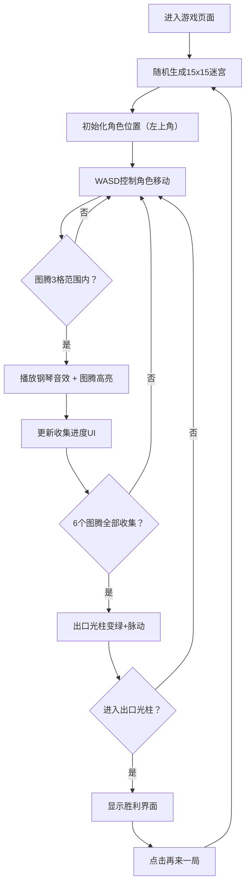

## 1. 产品概述
音弦回廊是一款暗色调几何迷宫探索音乐游戏，玩家在程序生成的迷宫中收集音符图腾以解锁出口。
- 核心玩法：WASD控制角色在随机迷宫中穿行，按顺序触碰发光图腾触发钢琴音效，集齐6个图腾后通过出口通关
- 目标用户：喜欢解谜探索和音乐互动的休闲玩家

## 2. 核心功能

### 2.1 功能模块
1. **游戏主场景**：Canvas渲染迷宫、角色、图腾、光柱出口
2. **音效系统**：Web Audio API生成钢琴音色，图腾触发时播放
3. **HUD界面**：收集进度显示、计时功能、磨砂玻璃UI
4. **胜利界面**：通关文字、用时统计、再来一局按钮

### 2.2 页面详情
| 页面名称 | 模块名称 | 功能描述 |
|-----------|-------------|---------------------|
| 游戏主页面 | 迷宫渲染层 | 15x15网格随机迷宫，墙厚2格，通道4格，暗紫色调#1A0A2E |
| 游戏主页面 | 角色控制 | WASD移动，速度4格/秒，蓝色菱形发光角色，矩形碰撞检测 |
| 游戏主页面 | 图腾系统 | 6个音符图腾，3格半径触发，颜色渐变#4A90D9→#00FFAA（0.3秒），触发音效 |
| 游戏主页面 | 出口光柱 | 右下角旋转金色光柱，周期4秒；集齐后变绿色#00FF66并脉动缩放 |
| HUD | 进度UI | 左上角半透明磨砂玻璃#FFFFFF15，圆角8px，显示"X/6" |
| HUD | 计时系统 | 实时显示游戏用时，胜利时保留一位小数 |
| 胜利界面 | 通关展示 | 全屏"通关"文字36px#FFD700，淡入动画1秒；显示用时；再来一局按钮 |

## 3. 核心流程
玩家打开页面即进入游戏→WASD控制蓝色菱形角色在随机迷宫中移动→靠近图腾（3格内）触发音效和高亮→左上角HUD实时更新收集进度→集齐6个图腾后出口光柱变绿并脉动→走进光柱触发胜利界面→显示通关文字和用时→点击"再来一局"重新生成迷宫并开始新游戏。

## 4. 用户界面设计

### 4.1 设计风格
- **主色调**：暗紫色背景#1A0A2E，图腾蓝色#4A90D9→绿色#00FFAA，角色蓝色光晕#00AAFF，金色光柱→绿色光柱#00FF66
- **按钮风格**：圆角8px无边框，红色#FF6B6B默认→#FF4466悬停
- **字体**：系统等宽字体，UI文字清晰可辨
- **布局风格**：游戏画布居中，HUD悬浮于左上角，胜利界面全屏覆盖
- **视觉特效**：星云径向渐变背景，呼吸光效（opacity 0.8-1循环，2秒周期），图腾渐变高亮，光柱旋转/脉动，文字淡入

### 4.2 页面设计概览
| 页面名称 | 模块名称 | UI元素 |
|-----------|-------------|-------------|
| 游戏主页面 | 背景层 | 星云径向渐变纹理，暗紫#1A0A2E底色 |
| 游戏主页面 | 迷宫层 | 深紫墙壁，通道为背景色，网格对齐 |
| 游戏主页面 | 角色层 | 蓝色菱形（10px边长），中心蓝色光晕#00AAFF |
| 游戏主页面 | 图腾层 | 蓝色发光音符图标，触发后变绿高亮 |
| 游戏主页面 | 出口层 | 金色旋转光柱（4秒/圈），集齐后变绿脉动（0.5秒/周期） |
| HUD | 进度卡片 | 左上角磨砂玻璃#FFFFFF15，圆角8px，显示"X/6"和用时 |
| 胜利界面 | 全屏覆盖 | 半透明深色遮罩，"通关"文字36px#FFD700淡入，用时显示，再来一局按钮 |

### 4.3 响应式
桌面端优先，固定画布尺寸；不做移动端适配。

### 4.4 动画性能要求
- 所有动画帧率≥45fps
- 内存占用≤150MB
- 使用Canvas 2D API渲染，React状态更新与Canvas绘制分离
