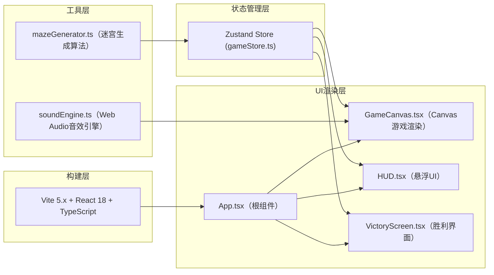

## 1. 架构设计



## 2. 技术描述
- **前端框架**：React 18 + TypeScript（严格模式）
- **构建工具**：Vite 5.x，开发服务器端口3000
- **状态管理**：Zustand 4.x，集中管理玩家位置、收集进度、时间、游戏状态
- **图形渲染**：Canvas 2D API，游戏循环使用requestAnimationFrame，目标帧率60fps
- **音效引擎**：Web Audio API，ADSR包络模拟钢琴音色，6种不同频率对应6个图腾
- **迷宫算法**：深度优先搜索（DFS）回溯算法生成完美迷宫，网格尺寸15x15
- **辅助库**：uuid（图腾唯一标识生成）

## 3. 模块文件结构

| 文件路径 | 职责说明 |
|-------|---------|
| `package.json` | 项目依赖与脚本（dev/build/preview） |
| `vite.config.js` | Vite配置：React插件、端口3000 |
| `tsconfig.json` | TypeScript严格模式、moduleResolution bundler |
| `index.html` | 入口页面，标题"音弦回廊"，挂载点#root |
| `src/main.tsx` | React入口，StrictMode包裹渲染App |
| `src/App.tsx` | 根组件，组合GameCanvas+HUD+VictoryScreen |
| `src/store/gameStore.ts` | Zustand store：position/totems/time/status/actions |
| `src/utils/mazeGenerator.ts` | generateMaze(w,h)→墙壁坐标数组，DFS算法 |
| `src/utils/soundEngine.ts` | playNote(freq,duration)，Web Audio钢琴合成 |
| `src/components/GameCanvas.tsx` | Canvas主循环：迷宫/角色/图腾/光柱渲染、WASD输入、碰撞检测 |
| `src/components/HUD.tsx` | 进度卡片：收集数X/6 + 计时器，磨砂玻璃样式 |
| `src/components/VictoryScreen.tsx` | 通关文字、用时、再来一局按钮，条件渲染 |

## 4. 数据模型

### 4.1 Zustand Store状态定义

```typescript
type Cell = { x: number; y: number };
type TotemStatus = 'idle' | 'triggered' | 'collected';
type Totem = {
  id: string;
  position: Cell;
  frequency: number;
  status: TotemStatus;
  glowStart: number;
};
type GameStatus = 'playing' | 'victory';

interface GameState {
  gridSize: number;        // 迷宫网格数15
  cellSize: number;        // 每格像素大小：墙厚2格+通道4格=6格为一个单元？
  wallThickness: number;   // 2像素格
  passageWidth: number;    // 4像素格
  walls: Set<string>;      // "x,y"格式的墙壁坐标集合
  playerPosition: { x: number; y: number };  // 像素坐标
  playerSpeed: number;     // 4格/秒
  totems: Totem[];
  collectedCount: number;
  exitPosition: Cell;      // 网格坐标
  exitActivated: boolean;
  startTime: number;
  timeElapsed: number;
  gameStatus: GameStatus;
  keys: Set<string>;       // 当前按下的WASD键
  
  // Actions
  initGame: () => void;
  setPlayerPosition: (x: number, y: number) => void;
  triggerTotem: (id: string) => void;
  updateTime: () => void;
  triggerVictory: () => void;
  setKey: (key: string, pressed: boolean) => void;
}
```

### 4.2 迷宫生成算法逻辑
- 15x15网格，每个"单元格"由墙厚2+通道4=6像素格组成
- 使用DFS回溯：从起点开始，随机选择未访问邻居，打通墙壁，递归深入
- 墙壁以像素坐标存储为Set<string>（key=`${x},${y}`），碰撞检测时O(1)查询
- 起点固定在左上角网格，出口固定在右下角网格

### 4.3 碰撞检测
- 角色矩形碰撞盒比菱形图形略小（8x8像素）
- 移动前计算下一帧位置，将矩形四角映射到墙壁Set查询
- 水平和垂直方向分别检测，允许贴墙滑行

### 4.4 图腾触发逻辑
- 每帧遍历图腾，计算玩家与图腾的欧氏距离
- 距离≤3像素格且状态为idle时，触发：
  - status→collected，collectedCount++
  - glowStart记录时间戳，用于0.3秒渐变动画
  - 调用soundEngine.playNote(freq, 0.3)
  - 若全部收集，exitActivated=true
