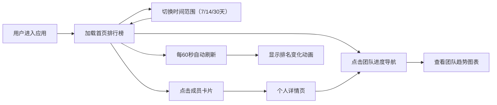

## 1. 产品概述
健身热力榜是一个面向社区健身爱好者小组的数据追踪与激励平台，通过记录每日步数、锻炼时长和消耗卡路里，生成可视化排行榜和趋势图表，激励团队成员坚持运动。

- 核心目标：帮助健身小组追踪成员运动数据，通过排行榜和趋势图表形成良性竞争氛围，提升团队整体运动积极性
- 目标用户：社区健身爱好者小组及其成员

## 2. 核心功能

### 2.1 用户角色
| 角色 | 注册方式 | 核心权限 |
|------|----------|----------|
| 小组成员 | 系统预置账号 | 浏览排行榜、查看个人详情、查看团队进度 |

### 2.2 功能模块
1. **首页（排行榜）**：时间范围筛选器、成员排名列表、排名变化动画
2. **个人详情页**：成员信息汇总、近7天步数趋势、近7天锻炼时长统计
3. **团队进度页**：30天团队步数趋势、平均卡路里统计、目标完成度圆环

### 2.3 页面详情
| 页面名称 | 模块名称 | 功能描述 |
|----------|----------|----------|
| 首页 | 导航栏 | Logo、排行榜/团队进度选项卡、毛玻璃固定定位 |
| 首页 | 时间筛选器 | 近7天/14天/30天切换、淡入淡出过渡动画 |
| 首页 | 排行榜列表 | 三列网格布局、成员卡片（排名/头像/昵称/步数/卡路里）、前三甲边框发光动画、排名变化箭头动画、点击跳转 |
| 个人详情页 | 信息汇总区 | 昵称、总步数、总卡路里、平均每日时长 |
| 个人详情页 | 步数趋势图 | Recharts折线图、#00D4AA配色、悬停显示数值 |
| 个人详情页 | 时长柱状图 | Recharts柱状图、#4A90D9配色、圆角4px |
| 团队进度页 | 数据汇总区 | 团队总步数、总卡路里、目标完成天数 |
| 团队进度页 | 步数趋势图 | Recharts折线图、#FF6B6B渐变填充 |
| 团队进度页 | 卡路里柱状图 | Recharts柱状图、#FFD700配色 |
| 团队进度页 | 目标圆环图 | Recharts环形图、10万步目标、中心显示实际值 |

## 3. 核心流程
用户进入应用 → 默认加载首页排行榜（近7天）→ 可切换时间范围刷新数据 → 点击成员卡片进入个人详情 → 通过导航栏切换到团队进度页 → 前端每60秒自动更新排行榜数据并展示排名变化

## 4. 用户界面设计

### 4.1 设计风格
- **主题色调**：深色科技感主题
  - 主背景：#121220
  - 卡片背景：#1E1E2E
  - 边框色：#2A2A3E
  - 主强调色：#00D4AA（薄荷绿）
  - 次强调色：#4A90D9（蓝色）、#FF6B6B（珊瑚红）、#FFD700（金色）
- **字体层级**：
  - 主要文字：#FFFFFF
  - 次要文字：#A0A0B8
- **卡片样式**：圆角16px、深色背景、细边框
- **图标风格**：使用 lucide-react 线性图标
- **动效风格**：流畅过渡、微妙发光、渐变填充

### 4.2 页面设计概述
| 页面名称 | 模块名称 | UI元素 |
|----------|----------|--------|
| 首页 | 导航栏 | 固定顶部、毛玻璃背景(#121220CC)、blur(10px)、选项卡下划线动画(#00D4AA、0.2s) |
| 首页 | 排行榜卡片 | 网格布局(桌面3列/平板2列/手机1列)、悬停上浮 translateY(-4px)、阴影 #00D4AA30、前三甲脉动发光边框(1.5s周期) |
| 首页 | 排名变化 | 绿色向上箭头/红色向下箭头、1秒后淡出、卡片背景闪烁 #00D4AA15 (0.3s) |
| 个人详情页 | 图表区域 | 背景 #1E1E2E、圆角 16px、内边距 20px、入场动画平滑 |
| 团队进度页 | 圆环图 | #00D4AA 完成部分 / #2A2A3E 未完成部分、中心数值显示 |

### 4.3 响应式设计
- **设计策略**：桌面端优先，适配平板和移动端
- **断点设置**：
  - 桌面端 (≥1024px)：排行榜三列网格
  - 平板端 (768px-1023px)：排行榜两列网格
  - 移动端 (<768px)：排行榜单列网格，卡片全宽
- **触控优化**：移动端增大点击区域、卡片间距适配

## 5. 性能要求
- 首页首次加载时间 ≤ 2秒（10个成员卡片+动画）
- 排行榜数据更新时 FPS ≥ 50帧
- 后端API响应时间 ≤ 200ms
- 前端自动刷新间隔：60秒
