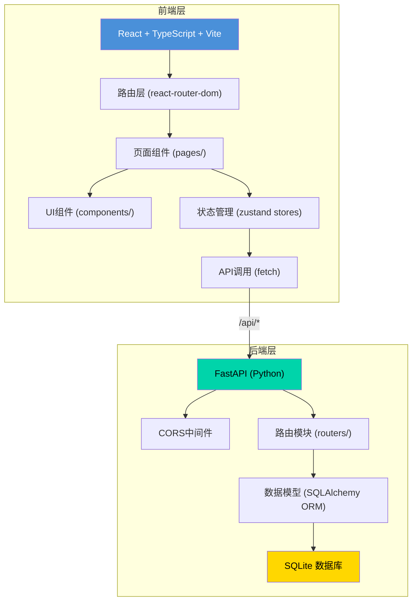
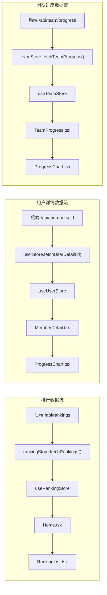
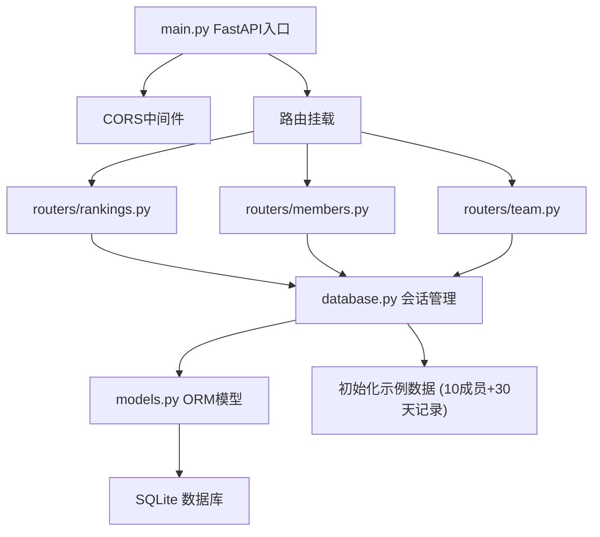
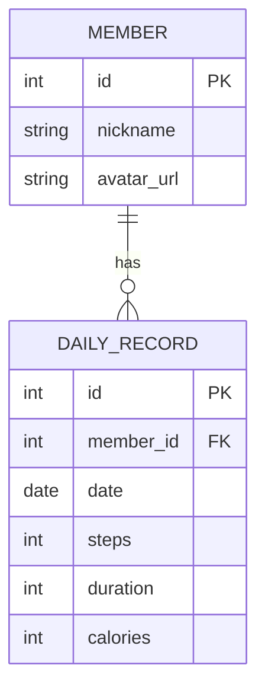

## 1. 架构设计



## 2. 技术栈说明

| 层级 | 技术选型 | 版本 | 用途 |
|------|----------|------|------|
| 前端框架 | React | ^18 | UI构建 |
| 前端语言 | TypeScript | ^5 | 类型安全 |
| 构建工具 | Vite | ^5 | 开发构建 |
| 路由 | react-router-dom | ^6 | 客户端路由 |
| 状态管理 | zustand | ^4 | 全局状态 |
| 图表库 | recharts | ^2 | 数据可视化 |
| UUID生成 | uuid | ^9 | 唯一标识 |
| 后端框架 | FastAPI | ^0.110 | RESTful API |
| ORM | SQLAlchemy | ^2.0 | 数据库操作 |
| 数据库 | SQLite | 内置 | 数据持久化 |
| 跨域 | uvicorn CORS | - | 跨域支持 |

## 3. 项目文件结构

```
auto409/
├── .trae/documents/
│   ├── PRD.md                    # 产品需求文档
│   └── 技术架构文档.md            # 技术架构文档
├── src/                          # 前端源码
│   ├── main.tsx                  # 应用入口
│   ├── App.tsx                   # 根组件（路由配置）
│   ├── pages/                    # 页面组件
│   │   ├── Home.tsx              # 首页-排行榜
│   │   ├── MemberDetail.tsx      # 个人详情页
│   │   └── TeamProgress.tsx      # 团队进度页
│   ├── stores/                   # Zustand状态仓库
│   │   ├── rankingStore.ts       # 排行榜数据
│   │   ├── userStore.ts          # 用户详情数据
│   │   └── teamStore.ts          # 团队进度数据
│   ├── components/               # 可复用UI组件
│   │   ├── RankingList.tsx       # 排行榜列表
│   │   └── ProgressChart.tsx     # 通用图表组件
│   └── types/                    # TypeScript类型定义
├── backend/                      # 后端源码
│   ├── main.py                   # FastAPI入口
│   ├── database.py               # 数据库连接与初始化
│   ├── models.py                 # SQLAlchemy数据模型
│   └── routers/                  # API路由模块
│       ├── members.py            # 成员详情接口
│       ├── rankings.py           # 排行榜接口
│       └── team.py               # 团队进度接口
├── package.json                  # 前端依赖配置
├── vite.config.js                # Vite构建配置
├── tsconfig.json                 # TypeScript配置
└── index.html                    # HTML入口
```

## 4. 前端路由定义

| 路由路径 | 页面组件 | 用途 | 数据流向 |
|----------|----------|------|----------|
| `/` | Home.tsx | 排行榜首页 | rankingStore → RankingList |
| `/member/:id` | MemberDetail.tsx | 个人详情页 | userStore → ProgressChart |
| `/team` | TeamProgress.tsx | 团队进度页 | teamStore → ProgressChart |

## 5. API接口定义

### 5.1 TypeScript 类型定义

```typescript
interface Member {
  id: number;
  nickname: string;
  avatar_url: string;
}

interface RankingMember extends Member {
  total_steps: number;
  total_calories: number;
  rank_change?: 'up' | 'down' | 'same';
  prev_rank?: number;
}

interface DailyRecord {
  date: string;
  steps: number;
  duration: number;
  calories: number;
}

interface MemberDetail extends Member {
  records: DailyRecord[];
  total_steps: number;
  total_calories: number;
  avg_duration: number;
}

interface TeamProgress {
  daily_totals: { date: string; total_steps: number; avg_calories: number }[];
  total_steps: number;
  total_calories: number;
  goal_days: number;
  current_day_steps: number;
}
```

### 5.2 接口清单

| 方法 | 路径 | 参数 | 返回 | 用途 |
|------|------|------|------|------|
| GET | `/api/rankings` | ?days=7 | RankingMember[] | 获取排行榜 |
| GET | `/api/members/{id}` | - | MemberDetail | 获取成员详情 |
| GET | `/api/team/progress` | - | TeamProgress | 获取团队进度 |

## 6. 状态管理数据流



## 7. 后端架构分层



## 8. 数据模型定义

### 8.1 ER 图



### 8.2 数据库初始化数据

- **Member 表**：预置10条成员数据，包含昵称和头像URL
- **DailyRecord 表**：为每个成员生成最近30天的随机运动记录，步数范围 3000-18000，时长范围 20-120分钟，卡路里按步数比例计算

### 8.3 核心业务查询逻辑

1. **排行榜查询**：按日期范围筛选 DailyRecord → 按 member_id 聚合 steps/calories → 关联 Member 表 → 按 total_steps 降序排列
2. **成员详情查询**：查询 Member 基本信息 → 获取近7天 DailyRecord → 聚合总计和平均值
3. **团队进度查询**：按日期分组聚合所有成员 steps/calories → 计算每日是否达成10万步目标 → 返回30天趋势数据
