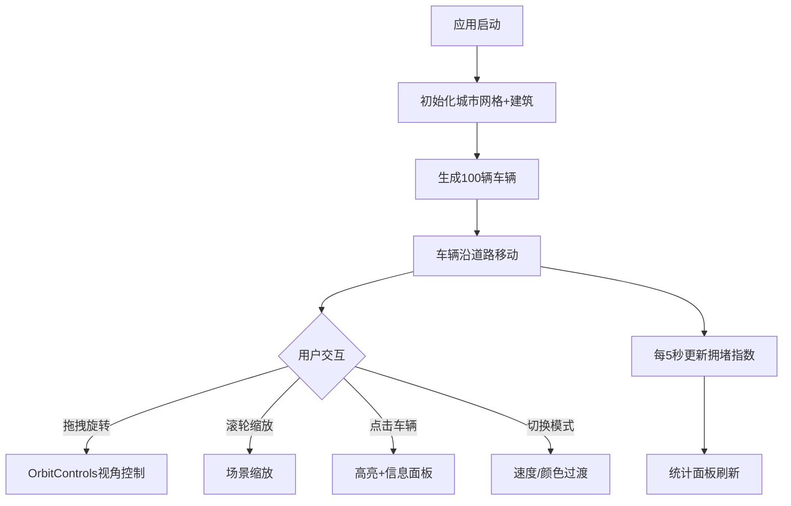

## 1. 产品概述

三维城市交通流动态模拟系统，用于直观观察不同时段路网拥堵状况和车辆迁徙模式。目标用户为城市规划研究者、交通工程师及数据可视化爱好者，核心价值在于将抽象的交通数据转化为可交互的三维可视化场景。

## 2. 核心功能

### 2.1 功能模块

1. **三维城市场景**：1km×1km方形街区，20×20道路网格，随机高度建筑物填充，OrbitControls交互
2. **车辆模拟系统**：100辆自动行驶车辆，道路跟随，交叉路口随机转向，基础碰撞检测
3. **时间模式切换**：早高峰/平峰/晚高峰三种模式，影响车辆速度与道路颜色
4. **实时统计面板**：车辆总数、平均速度、拥堵指数，5秒刷新
5. **FPS计数器**：左下角实时帧率显示

### 2.2 页面详情

| 页面名称 | 模块名称 | 功能描述 |
|----------|----------|----------|
| 主场景 | 城市网格 | 20×20道路网格渲染，建筑物随机生成 |
| 主场景 | 车辆系统 | 100辆车沿道路移动，碰撞检测，点击高亮 |
| 主场景 | 时间模式 | 三个切换按钮，速度/颜色平滑过渡 |
| 主场景 | 统计面板 | 右侧实时数据面板，响应式折叠 |
| 主场景 | FPS计数器 | 左下角帧率监控 |

## 3. 核心流程

用户打开应用 → 加载三维城市场景 → 100辆车自动沿道路行驶 → 用户可拖拽旋转视角、缩放 → 切换时间模式观察不同拥堵状态 → 点击车辆查看详情 → 右侧面板实时监控统计

## 4. 用户界面设计

### 4.1 设计风格

- **主色调**：赛博朋克暗色系，背景#0A0A1A，强调色#00FFAA
- **按钮风格**：圆角按钮，#00FFAA强调色边框，半透明背景
- **字体**：14px白色#FFFFFF，FPS计数器16px绿色#00FFAA
- **布局风格**：3D场景全屏，UI元素悬浮叠加
- **道路颜色**：基础#3A3A4E，拥堵#FF6B6B，平峰#4A90D9，晚高峰#FF8800
- **建筑颜色**：#6A6A7E浅色边框

### 4.2 页面设计概览

| 页面名称 | 模块名称 | UI元素 |
|----------|----------|--------|
| 主场景 | 3D城市 | 全屏Canvas，暗色背景#0A0A1A |
| 主场景 | 时间按钮 | 顶部居中，三个模式切换按钮 |
| 主场景 | 统计面板 | 右侧悬浮，半透明#00000040，圆角12px |
| 主场景 | FPS计数器 | 左下角，绿色#00FFAA 16px |
| 主场景 | 车辆信息 | 点击弹出，车辆ID/坐标/速度/方向 |

### 4.3 响应式适配

- 桌面端（≥768px）：统计面板右侧常驻显示
- 移动端（<768px）：统计面板折叠为顶部可点击展开抽屉

### 4.4 3D场景指引

- **环境**：赛博朋克暗夜城市，无HDRI，自发光元素营造氛围
- **光照**：环境光+方向光，启用阴影映射
- **相机**：透视相机，OrbitControls，最近10单位/最远100单位
- **交互**：鼠标拖拽旋转、滚轮缩放、点击选择车辆
- **性能**：100辆车+20×20网格+阴影，目标60 FPS
