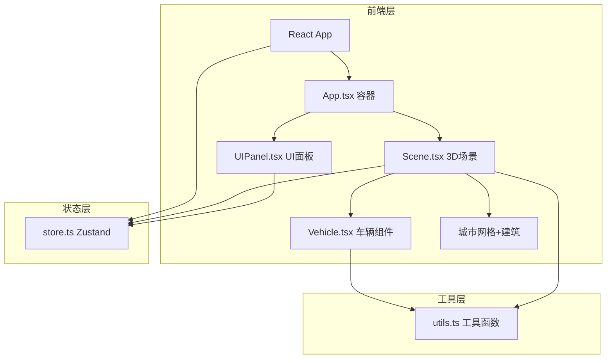

## 1. 架构设计



## 2. 技术说明

- **前端框架**：React 18 + TypeScript
- **3D渲染**：Three.js + @react-three/fiber + @react-three/drei
- **状态管理**：Zustand
- **构建工具**：Vite
- **唯一标识**：uuid
- **无后端**：纯前端应用，所有模拟逻辑在客户端运行

## 3. 路由定义

| 路由 | 用途 |
|------|------|
| / | 主场景页面（单页应用） |

## 4. 文件结构

```
├── package.json
├── vite.config.js
├── tsconfig.json
├── index.html
└── src/
    ├── main.tsx          # React入口
    ├── App.tsx           # 主场景容器
    ├── store.ts          # Zustand状态管理
    ├── Scene.tsx         # 3D场景组件
    ├── Vehicle.tsx       # 车辆组件
    ├── UIPanel.tsx       # 统计面板+模式按钮
    └── utils.ts          # 工具函数
```

## 5. 状态模型

### 5.1 Zustand Store 定义

```typescript
interface VehicleState {
  id: string;
  position: [number, number, number];
  speed: number;
  direction: 'north' | 'south' | 'east' | 'west';
  roadIndex: { row: number; col: number };
  isHighlighted: boolean;
}

type TimeMode = 'morning' | 'normal' | 'evening';

interface TrafficStore {
  vehicles: VehicleState[];
  timeMode: TimeMode;
  selectedVehicleId: string | null;
  stats: { totalCount: number; avgSpeed: number; congestionIndex: number };
  setTimeMode: (mode: TimeMode) => void;
  selectVehicle: (id: string | null) => void;
  updateVehicle: (id: string, updates: Partial<VehicleState>) => void;
  updateStats: () => void;
}
```

### 5.2 核心数据流

- **Store → Scene**：车辆列表、时间模式
- **Store → UIPanel**：统计数据、时间模式、选中车辆
- **Vehicle → Store**：位置更新、碰撞检测后状态
- **UIPanel → Store**：模式切换动作

## 6. 性能策略

- 使用InstancedMesh渲染建筑物和车辆以减少DrawCall
- 车辆碰撞检测使用空间哈希网格优化
- 阴影使用中等分辨率贴图
- useFrame中避免创建新对象，复用Vector3等
