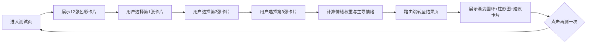

## 1. 产品概述

色彩情绪是一款基于色彩心理学的交互式情绪测试应用。用户通过选择抽象颜色卡片来匹配当下的情绪状态，系统根据色彩与情绪的映射关系分析并生成个性化情绪报告。

- 核心功能：通过色彩选择 → 情绪分析 → 个性化报告
- 目标用户：希望快速了解自身情绪状态的普通用户
- 产品价值：提供简单、直观、美观的情绪自测工具，帮助用户觉察情绪并获得建议

## 2. 核心功能

### 2.1 用户角色

无需注册登录，匿名用户直接使用全部功能。

### 2.2 功能模块

1. **测试页**：12张色彩卡片展示、3张卡片选择、选择状态管理、选择完成自动跳转
2. **结果页**：主导情绪展示（渐变圆环）、情绪能量柱形图、建议活动卡片、再测一次按钮
3. **路由与动画**：页面切换过渡动画、卡片交互动画、图表动画

### 2.3 页面详情

| 页面名称 | 模块名称 | 功能描述 |
|-----------|-------------|---------------------|
| 测试页 | 标题区 | 主标题、副标题 |
| 测试页 | 卡片网格 | 12张圆形色彩卡片（3x4/2x6/1x12自适应）、悬停放大、点击脉冲、选择计数、最多选满半透明禁用 |
| 测试页 | 路由跳转 | 选满3张后自动跳转结果页 |
| 结果页 | 报告标题 | "你的情绪报告" |
| 结果页 | 主导情绪圆环 | 直径200px渐变圆环、中央情绪名称、主色调渐变 |
| 结果页 | 情绪能量柱形图 | 6种基础情绪、0-10能量值、柱条颜色对应、底部升起动画 |
| 结果页 | 建议活动卡片 | 毛玻璃效果、emoji图标、文字建议 |
| 结果页 | 再测一次按钮 | 蓝紫渐变、重置状态返回测试页 |

## 3. 核心流程

用户进入应用 → 展示12张色彩卡片 → 用户选择3张卡片 → 自动计算情绪权重 → 跳转结果页 → 展示主导情绪/能量图/建议 → 用户可再测一次

## 4. 用户界面设计

### 4.1 设计风格

- 主色调：深色背景 #1A1A2E，文字 #E0E0E0
- 色彩调色板：12种预设色彩（#FF6B6B、#4ECDC4、#45B7D1、#96CEB4、#FFEAA7、#DDA0DD、#98D8C8、#FFA07A、#FFD700、#B0C4DE、#FFDAB9、#87CEEB）
- 按钮样式：圆角、蓝紫渐变（#667eea→#764ba2）
- 字体：Inter（Google Fonts）
- 布局风格：Flex居中布局、卡片网格、毛玻璃效果
- Emoji风格：原生emoji用于建议卡片图标
- 动效：所有交互均使用 framer-motion 过渡动画

### 4.2 页面设计概述

| 页面名称 | 模块名称 | UI 元素 |
|-----------|-------------|-------------|
| 测试页 | 标题区 | 标题28px font-weight 300 letter-spacing 2px、副标题14px #9E9E9E |
| 测试页 | 卡片网格 | 圆形120px直径、间距自适应网格、悬停放大115%阴影rgba(0,0,0,0.2)、点击脉冲、半透明禁用 |
| 结果页 | 渐变圆环 | 200px直径、主色调渐变、中央24px加粗情绪名 |
| 结果页 | 柱形图 | 600x300px、背景#F0F4F8、圆角12px、柱条底部升起动画 |
| 结果页 | 建议卡片 | 200px宽、毛玻璃、圆角16px、边框rgba(255,255,255,0.3) |
| 结果页 | 再测按钮 | 圆角8px、内边距12px 24px、悬停变亮 |

### 4.3 响应式

桌面优先：
- 桌面端：3x4网格
- 平板：2x6网格
- 移动端：1x12单列

所有布局使用CSS Grid自适应，间距使用响应式断点。
