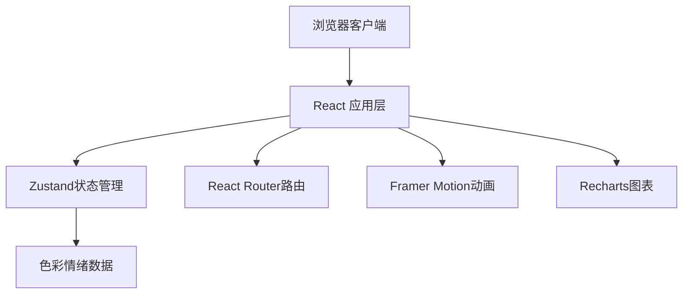

## 1. 架构设计

纯前端应用，无需后端服务。



## 2. 技术描述

- 前端框架：React 18 + TypeScript
- 构建工具：Vite 5
- 状态管理：Zustand 4
- 路由管理：React Router DOM 6
- 动画库：Framer Motion 11
- 图表库：Recharts 2
- 工具库：UUID 9
- UI 字体：Google Fonts Inter

## 3. 路由定义

| 路由 | 用途 |
|-------|---------|
| / | 测试页面（色彩卡片选择） |
| /result | 结果页面（情绪报告展示） |

## 4. 项目结构

```
src/
├── App.tsx                    # 应用根组件，路由与主题配置
├── main.tsx                   # 入口文件
├── store/
│   └── emotionStore.ts      # Zustand 状态管理
├── components/
│   └── ColorCard.tsx     # 单个颜色卡片组件
├── pages/
│   ├── TestPage.tsx      # 测试页面
│   └── ResultPage.tsx    # 结果页面
└── data/
    └── colors.ts          # 色彩与情绪映射数据
```

## 5. 数据模型

### 5.1 数据结构定义

```typescript
// 情绪类型
type EmotionType = '快乐' | '平静' | '兴奋' | '忧伤' | '焦虑' | '疲惫';

// 颜色映射数据接口
interface ColorEmotion {
  id: string;
  color: string;           // hex 颜色值
  name: string;         // 颜色描述名
  emotions: {
    type: EmotionType;
    weight: number;    // 权重值
  }[];
}

// 情绪权重记录
interface EmotionWeights = Record<EmotionType, number>;

// 选中颜色
interface SelectedColor {
  id: string;
  color: string;
  selectedAt: number;  // 时间戳，用于平局时判断最新选择
}

// 历史记录
interface HistoryRecord {
  id: string;
  selectedColors: string[];
  dominantEmotion: EmotionType;
  emotionWeights: EmotionWeights;
  createdAt: number;
}
```

### 5.2 状态管理（Zustand Store

```typescript
interface EmotionStore {
  selectedColors: SelectedColor[];
  history: HistoryRecord[];
  emotionWeights: EmotionWeights;
  dominantEmotion: EmotionType | null;
  selectColor: (color: ColorEmotion) => void;
  resetSelection: () => void;
  calculateResult: () => void;
  clearAll: () => void;
}
```

### 5.3 情绪柱形图数据

6 种基础情绪及对应颜色：
- 快乐：#FFD700
- 平静：#4ECDC4
- 兴奋：#FF6B6B
- 忧伤：#98D8C8
- 焦虑：#87CEEB
- 疲惫：#B0C4DE
