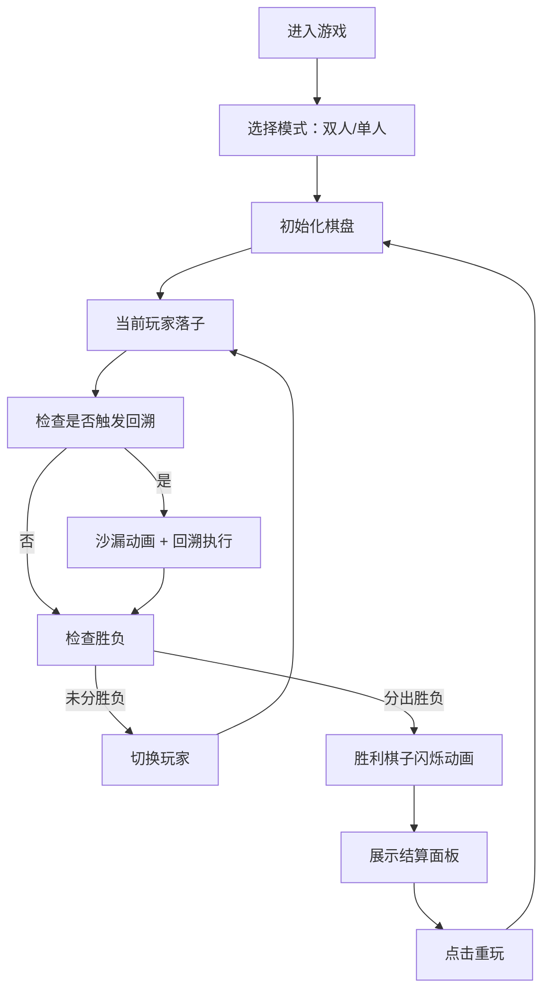

## 1. 产品概述

时光棋局是一款融合记忆与策略的双人对战棋盘游戏，在6x6的复古木质棋盘上进行。游戏核心机制是每3-5步随机触发"时空回溯"效果，打乱或撤销最近的落子，玩家需要凭借记忆和推演能力来应对不确定性，最终以连成四子获胜。

- 核心玩法：双人轮流落子 + 随机回溯机制 + 四子连珠胜利条件
- 目标用户：喜欢策略棋类游戏、追求新颖玩法的玩家
- 产品价值：将经典五子棋/四子棋玩法与随机性结合，创造独特的记忆策略体验

## 2. 核心功能

### 2.1 用户角色

| 角色 | 进入方式 | 核心权限 |
|------|----------|----------|
| 玩家1（先手） | 进入游戏自动分配 | 使用白色棋子，先手落子 |
| 玩家2（后手） | 双人模式/AI模式 | 使用黑色棋子，后手落子 |
| AI对手 | 单人模式 | 自动落子，具备基础防守策略 |

### 2.2 功能模块

1. **游戏主界面**：棋盘渲染、棋子落子、动画效果
2. **回溯系统**：随机触发回溯事件、棋盘状态回退/打乱
3. **结算系统**：胜负判定、结算面板展示
4. **模式选择**：双人对战 / 单人AI对战
5. **统计面板**：对局步数、回溯次数、玩家用时

### 2.3 页面详情

| 页面名称 | 模块名称 | 功能描述 |
|---------|----------|----------|
| 游戏主页面 | 标题区域 | 展示"时光棋局"标题，手写风格字体 |
| 游戏主页面 | 模式选择 | 双人/单人模式切换按钮 |
| 游戏主页面 | 棋盘区域 | 6x6木质纹理棋盘，棋子渲染与动画 |
| 游戏主页面 | 状态提示 | 当前玩家提示、回溯事件提示文字 |
| 游戏主页面 | 统计信息 | 步数、回溯次数、双方用时 |
| 游戏主页面 | 结算面板 | 游戏结束时展示结果与统计 |
| 游戏主页面 | 重置按钮 | 重新开始游戏 |

## 3. 核心流程

玩家进入游戏后选择模式，双人模式下两人轮流点击棋盘落子，单人模式下玩家与AI轮流落子。每落子3-5步后随机触发回溯事件，棋盘状态发生变化。当一方连成四子或棋盘填满时游戏结束，展示结算面板。

## 4. 用户界面设计

### 4.1 设计风格

- **主色调**：深棕色木纹背景 `#2C1810`，棋盘格子交替使用 `#4A2E1B` 和 `#8B5E3C`
- **点缀色**：金色 `#FFD700`（回溯效果、光晕），深绿色按钮 `#2D5A27` 配金色描边 `#8B6914`
- **棋子色**：白色 `#F5F5F5`（带微弱光泽）、黑色 `#1A1A1A`（带金属反光）
- **胜利色**：红色 `#FF4444`
- **按钮风格**：圆角矩形，深绿色填充，金色描边，悬停变亮并放大5%
- **字体**：标题使用 Playfair Display（手写风格），正文使用系统无衬线字体
- **整体质感**：复古桌游风格，木质纹理，毛玻璃结算面板

### 4.2 页面设计概述

| 页面名称 | 模块名称 | UI元素 |
|---------|----------|--------|
| 游戏主页面 | 标题区域 | Playfair Display 字体，居中，金色文字 |
| 游戏主页面 | 模式切换 | 两个按钮并排，选中状态高亮 |
| 游戏主页面 | 棋盘容器 | 居中布局，木质边框，淡金色光晕效果 |
| 游戏主页面 | 棋盘格子 | 6x6网格，交替棕色，圆角4px，60px格子大小 |
| 游戏主页面 | 棋子 | 圆形，光泽/反光效果，落子缩放弹跳动画 |
| 游戏主页面 | 回溯提示 | 沙漏旋转动画 + "时空扰动！"文字渐隐 |
| 游戏主页面 | 状态统计 | 两侧/下方展示步数、回溯次数、计时 |
| 游戏主页面 | 结算面板 | 毛玻璃效果，圆角16px，半透明白色边框 |
| 游戏主页面 | 重置按钮 | 深绿色金色描边，位于棋盘下方 |

### 4.3 响应式

- **桌面端**：棋盘居中，格子60px，两侧展示统计信息
- **平板端**：棋盘自适应宽度，统计信息移至下方
- **手机端**：棋盘宽度占屏幕95%，格子最小40px，支持触控落子，布局垂直排列
- **触控优化**：增大点击热区，确保触控精准

### 4.4 动效设计

- **落子动画**：0.3秒缩放弹跳效果（scale from 0 to 1.2 to 1）
- **落子光晕**：棋盘边缘淡金色光晕短暂亮起
- **回溯动画**：金色沙漏旋转1.5秒，随后棋盘状态变化
- **回溯提示**："时空扰动！"文字0.5秒渐隐效果
- **胜利动画**：获胜棋子依次闪烁三次（变红色），间隔0.3秒
- **按钮悬停**：颜色变亮 + 放大5%，过渡平滑
- **性能要求**：所有动画稳定60FPS，回溯计算与重绘不超过50ms
