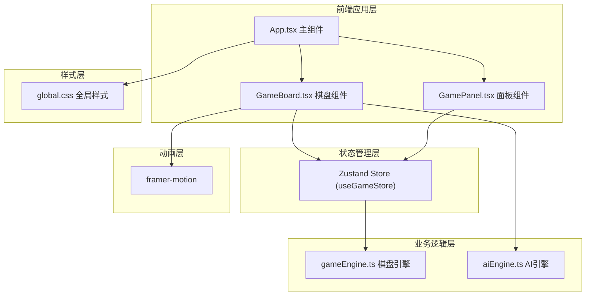

## 1. 架构设计



## 2. 技术描述

- **前端框架**：React 18 + TypeScript
- **构建工具**：Vite 5
- **状态管理**：Zustand
- **动画库**：framer-motion
- **路由**：react-router-dom（预留）
- **工具库**：uuid
- **样式方案**：原生 CSS + CSS 变量
- **字体**：Google Fonts - Playfair Display

## 3. 目录结构

```
src/
├── modules/
│   ├── gameEngine.ts    # 棋盘引擎：状态管理、落子逻辑、回溯机制
│   └── aiEngine.ts      # AI引擎：单人模式AI对手
├── ui/
│   ├── App.tsx          # 主应用组件
│   ├── GameBoard.tsx    # 棋盘渲染组件
│   └── GamePanel.tsx    # 结算与状态面板
├── styles/
│   └── global.css       # 全局样式
└── main.tsx             # 入口文件
```

## 4. 核心数据模型

### 4.1 棋盘状态

```typescript
type Player = 'white' | 'black';
type Cell = Player | null;
type Board = Cell[][];  // 6x6 二维数组

interface Move {
  row: number;
  col: number;
  player: Player;
  timestamp: number;
}

interface TimeWarpEvent {
  id: string;
  type: 'shuffle' | 'rewind';
  movesAffected: number;
  timestamp: number;
}
```

### 4.2 游戏状态 Store

```typescript
interface GameState {
  board: Board;
  currentPlayer: Player;
  moveHistory: Move[];
  eventLog: TimeWarpEvent[];
  gameStatus: 'playing' | 'won' | 'draw';
  winner: Player | null;
  winningLine: [number, number][] | null;
  moveCount: number;
  timeWarpCount: number;
  nextWarpAt: number;
  isWarping: boolean;
  startTime: number | null;
  whiteTime: number;
  blackTime: number;
  
  // Actions
  placePiece: (row: number, col: number) => boolean;
  triggerTimeWarp: () => void;
  resetGame: () => void;
  checkWin: (board: Board, row: number, col: number, player: Player) => boolean;
}
```

## 5. 模块职责

### 5.1 gameEngine.ts（棋盘引擎）

- 定义棋盘类型与游戏状态接口
- 实现落子规则与合法性校验
- 实现回溯事件触发逻辑（每3-5步随机）
- 实现回溯执行：随机交换最近棋子 / 回退一步
- 实现胜负判定（四子连珠：横、竖、斜）
- 导出 Zustand store 供 UI 层使用

### 5.2 aiEngine.ts（AI引擎）

- 导出 `getAIMove(board: Board, player: Player): [number, number]`
- 简单难度策略：
  1. 优先阻止对方即将四连
  2. 其次尝试自己连子
  3. 都没有则随机落子
- 不使用复杂算法，保证响应速度

### 5.3 GameBoard.tsx（棋盘组件）

- 渲染6x6棋盘网格与木质纹理
- 渲染棋子与落子动画（framer-motion）
- 处理点击/触控落子事件
- 渲染回溯沙漏动画与提示文字
- 渲染胜利棋子闪烁效果
- 从 gameEngine store 读取状态，调用 action
- 单人模式下调用 AI 引擎自动落子

### 5.4 GamePanel.tsx（面板组件）

- 渲染游戏状态：当前玩家、步数、回溯次数
- 渲染双方用时计时器
- 游戏结束时渲染结算面板（毛玻璃效果）
- 提供重新开始按钮

### 5.5 App.tsx（主组件）

- 组合 GameBoard 与 GamePanel
- 提供模式选择：双人 / 单人AI
- 整体布局与响应式适配
- 标题区域渲染

## 6. 性能优化

- 使用 Zustand 选择器避免不必要重渲染
- 棋盘格子使用 memo 优化
- 回溯计算使用不可变数据，确保 < 50ms
- 动画使用 transform 属性保证 60FPS
- 移动端按需加载，避免过度绘制
