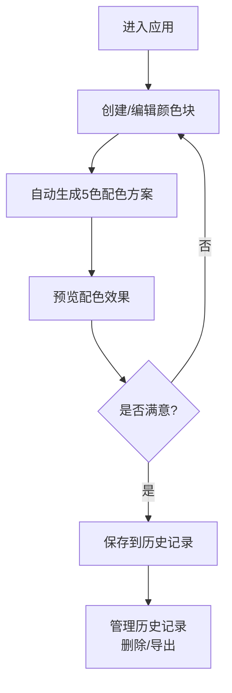

## 1. 产品概述

CSS调色板创建工具，帮助设计师和开发者在网页上快速创建、测试和分享自定义CSS调色板。
- 解决设计师和开发者无法直观预览颜色组合效果、难以导出标准化色彩方案的问题
- 目标用户：前端开发者、UI/UX设计师、创意工作者

## 2. 核心功能

### 2.1 功能模块
1. **调色板编辑器**：颜色选择器、HEX/RGB输入、颜色块管理（最多12个）、拖拽排序
2. **配色方案生成**：根据主色自动生成主色、辅色、强调色、背景色、文字色共5种配色
3. **实时预览模式**：模拟Web页面展示，包含页眉、导航、卡片、按钮、表单等组件
4. **历史记录管理**：本地存储、卡片网格展示、删除和导出功能

### 2.2 页面详情
| 页面名称 | 模块名称 | 功能描述 |
|-----------|-------------|---------------------|
| 编辑器页面 | 主编辑区 | 颜色块展示、添加、删除、编辑名称、拖拽排序 |
| 编辑器页面 | 配色方案面板 | 5色方案卡片展示、一键复制颜色值 |
| 编辑器页面 | 预览模式切换 | 切换到模拟Web页面预览，包含3种以上组件状态动画 |
| 历史记录页面 | 卡片网格 | 每行4/2/1个响应式布局，缩略色块+时间展示 |
| 历史记录页面 | 卡片操作 | 悬停显示删除和导出按钮，支持CSS变量和JSON格式导出 |

## 3. 核心流程

用户进入应用后，可通过颜色选择器或直接输入颜色值创建颜色块。系统根据第一个添加的主色自动生成5色配色方案。用户可切换到预览模式查看配色在模拟Web页面上的效果。满意后可保存到本地历史记录，历史记录支持删除和导出（CSS变量或JSON格式）。

## 4. 用户界面设计

### 4.1 设计风格
- **主色调**：#00D4AA（用于按钮、链接、激活状态）
- **背景色**：#121220（整体）、#1E1E2E（编辑区）
- **文字色**：#E0E0F0（主文字）、#8888AA（次要文字）
- **按钮样式**：圆角8px，悬停背景变暗10%并缩小至95%
- **输入框样式**：圆角6px，聚焦时边框变为#00D4AA并带发光效果
- **卡片样式**：毛玻璃效果，背景#FFFFFF10，圆角12px，边框#FFFFFF20
- **颜色块**：80x80px方块，圆角8px，边框#2A2A3A，悬停缩放105%并显示#00D4AA阴影
- **动画**：Framer Motion实现列表项淡入+上移0.3秒，组件状态过渡0.2秒ease-in-out

### 4.2 页面设计概述
| 页面名称 | 模块名称 | UI元素 |
|-----------|-------------|-------------|
| 编辑器页面 | 主编辑区 | 深色卡片容器、颜色块网格、添加按钮、可编辑标签 |
| 编辑器页面 | 配色方案面板 | 毛玻璃卡片、颜色预览、一键复制按钮 |
| 编辑器页面 | 预览区 | 模拟Web页面：页眉/导航/卡片/按钮/表单，带状态动画 |
| 历史记录页面 | 网格卡片 | 缩略色块阵列、创建时间、悬停操作按钮 |

### 4.3 响应式设计
- 桌面端（≥1200px）：编辑区+右侧面板双栏布局，历史记录每行4个
- 平板端（≥768px且<1200px）：单栏堆叠布局，历史记录每行2个
- 手机端（<768px）：紧凑布局，历史记录每行1个
