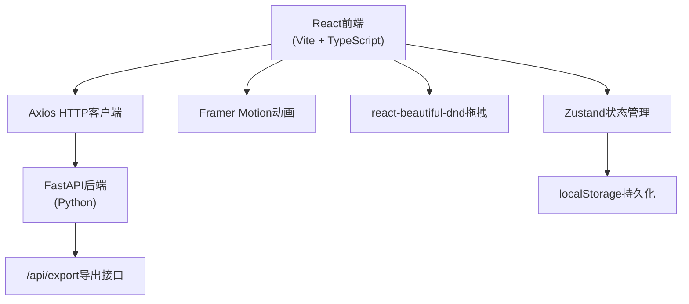
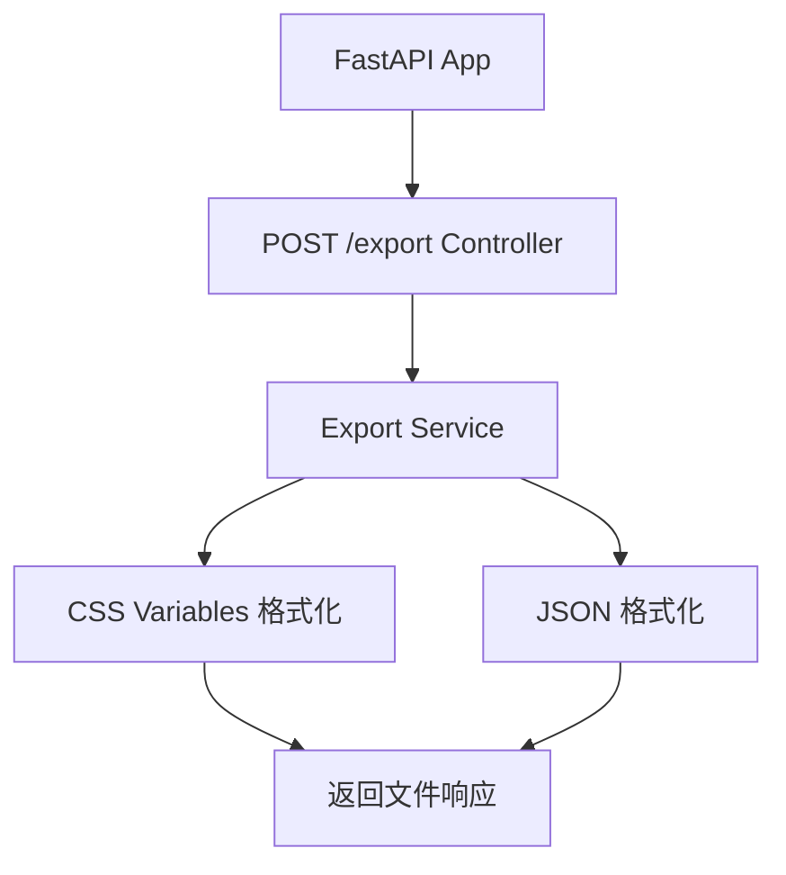
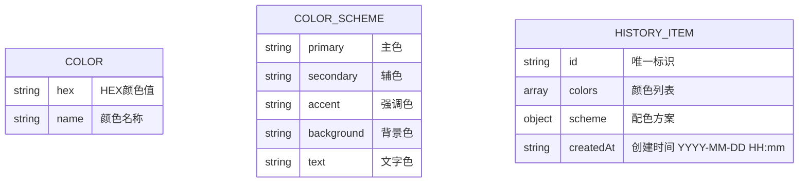

## 1. 架构设计



## 2. 技术说明
- **前端**：React 18 + TypeScript + Vite 5
- **状态管理**：Zustand 4
- **路由**：React Router DOM 6
- **动画**：Framer Motion 11
- **拖拽**：react-beautiful-dnd 13
- **HTTP客户端**：Axios 1
- **后端**：Python FastAPI + Uvicorn
- **构建工具**：Vite 5，开发端口5173，后端端口8000

## 3. 路由定义
| 路由 | 用途 |
|-------|---------|
| / | 主编辑器页面（颜色编辑、配色方案、预览） |
| /history | 历史记录页面（卡片网格、删除、导出） |

## 4. API定义

### POST /api/export
请求体：
```typescript
interface ExportRequest {
  format: 'css' | 'json';
  palette: {
    colors: Array<{ hex: string; name: string }>;
    scheme: {
      primary: string;
      secondary: string;
      accent: string;
      background: string;
      text: string;
    };
    createdAt: string;
  };
}
```

响应：文件下载（Content-Disposition: attachment）

## 5. 服务端架构



## 6. 数据模型

### 6.1 数据模型定义



### 6.2 Store状态定义
```typescript
interface ColorState {
  colors: ColorItem[];
  selectedColorId: string | null;
  scheme: ColorScheme | null;
  history: HistoryItem[];
  
  addColor: (hex: string, name?: string) => void;
  removeColor: (id: string) => void;
  updateColor: (id: string, updates: Partial<ColorItem>) => void;
  reorderColors: (startIndex: number, endIndex: number) => void;
  selectColor: (id: string | null) => void;
  generateScheme: () => void;
  saveToHistory: () => void;
  removeFromHistory: (id: string) => void;
  loadHistory: () => void;
}
```
