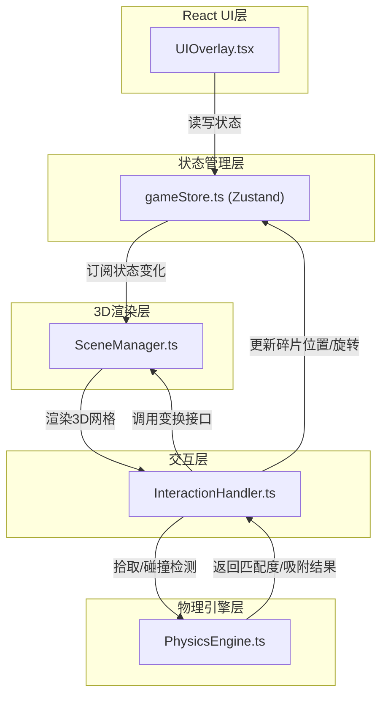
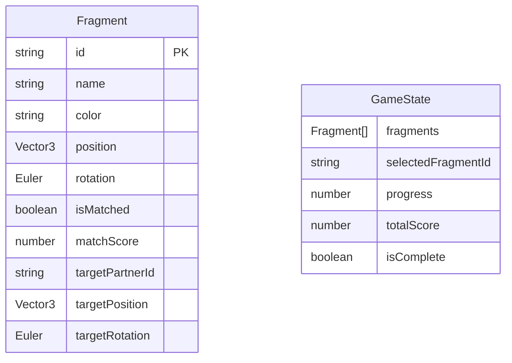

## 1. 架构设计



## 2. 技术描述
- **前端框架**：React@18 + TypeScript@5
- **3D引擎**：Three.js + @react-three/fiber + @react-three/drei
- **构建工具**：Vite@5 + @vitejs/plugin-react
- **状态管理**：Zustand@4
- **工具库**：uuid

## 3. 目录结构
```
src/
├── stores/
│   └── gameStore.ts          # Zustand状态仓库
├── modules/
│   ├── scene/
│   │   └── SceneManager.ts   # Three.js场景管理器
│   ├── interaction/
│   │   └── InteractionHandler.ts  # 交互处理模块
│   └── physics/
│       └── PhysicsEngine.ts  # 物理匹配引擎
├── ui/
│   └── UIOverlay.tsx         # React UI覆盖层
├── App.tsx                   # 根组件
├── main.tsx                  # 应用入口
└── index.css                 # 全局样式
```

### 文件职责与调用关系
| 文件 | 职责 | 被调用方 | 调用方 |
|------|------|----------|--------|
| `gameStore.ts` | 管理碎片列表、选中状态、拼合进度、评分 | - | UIOverlay, InteractionHandler, SceneManager |
| `SceneManager.ts` | 初始化场景/相机/光照，渲染3D网格，拾取与变换接口 | PhysicsEngine | InteractionHandler |
| `InteractionHandler.ts` | 监听鼠标事件，调用拾取/吸附，更新碎片状态 | gameStore, SceneManager, PhysicsEngine | App.tsx |
| `PhysicsEngine.ts` | 距离/角度匹配算法，吸附检测，匹配度评分 | - | InteractionHandler, SceneManager |
| `UIOverlay.tsx` | 渲染碎片列表、进度条、指示器、按钮 | gameStore | App.tsx |

### 数据流向
1. 用户交互 → `InteractionHandler` 捕获事件
2. `InteractionHandler` → 调用 `SceneManager.pickFragment()` 拾取碎片
3. `InteractionHandler` → 调用 `PhysicsEngine.checkMatch()` 检测匹配
4. 匹配成功 → `InteractionHandler` → `SceneManager.snapToPosition()` 执行吸附动画
5. 状态变更 → `gameStore` 更新 `fragments` / `selectedId` / `progress` / `score`
6. `UIOverlay` 订阅 `gameStore` → 重新渲染列表/进度条/指示器
7. `SceneManager` 订阅 `gameStore` → 更新3D场景渲染

## 4. 数据模型

### 4.1 数据模型定义


### 4.2 核心接口定义
```typescript
// Fragment 碎片数据结构
interface Fragment {
  id: string;
  name: string;
  color: string;
  position: [number, number, number];
  rotation: [number, number, number];
  isMatched: boolean;
  matchScore: number;
  partnerId: string | null;
  targetPosition: [number, number, number];
  targetRotation: [number, number, number];
}

// GameState 游戏状态
interface GameState {
  fragments: Fragment[];
  selectedId: string | null;
  progress: number;
  totalScore: number;
  isComplete: boolean;
  selectFragment: (id: string | null) => void;
  updateFragment: (id: string, updates: Partial<Fragment>) => void;
  matchFragments: (id1: string, id2: string, score: number) => void;
  resetView: () => void;
  autoAlign: () => void;
}
```
