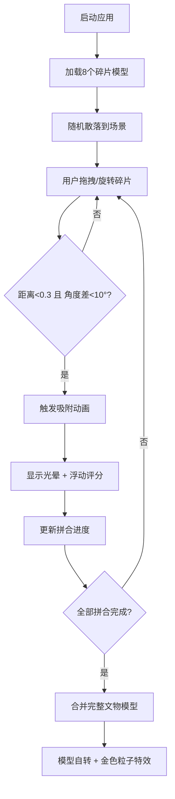

## 1. 产品概述
文物拼合台是一个面向考古研究人员的3D交互式文物碎片拼合与修复可视化应用，通过浏览器端3D渲染技术实现文物碎片的虚拟拼合、匹配检测与修复预览。
- 核心价值：让考古研究人员直观地观察碎片间的匹配关系，提高文物修复工作的效率和准确性
- 目标用户：考古研究人员、文物修复专家、博物馆数字化工作者

## 2. 核心功能

### 2.1 用户角色
| 角色 | 注册方式 | 核心权限 |
|------|----------|----------|
| 研究人员 | 无需注册，直接使用 | 加载碎片模型、拖拽拼合、查看匹配度、预览修复效果 |

### 2.2 功能模块
1. **3D场景渲染**：文物碎片三维展示、相机控制、光照效果
2. **碎片交互系统**：拖拽移动、旋转、选中高亮、包围盒显示
3. **物理匹配引擎**：距离/角度检测、自动吸附、匹配度评分
4. **拼合状态追踪**：碎片列表、进度条、匹配度指示器
5. **完成特效**：自动合并模型、自转展示、金色粒子特效

### 2.3 页面详情
| 页面名称 | 模块名称 | 功能描述 |
|-----------|-------------|---------------------|
| 主界面 | 左侧碎片列表面板 | 显示8个文物碎片缩略图与名称、拼合进度条、匹配度指示器、自动对齐/重置视角按钮 |
| 主界面 | 中央3D场景 | Three.js渲染场景，包含碎片模型、OrbitControls相机、光照系统 |
| 主界面 | 浮动提示卡片 | 拼合成功时显示"+5分"浮动文字、全部完成时显示拼合完成提示 |

## 3. 核心流程
用户打开应用后，场景中随机散落8个文物碎片。用户通过鼠标左键拖拽移动碎片，Shift+拖拽旋转碎片，右键拖拽调整视角，滚轮缩放。当两个碎片距离小于0.3单位且角度差小于10度时自动吸附，显示匹配度评分与光晕效果。全部碎片拼合完成后，自动合并模型并播放金色粒子上升特效。

## 4. 用户界面设计

### 4.1 设计风格
- **主色调**：深空蓝黑(#0B0E1A) → 暗紫色(#1A0A2E)渐变背景
- **强调色**：薄荷绿(#00FFAA)选中高亮、金色(#FFD700 → #FF8C00)匹配光晕
- **碎片色板**：#B87333、#C0A050、#8B7355等土色系粗糙纹理
- **按钮样式**：圆角8px，背景#2A2A3E，悬停#3A3A4E，点击#4A4A5E
- **字体颜色**：#E0E0FF 淡紫白色
- **面板样式**：毛玻璃效果(背景#FFFFFF08，圆角16px，边框#FFFFFF15)

### 4.2 页面设计概述
| 页面名称 | 模块名称 | UI元素 |
|-----------|-------------|-------------|
| 主界面 | 左侧碎片面板 | 宽度280px毛玻璃面板、80x80px圆角缩略图、8px间距列表项、渐变进度条(#FF6B6B→#4ECDC4) |
| 主界面 | 3D场景 | 渐变背景、半透明包围盒(选中时)、脉动光晕(匹配时)、浮动评分文字 |
| 主界面 | 完成提示 | 金色圆角卡片(背景#1A1A2E，边框#FFD700，圆角12px) |

### 4.3 响应式
桌面端优先设计，左侧固定面板+右侧自适应场景区域。

### 4.4 3D场景指导
- **环境**：深空蓝黑到暗紫色线性渐变背景
- **光照设置**：环境光(强度0.5) + 方向光(强度1.0，带阴影) + 点光源(匹配时增强)
- **相机设置**：PerspectiveCamera，视距范围2-20单位，OrbitControls右键旋转
- **组合与焦点**：碎片散落在半径5单位圆形区域，完成后居中展示完整文物
- **交互与动画**：拖拽弹性跟随、0.5秒easeOut吸附动画、1秒脉动光晕周期、10秒自转周期
- **后期处理**：选中/悬停时边缘发光效果，匹配时金色辉光
- **性能约束**：稳定50fps以上，单个碎片500+三角面，吸附动画60Hz更新
