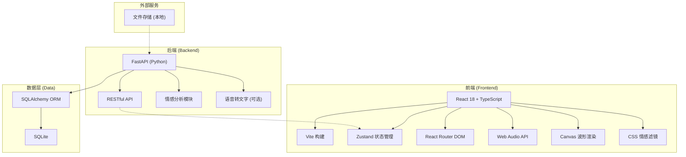
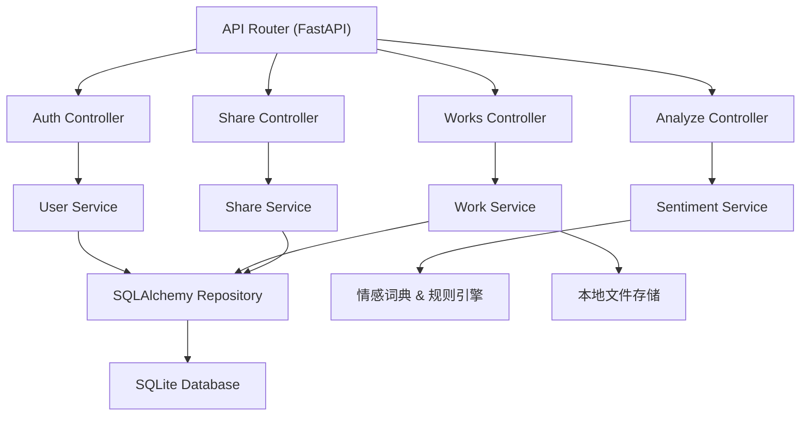
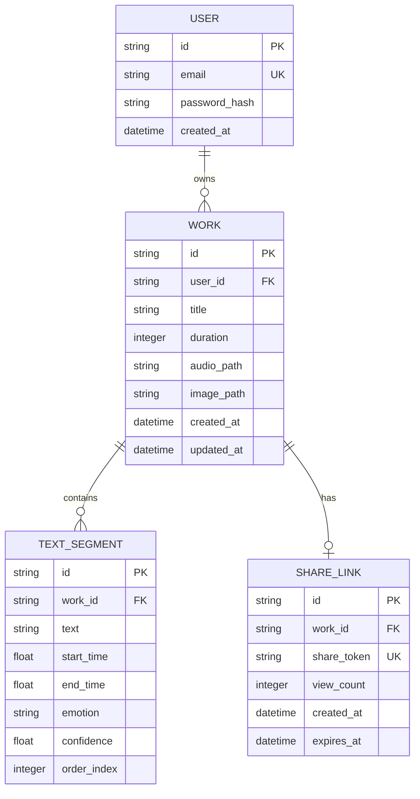

## 1. 架构设计



## 2. 技术描述

- **前端**：React 18 + TypeScript + Vite
  - 状态管理：Zustand
  - 路由：React Router DOM v6
  - 音频处理：Web Audio API
  - 波形可视化：Canvas API
  - 图片处理：CSS Filter 混合模式
- **后端**：Python 3.9+ + FastAPI
  - ORM：SQLAlchemy
  - 数据库：SQLite
  - 情感分析：规则匹配 + 关键词词典（满足200ms响应要求）
  - ASGI服务器：Uvicorn
- **开发工具**：
  - 前端构建：Vite
  - 类型检查：TypeScript 严格模式
  - 包管理：npm (前端) / pip (后端)

## 3. 路由定义

| 前端路由 | 页面 | 功能 |
|----------|------|------|
| `/login` | 登录页 | 用户登录 |
| `/register` | 注册页 | 用户注册 |
| `/dashboard` | 控制台 | 作品列表 |
| `/editor/:id` | 编辑页 | 作品编辑 |
| `/share/:id` | 分享页 | 作品展示（只读） |

| 后端API | 方法 | 功能 |
|---------|------|------|
| `/api/auth/register` | POST | 用户注册 |
| `/api/auth/login` | POST | 用户登录 |
| `/api/works` | GET | 获取作品列表 |
| `/api/works` | POST | 创建作品 |
| `/api/works/:id` | GET | 获取作品详情 |
| `/api/works/:id` | PUT | 更新作品 |
| `/api/works/:id` | DELETE | 删除作品 |
| `/api/works/:id/audio` | POST | 上传音频 |
| `/api/works/:id/image` | POST | 上传图片 |
| `/api/analyze/sentiment` | POST | 情感分析 |
| `/api/share/:id` | GET | 生成/获取分享链接 |

## 4. API 定义

```typescript
// 用户相关
interface User {
  id: string;
  email: string;
  createdAt: string;
}

interface LoginRequest {
  email: string;
  password: string;
}

interface AuthResponse {
  token: string;
  user: User;
}

// 作品相关
interface Work {
  id: string;
  title: string;
  duration: number;
  coverImage: string | null;
  audioUrl: string | null;
  text: TextSegment[];
  createdAt: string;
  updatedAt: string;
}

interface TextSegment {
  id: string;
  text: string;
  startTime: number;
  endTime: number;
  emotion: 'joy' | 'sadness' | 'anger' | 'neutral';
  confidence: number;
}

interface SentimentRequest {
  text: string;
}

interface SentimentResponse {
  emotion: 'joy' | 'sadness' | 'anger' | 'neutral';
  confidence: number;
  keywords: string[];
}

// 分享相关
interface ShareLink {
  id: string;
  workId: string;
  shareUrl: string;
  createdAt: string;
  viewCount: number;
}
```

## 5. 服务器架构图



## 6. 数据模型

### 6.1 数据模型定义



### 6.2 数据定义语言

```sql
-- 用户表
CREATE TABLE users (
    id VARCHAR(36) PRIMARY KEY,
    email VARCHAR(255) UNIQUE NOT NULL,
    password_hash VARCHAR(255) NOT NULL,
    created_at DATETIME DEFAULT CURRENT_TIMESTAMP
);

-- 作品表
CREATE TABLE works (
    id VARCHAR(36) PRIMARY KEY,
    user_id VARCHAR(36) NOT NULL,
    title VARCHAR(255) NOT NULL DEFAULT '未命名作品',
    duration INTEGER DEFAULT 0,
    audio_path VARCHAR(512),
    image_path VARCHAR(512),
    created_at DATETIME DEFAULT CURRENT_TIMESTAMP,
    updated_at DATETIME DEFAULT CURRENT_TIMESTAMP,
    FOREIGN KEY (user_id) REFERENCES users(id) ON DELETE CASCADE
);

-- 文本片段表
CREATE TABLE text_segments (
    id VARCHAR(36) PRIMARY KEY,
    work_id VARCHAR(36) NOT NULL,
    text TEXT NOT NULL,
    start_time FLOAT NOT NULL DEFAULT 0,
    end_time FLOAT NOT NULL DEFAULT 0,
    emotion VARCHAR(20) DEFAULT 'neutral',
    confidence FLOAT DEFAULT 0.5,
    order_index INTEGER NOT NULL DEFAULT 0,
    FOREIGN KEY (work_id) REFERENCES works(id) ON DELETE CASCADE
);

-- 分享链接表
CREATE TABLE share_links (
    id VARCHAR(36) PRIMARY KEY,
    work_id VARCHAR(36) NOT NULL,
    share_token VARCHAR(64) UNIQUE NOT NULL,
    view_count INTEGER DEFAULT 0,
    created_at DATETIME DEFAULT CURRENT_TIMESTAMP,
    expires_at DATETIME,
    FOREIGN KEY (work_id) REFERENCES works(id) ON DELETE CASCADE
);

-- 索引
CREATE INDEX idx_works_user_id ON works(user_id);
CREATE INDEX idx_segments_work_id ON text_segments(work_id);
CREATE INDEX idx_share_token ON share_links(share_token);
```
