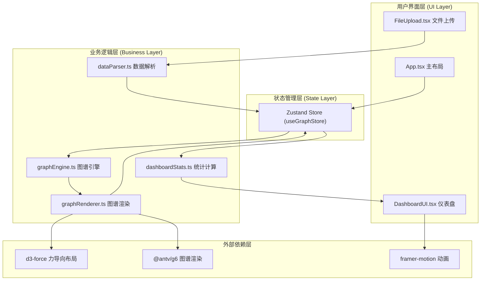

## 1. 架构设计



## 2. 技术栈说明

- **前端框架**：React 18 + TypeScript (严格模式)
- **构建工具**：Vite 5，端口 3000
- **状态管理**：Zustand
- **路由**：react-router-dom（单页无需多路由，保留依赖用于扩展）
- **图谱布局**：d3-force
- **图谱渲染**：@antv/g6
- **动画库**：framer-motion
- **样式方案**：内联样式 + CSS变量（不使用Tailwind，遵循用户指定颜色系统）

## 3. 目录结构

```
.
├── package.json
├── index.html
├── tsconfig.json
├── vite.config.js
└── src/
    ├── main.tsx
    ├── App.css
    ├── modules/
    │   ├── data/
    │   │   └── dataParser.ts
    │   ├── graph/
    │   │   ├── graphEngine.ts
    │   │   └── graphRenderer.ts
    │   ├── dashboard/
    │   │   ├── dashboardStats.ts
    │   │   └── dashboardUI.tsx
    │   ├── ui/
    │   │   ├── App.tsx
    │   │   └── fileUpload.tsx
    │   └── store/
    │       └── graphStore.ts
    └── types/
        └── index.ts
```

## 4. 数据模型定义

### 4.1 核心类型

```typescript
// 原始输入数据格式
interface RawGraphData {
  nodes: RawNode[];
  edges: RawEdge[];
}

interface RawNode {
  id: string;
  name?: string;
  [key: string]: any;
}

interface RawEdge {
  source: string;
  target: string;
  [key: string]: any;
}

// 内部标准节点格式
interface GraphNode {
  id: string;
  name: string;
  x: number;
  y: number;
  vx?: number;
  vy?: number;
  degree: number;
  color: string;
  radius: number;
  highlighted: boolean;
  visible: boolean;
}

// 内部标准边格式
interface GraphEdge {
  id: string;
  source: string;
  target: string;
  visible: boolean;
}

// 统计指标
interface GraphStats {
  nodeCount: number;
  edgeCount: number;
  averageDegree: number;
  maxCentrality: number;
  maxCentralityNode: string;
}

// Zustand Store 状态
interface GraphStore {
  rawData: RawGraphData | null;
  nodes: GraphNode[];
  edges: GraphEdge[];
  stats: GraphStats;
  filterKeyword: string;
  error: string | null;
  fileName: string | null;
  // actions
  setRawData: (data: RawGraphData | null) => void;
  setNodes: (nodes: GraphNode[]) => void;
  setEdges: (edges: GraphEdge[]) => void;
  setStats: (stats: GraphStats) => void;
  setFilterKeyword: (keyword: string) => void;
  setError: (error: string | null) => void;
  setFileName: (name: string | null) => void;
  applyFilter: () => void;
  resetHighlight: () => void;
  highlightNode: (nodeId: string) => void;
}
```

## 5. 模块数据流向

| 模块 | 输入 | 输出 | 说明 |
|------|------|------|------|
| dataParser.ts | File对象 | RawGraphData \| ParseError | 校验JSON格式，转换nodes/edges |
| graphEngine.ts | RawGraphData | GraphNode[], GraphEdge[] | d3-force计算力导向布局，计算节点度数和颜色 |
| graphRenderer.ts | GraphNode[], GraphEdge[] | 用户交互事件(点击/拖拽) | @antv/g6渲染，处理画布交互 |
| dashboardStats.ts | GraphNode[], GraphEdge[] | GraphStats | 计算节点数、连接数、平均度数、最大中心度 |
| dashboardUI.tsx | GraphStats, filterKeyword, error | 用户输入事件 | 渲染卡片、输入框、错误提示 |
| App.tsx | 所有模块 | 布局协调 | 主容器，左右分栏/抽屉 |

## 6. 状态管理设计

使用 Zustand 创建单一 Store `useGraphStore`：
- **原始数据层**：rawData, fileName 存储用户上传的原始数据
- **计算数据层**：nodes, edges 存储经过引擎处理后带位置和样式的数据
- **统计层**：stats 存储仪表盘展示用的计算指标
- **UI层**：filterKeyword, error 存储筛选关键词和错误提示
- **Actions**：数据设置、筛选应用、节点高亮/重置高亮
