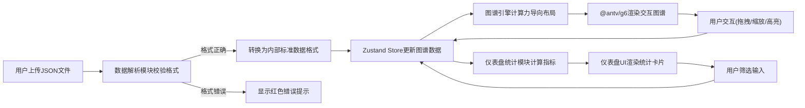

## 1. 产品概述

交互式数据谱系是一款在线数据关系图谱可视化与仪表盘分析工具，帮助用户快速理解复杂数据集中的节点关系与网络结构。用户可上传JSON格式数据文件，系统自动解析并生成可交互的力导向关系图谱，同时在仪表盘面板中展示实时数据统计指标。

- **主要用途**：数据关系可视化、网络结构分析、数据探索
- **目标用户**：数据分析师、产品经理、开发人员、科研人员
- **核心价值**：将抽象的JSON数据转化为直观可交互的关系图谱，降低数据理解成本

## 2. 核心功能

### 2.1 用户角色

无用户角色区分，单用户使用模式。

### 2.2 功能模块

1. **数据解析模块**：JSON文件上传、格式校验、错误提示、数据标准化转换
2. **图谱引擎模块**：d3-force力导向布局计算、节点/边增删、数据筛选接口
3. **图谱渲染模块**：@antv/g6画布渲染、拖拽交互、缩放控制、节点高亮、连线样式
4. **仪表盘统计模块**：节点数、连接数、平均度数、中心度等指标计算
5. **仪表盘UI模块**：毛玻璃风格卡片、数字滚动动画、筛选输入框
6. **主应用模块**：布局管理、路由协调、状态管理、响应式适配

### 2.3 页面详情

| 页面名称 | 模块名称 | 功能描述 |
|-----------|-------------|---------------------|
| 主页面 | 左侧图谱区域 (70%) | Canvas画布渲染力导向图，支持节点拖拽、滚轮缩放(0.5-3x)、双击高亮、重置布局按钮 |
| 主页面 | 右侧仪表盘面板 (30%) | 4张统计卡片（节点数、连接数、平均度数、最大中心度），顶部筛选输入框，错误提示区 |
| 主页面 | 文件上传组件 | 点击/拖拽上传JSON文件，显示文件名与解析状态，格式错误红色提示 |

## 3. 核心流程

用户核心操作流程：上传JSON数据 → 系统解析校验 → 生成力导向布局 → 渲染交互式图谱 → 展示统计仪表盘 → 用户筛选/交互探索。

## 4. 用户界面设计

### 4.1 设计风格

- **主色调**：深色主题，背景 #0A0A1A
- **图谱区域背景**：#0F0F23
- **仪表盘面板背景**：#1A1A2E
- **强调色**：#00D4AA（青绿色主按钮）、#FF6B6B/#4ECDC4/#45B7D1/#96CEB4（节点色板）、#FF4466（错误提示）
- **边框色**：#2A2A3A
- **卡片毛玻璃**：背景 #FFFFFF10，边框 #FFFFFF15，圆角 12px
- **按钮风格**：渐变上传按钮(#FF6B6B→#45B7D1)，圆角8px；重置按钮纯色#00D4AA，圆角6px
- **字体**：系统默认无衬线字体
- **动效**：数字滚动动画(1.5s ease-out)、卡片依次进入(0.1s间隔)、悬停反馈

### 4.2 页面设计概述

| 页面名称 | 模块名称 | UI元素 |
|-----------|-------------|-------------|
| 主页面 | 整体布局 | 左右分栏(70%/30%)，深色背景，圆角12px容器，卡片间距12px |
| 主页面 | 图谱区域 | 左上角上传按钮，右下角重置按钮，Canvas画布居中 |
| 主页面 | 节点样式 | 圆形，半径8-20px按度数动态，色板随机分配，高亮时发光边缘#FFD700并放大1.2倍 |
| 主页面 | 连线样式 | 灰色#4A4A5A，线宽1px，悬停加粗至2px变色#00FFAA |
| 主页面 | 仪表盘卡片 | 毛玻璃效果，数值数字滚动动画，标题小号浅色字，依次进入动画 |
| 主页面 | 错误提示 | 顶部红色背景#FF446620，圆角8px，14px字体，带关闭按钮 |
| 主页面 | 筛选输入框 | 宽度100%，内边距8px，圆角8px，背景#2A2A3A，文字白色，placeholder#6A6A7E |

### 4.3 响应式适配

采用桌面优先设计：
- **桌面端(≥768px)**：左右分栏布局，图谱区70%，仪表盘30%
- **移动端(<768px)**：图谱区占100%宽度，仪表盘以抽屉形式从右侧滑入，通过按钮触发显示/隐藏
- **触控优化**：节点拖拽区域扩大，按钮最小触控区域44px

### 4.4 性能目标

- 图谱渲染帧率 ≥ 45 FPS
- 支持节点数 ≤ 200 个时交互流畅无卡顿
- 文件解析时间 ≤ 0.5秒
